# GenAI Engineering: Beginner to Expert

A structured, self-contained course on building production GenAI systems — starting from
LLM/agent basics and ending at high-level system design for GenAI platforms serving millions
of users and tens of millions of documents.

This is not a link dump. Every module is written notes-style: concepts explained from first
principles, an architecture/flow diagram, a scenario walkthrough, runnable-looking code
(Python + LangChain/LangGraph/Pydantic), production pitfalls, and exercises. See
[docs/style-guide.md](docs/style-guide.md) for the exact template every module follows.

> **Status**: complete. 33 modules across Parts 1-3, plus a 6-phase build-from-scratch
> capstone in Part 4 — 39 documents total.

## How to use this repo

- Go in order the first time — later modules assume earlier ones.
- Each module is a folder with a `README.md`. Start at Part 1, Module 1.
- Three recurring fictional systems are used throughout Parts 1-3 so scenarios build on each
  other instead of resetting every module: **Northwind** (e-commerce support bot),
  **Aster Health** (compliance-heavy healthcare bot), and **Ledger** (fintech
  doc-ingestion-at-scale capstone). Details in [docs/style-guide.md](docs/style-guide.md).
  Part 4 uses its own single running system, **TFE Agent**, built as one continuous
  MVP-to-production story rather than a single design doc.

## The learning path

```mermaid
flowchart TD
    subgraph P1["Part 1 — Foundations (Beginner)"]
        direction TB
        A1[LLM & GenAI Basics] --> A2[LangChain Fundamentals]
        A2 --> A3[LangGraph Fundamentals]
        A3 --> A4[Pydantic & Structured Outputs]
        A4 --> A5[Agents 101]
        A5 --> A6[Workflows vs Agents]
        A6 --> A7[Basic RAG Pipeline]
        A7 --> A8[Vector Databases]
    end

    subgraph P2["Part 2 — Advanced GenAI Engineering"]
        direction TB
        B1[Advanced Agent Architectures] --> B2[Context & Memory Mgmt at Scale]
        B2 --> B3[Caching in Agents]
        B3 --> B4[Advanced Production RAG:<br/>metadata · HyDE · hybrid · rerank · CRAG · GraphRAG]
        B4 --> B5[LLM Guardrails]
        B5 --> B6[LLM Gateway]
        B6 --> B7[LLMOps: Observability & Security]
    end

    subgraph P3["Part 3 — System Design for GenAI at Scale"]
        direction TB
        C1[HLD Fundamentals for GenAI] --> C2[Multi-Tenant User Management]
        C2 --> C3[Database Design for GenAI Apps]
        C3 --> C4[Event-Driven Architecture]
        C4 --> C5[Scaling GenAI Systems]
        C5 --> C6[High Availability & Reliability]
        C6 --> C7[Memory & State at Scale]
        C7 --> C8[Semantic Caching at Scale]
        C8 --> C9[Ingesting 10M+ Documents]
        C9 --> C10[Database Scaling Strategies]
        C10 --> C11[Server & Compute Scaling]
        C11 --> C12[Capstone: Full HLD Case Study]
    end

    subgraph P4["Part 4 — Capstone Build: TFE Agent"]
        direction TB
        D1[Phase 1: MVP] --> D2[Phase 2: 100K Users]
        D2 --> D3[Phase 3: Event-Driven + Multimodal RAG]
        D3 --> D4[Phase 4: DB & Tenant Isolation]
        D4 --> D5[Phase 5: 1M Requests — Vector Crisis]
        D5 --> D6[Phase 6: Final Architecture, Assembled]
    end

    P1 --> P2 --> P3 --> P4
```

## Part 1 — Foundations

| # | Module | Status |
|---|--------|--------|
| 1 | [GenAI & LLM Basics](part-1-foundations/01-genai-and-llm-basics/README.md) | 🟢 complete |
| 2 | [LangChain Fundamentals](part-1-foundations/02-langchain-fundamentals/README.md) | 🟢 complete |
| 3 | [LangGraph Fundamentals](part-1-foundations/03-langgraph-fundamentals/README.md) | 🟢 complete |
| 4 | [Pydantic & Structured Outputs](part-1-foundations/04-pydantic-and-structured-outputs/README.md) | 🟢 complete |
| 5 | [Agents 101](part-1-foundations/05-agents-101/README.md) | 🟢 complete |
| 6 | [Workflows vs Agents](part-1-foundations/06-workflows-vs-agents/README.md) | 🟢 complete |
| 7 | [Basic RAG Pipeline](part-1-foundations/07-basic-rag-pipeline/README.md) | 🟢 complete |
| 8 | [Vector Databases](part-1-foundations/08-vector-databases/README.md) | 🟢 complete |

## Part 2 — Advanced GenAI Engineering

| # | Module | Status |
|---|--------|--------|
| 1 | [Advanced Agent Architectures](part-2-advanced-engineering/01-advanced-agent-architectures/README.md) | 🟢 complete |
| 2 | [Context & Memory Management at Scale](part-2-advanced-engineering/02-context-and-memory-management-at-scale/README.md) | 🟢 complete |
| 3 | [Caching in Agents](part-2-advanced-engineering/03-caching-in-agents/README.md) | 🟢 complete |
| 4 | [Advanced Production RAG](part-2-advanced-engineering/04-advanced-production-rag/README.md) (overview) | 🟢 complete |
| 4a | ↳ [Metadata Filtering & Query Construction](part-2-advanced-engineering/04-advanced-production-rag/01-metadata-filtering-and-query-construction/README.md) | 🟢 complete |
| 4b | ↳ [HyDE](part-2-advanced-engineering/04-advanced-production-rag/02-hyde/README.md) | 🟢 complete |
| 4c | ↳ [Hybrid Search](part-2-advanced-engineering/04-advanced-production-rag/03-hybrid-search/README.md) | 🟢 complete |
| 4f | ↳ [Reranking](part-2-advanced-engineering/04-advanced-production-rag/06-reranking/README.md) | 🟢 complete |
| 4d | ↳ [Corrective RAG (CRAG)](part-2-advanced-engineering/04-advanced-production-rag/04-corrective-rag-crag/README.md) | 🟢 complete |
| 4e | ↳ [GraphRAG](part-2-advanced-engineering/04-advanced-production-rag/05-graphrag/README.md) | 🟢 complete |
| 5 | [LLM Guardrails](part-2-advanced-engineering/05-llm-guardrails/README.md) | 🟢 complete |
| 6 | [LLM Gateway](part-2-advanced-engineering/06-llm-gateway/README.md) | 🟢 complete |
| 7 | [LLMOps: Observability & Security](part-2-advanced-engineering/07-llmops-observability-and-security/README.md) | 🟢 complete |

## Part 3 — System Design for GenAI at Scale

| # | Module | Status |
|---|--------|--------|
| 1 | [HLD Fundamentals for GenAI Systems](part-3-system-design/01-hld-fundamentals-for-genai/README.md) | 🟢 complete |
| 2 | [Multi-Tenant User Management](part-3-system-design/02-multi-tenant-user-management/README.md) | 🟢 complete |
| 3 | [Database Design for GenAI Apps](part-3-system-design/03-database-design-for-genai-apps/README.md) | 🟢 complete |
| 4 | [Event-Driven Architecture in GenAI Apps](part-3-system-design/04-event-driven-architecture/README.md) | 🟢 complete |
| 5 | [Scaling GenAI Systems](part-3-system-design/05-scaling-genai-systems/README.md) | 🟢 complete |
| 6 | [High Availability & Reliability](part-3-system-design/06-high-availability-and-reliability/README.md) | 🟢 complete |
| 7 | [Memory & State at Scale](part-3-system-design/07-memory-and-state-at-scale/README.md) | 🟢 complete |
| 8 | [Semantic Caching at Scale](part-3-system-design/08-semantic-caching-at-scale/README.md) | 🟢 complete |
| 9 | [Ingesting 10M+ Documents](part-3-system-design/09-ingesting-10m-plus-documents/README.md) | 🟢 complete |
| 10 | [Database Scaling Strategies](part-3-system-design/10-database-scaling-strategies/README.md) | 🟢 complete |
| 11 | [Server & Compute Scaling](part-3-system-design/11-server-and-compute-scaling/README.md) | 🟢 complete |
| 12 | [Capstone: Full HLD Case Study (Ledger)](part-3-system-design/12-capstone-case-study/README.md) | 🟢 complete |

## Part 4 — Capstone Build: The TFE Agent, From Scratch

A single continuous story — one system, six phases, MVP to production — rather than
independent modules. Each phase recaps where the last one left off and ends on the specific
symptom that forces the next. See [Part 4's README](part-4-capstone-build-tfe-agent/README.md)
for the full scenario setup.

| # | Phase | Status |
|---|-------|--------|
| 1 | [MVP](part-4-capstone-build-tfe-agent/01-mvp/README.md) | 🟢 complete |
| 2 | [Scaling to 100K Users](part-4-capstone-build-tfe-agent/02-scaling-to-100k-users/README.md) | 🟢 complete |
| 3 | [Event-Driven Ingestion & Multimodal RAG](part-4-capstone-build-tfe-agent/03-event-driven-ingestion-and-multimodal-rag/README.md) | 🟢 complete |
| 4 | [Database & Tenant Isolation at Scale](part-4-capstone-build-tfe-agent/04-database-and-tenant-isolation-at-scale/README.md) | 🟢 complete |
| 5 | [Scaling to 1M Requests: the Vector Retrieval Crisis](part-4-capstone-build-tfe-agent/05-scaling-to-1m-requests-vector-retrieval-crisis/README.md) | 🟢 complete |
| 6 | [Final Architecture: the TFE Agent, Assembled](part-4-capstone-build-tfe-agent/06-final-architecture-the-tfe-agent/README.md) | 🟢 complete |

Legend: 🟡 stub (objectives + outline only) · 🟢 complete
