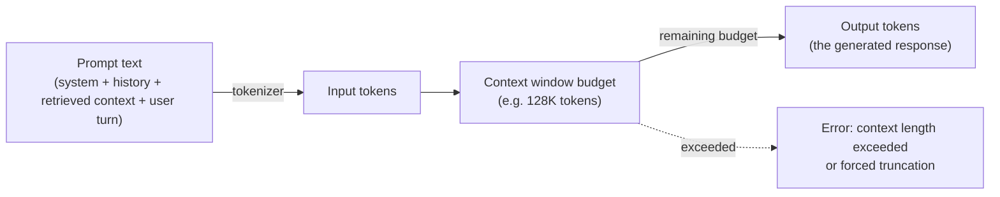
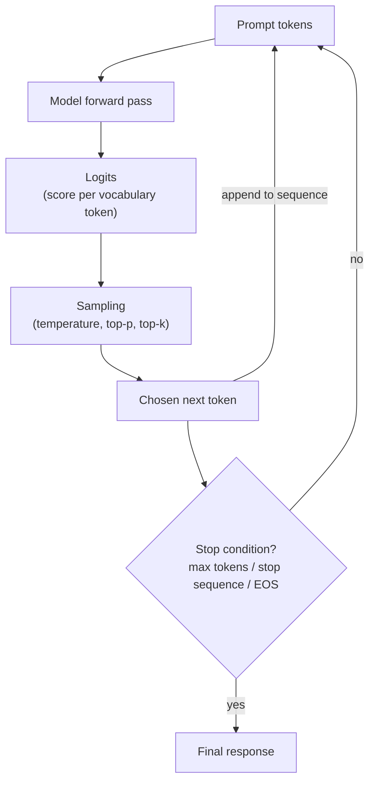
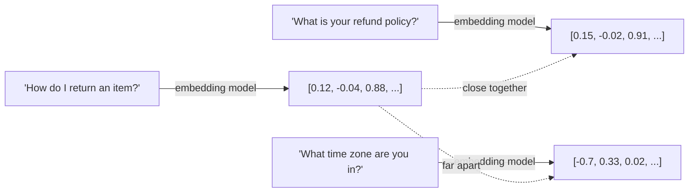
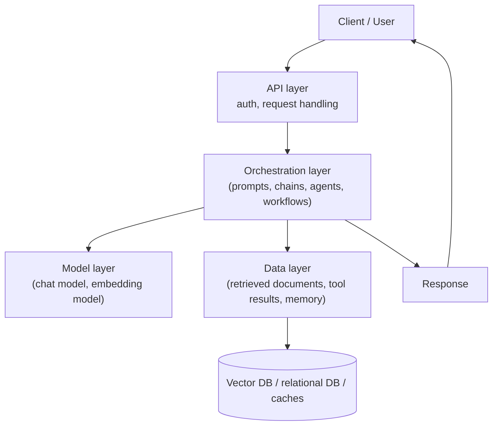

# 1. GenAI & LLM Basics

Every later module in this course — agents, RAG, guardrails, scaling a system to 10M
documents — is built on top of a small set of facts about how large language models (LLMs)
actually work. Skip this module and everything downstream feels like magic incantation
("why did adding one sentence to the prompt fix it?"). Get it solid and the rest of the
course is mostly *engineering* on top of a machine you understand.

## Learning objectives

- Explain what a large language model is and isn't (a next-token predictor, not a database
  or a reasoning engine with certainty guarantees).
- Explain tokens and context windows, and why both are hard budgets that shape every later
  design decision (cost, latency, RAG chunk sizes, agent memory).
- Explain the generation loop: prompt → tokens → logits → sampling → output, including what
  temperature and top-p actually control.
- Explain embeddings at a conceptual level: text becomes a vector, and semantic similarity
  becomes geometric distance.
- Describe the standard anatomy of a GenAI application and locate where each later module in
  this course plugs into it.
- Categorize model types (chat/instruct, embedding, reasoning, multimodal) and reason about
  picking one for a task.

## Prerequisites

None — this is the entry point of the course.

## Core concepts

### 1.1 What an LLM actually is

A large language model is a function that takes a sequence of tokens and predicts a
probability distribution over what the *next* token is likely to be. That's it. Everything
that looks like reasoning, knowledge, or personality is an emergent side effect of being very
good at that one task, trained on an enormous amount of text.

Three training stages get you from "predicts next token" to "useful assistant":

1. **Pretraining** — the model reads a huge corpus of text (web pages, books, code) and
   learns to predict the next token. This is where it acquires broad world knowledge and
   language patterns. It has no notion yet of "answering a question helpfully."
2. **Supervised fine-tuning (SFT)** — the model is trained further on curated examples of
   instruction → good response, to teach it the *chat/assistant* behavior.
3. **Alignment (e.g. RLHF/DPO)** — the model is tuned so its responses better match human
   preferences (helpful, harmless, honest), using human or AI feedback.

The practical implication: an LLM's "knowledge" is frozen at whatever its training data
covered (its **knowledge cutoff**), and it is fundamentally a pattern-completion machine, not
a database lookup. It can and will produce fluent, confident, wrong answers — this single
fact motivates the entire RAG track of this course ([Basic RAG Pipeline](../07-basic-rag-pipeline/README.md)
onward) and the guardrails/evaluation modules in Part 2.

### 1.2 Tokens and context windows

Models don't see characters or words — they see **tokens**, sub-word units produced by a
tokenizer (e.g. byte-pair encoding). A rough rule of thumb for English text: **1 token ≈ 4
characters ≈ 0.75 words**. So 1,000 words is roughly 1,300 tokens.

The **context window** is the maximum number of tokens (input + output combined, for most
APIs) a model can process in one call — commonly ranging from 8K to over 1M tokens depending
on the model. This is a hard budget, not a soft guideline, and it shapes design decisions
throughout this course:

- How large a RAG chunk can be, and how many chunks you can stuff into a prompt.
- How long a conversation can run before you need summarization/compaction
  ([Context & Memory Management at Scale](../../part-2-advanced-engineering/02-context-and-memory-management-at-scale/README.md)).
- How many tool definitions and tool outputs an agent can carry before context degrades.
- Cost — most providers bill per token, for both input and output.



A subtler failure mode worth knowing now: models don't attend to all parts of a long context
equally well — information placed in the *middle* of a very long prompt is statistically more
likely to be under-used than information at the start or end ("lost in the middle"). This is
one reason naive "just retrieve more chunks and stuff them all in" RAG degrades, revisited in
[Advanced Production RAG](../../part-2-advanced-engineering/04-advanced-production-rag/README.md).

### 1.3 The generation loop and sampling

At each step, the model outputs a probability distribution over its entire vocabulary for
"what token comes next" (these raw scores are called **logits**). A *sampling* strategy turns
that distribution into an actual chosen token:

- **Temperature** — scales the distribution before sampling. Near 0: the model almost always
  picks the highest-probability token (deterministic, focused, sometimes repetitive).
  Higher (e.g. 0.7-1.0): more randomness, more varied/creative output, higher chance of
  going off the rails.
- **Top-p (nucleus sampling)** — only samples from the smallest set of tokens whose combined
  probability exceeds `p` (e.g. 0.9), cutting off the long unlikely tail.
- **Top-k** — only samples from the `k` most likely next tokens.
- **Max tokens** — a hard cap on output length (part of your context budget from §1.2).
- **Stop sequences** — strings that, once generated, end the response early (useful for
  structured formats).



Practical guidance you'll reuse throughout the course: use **low temperature (0-0.2)** for
tasks needing consistency — classification, structured extraction, tool-call argument
generation (all of [Module 4](../04-pydantic-and-structured-outputs/README.md) and beyond).
Use **higher temperature** only for open-ended generation where variety is a feature, not a
bug (brainstorming, creative writing).

### 1.4 Embeddings, briefly

An **embedding model** is a different kind of model from a chat model: instead of predicting
the next token, it maps a piece of text to a fixed-length vector of numbers (e.g. 1536
dimensions) such that texts with similar *meaning* end up as vectors that are close together
in that space. "Semantic similarity" becomes a geometric distance calculation (cosine
similarity, dot product) instead of exact string matching.



This single idea — meaning as geometry — is the foundation of everything in
[Vector Databases](../08-vector-databases/README.md) and the RAG track. You don't need the
math yet, just the concept: **embed, then compare distances to find "similar" text.**

### 1.5 Anatomy of a GenAI application

Almost every GenAI application, from a simple chatbot to the "Ledger" system this course
builds toward, is composed of the same handful of layers:



Where this course covers each layer:

| Layer | Covered in |
|---|---|
| Orchestration (prompts, chains) | [LangChain Fundamentals](../02-langchain-fundamentals/README.md) |
| Orchestration (graphs, agents, workflows) | [LangGraph Fundamentals](../03-langgraph-fundamentals/README.md), [Agents 101](../05-agents-101/README.md), [Workflows vs Agents](../06-workflows-vs-agents/README.md) |
| Structured data between layers | [Pydantic & Structured Outputs](../04-pydantic-and-structured-outputs/README.md) |
| Data layer (retrieval) | [Basic RAG Pipeline](../07-basic-rag-pipeline/README.md), [Vector Databases](../08-vector-databases/README.md), and all of Part 2 Module 4 |
| Model layer at scale, cross-cutting concerns | [LLM Gateway](../../part-2-advanced-engineering/06-llm-gateway/README.md) |
| Safety on the API/orchestration boundary | [LLM Guardrails](../../part-2-advanced-engineering/05-llm-guardrails/README.md) |
| All of it, distributed and at scale | Part 3 |

### 1.6 Model categories

- **Chat/instruct models** — the general-purpose conversational models (what most of this
  course calls "the model"). Take a sequence of role-tagged messages, return a response.
- **Embedding models** — turn text into vectors (§1.4); used for search/retrieval, not
  conversation.
- **Reasoning models** — variants tuned/optimized to spend more inference-time computation
  "thinking" before answering, trading latency/cost for better performance on multi-step
  logic, math, and planning tasks.
- **Multimodal models** — accept and/or produce more than text (images, audio); relevant
  when your GenAI app needs to ingest scanned documents, screenshots, or audio.

Picking one is a trade-off across capability, latency, and cost — a decision you'll make
concretely once [LLM Gateway](../../part-2-advanced-engineering/06-llm-gateway/README.md)
covers routing requests to different models by task.

## Scenario walkthrough: Northwind Support Copilot, v0

Northwind is a fictional mid-size e-commerce company. Its support team wants an AI assistant
that can answer customer questions. The very first version — before any of the frameworks in
this course — is a single API call:

> System: "You are a helpful support assistant for Northwind."
> User: "Do you accept returns on opened electronics?"

This works, sort of. But immediately you can see the concepts from this module at play:

- The model **doesn't actually know Northwind's return policy** — it will either say
  something plausible-but-generic or hallucinate specifics. It's a next-token predictor,
  not a lookup against Northwind's actual policy documents (§1.1). This is the exact problem
  [Basic RAG Pipeline](../07-basic-rag-pipeline/README.md) exists to solve.
- If Northwind wants consistent, on-policy answers, they should run this at **low
  temperature** (§1.3), not the creative-writing default.
- Every conversation turn costs **tokens**, and a long back-and-forth support conversation
  will eventually approach the **context window** limit (§1.2) — a problem this course
  returns to at individual-conversation scale in Part 1/2 and at millions-of-users scale in
  [Memory & State at Scale](../../part-3-system-design/07-memory-and-state-at-scale/README.md).
- As soon as Northwind wants the assistant to *look up* a specific order status, a single
  prompt-in/response-out call isn't enough — that's a **tool call**, which needs an
  orchestration layer (§1.5), covered starting in [LangChain Fundamentals](../02-langchain-fundamentals/README.md).

This gap between "v0 single call" and "a real support copilot" is exactly the path the rest
of Part 1 walks.

## Code example

```python
from openai import OpenAI  # any provider's SDK works the same way conceptually

client = OpenAI(api_key="YOUR_API_KEY")

response = client.chat.completions.create(
    model="gpt-4.1",
    messages=[
        {"role": "system", "content": "You are a helpful support assistant for Northwind."},
        {"role": "user", "content": "Do you accept returns on opened electronics?"},
    ],
    temperature=0.2,   # low temperature: favor consistent, on-policy answers
    max_tokens=300,    # hard output budget
)

print(response.choices[0].message.content)
print("tokens used:", response.usage.total_tokens)  # input + output tokens, what you're billed for
```

```python
# Embeddings: text -> vector, used for similarity search (foundation for Module 8)
embedding_response = client.embeddings.create(
    model="text-embedding-3-small",
    input="What is your refund policy?",
)
vector = embedding_response.data[0].embedding
print(len(vector))  # e.g. 1536 dimensions
```

## Production pitfalls

- **Treating the model as a knowledge base.** It will answer confidently even when it
  doesn't "know" — there's no built-in uncertainty signal. Never ship a fact-sensitive
  feature without grounding it in real data (RAG) or accepting the hallucination risk
  explicitly.
- **Ignoring token costs until the bill arrives.** Long system prompts, full conversation
  history resent every turn, and verbose tool outputs all silently multiply cost — this is
  why context/memory management (Part 2 Module 2) and caching (Part 2 Module 3) exist.
- **Using default/high temperature for tasks that need consistency.** Classification,
  extraction, and tool-call argument generation should almost always run near temperature 0.
- **Assuming a bigger context window means "just paste everything in."** Lost-in-the-middle
  degradation and cost both argue against this — relevance-based retrieval beats brute-force
  context stuffing, a theme that recurs through the whole RAG track.
- **Conflating chat models and embedding models.** They are different model types serving
  different purposes; you typically need both in a RAG system.

## Key takeaways

- An LLM predicts the next token; it has no built-in fact-checking or certainty signal.
- Tokens and context windows are hard budgets that shape cost, latency, and architecture
  decisions throughout this entire course.
- Temperature/top-p control randomness in generation — low for consistency, higher for
  creativity.
- Embeddings turn text into vectors so "similar meaning" becomes "close in vector space" —
  the foundation of retrieval.
- A GenAI application is a small number of recurring layers (API, orchestration, model, data)
  that every later module in this course elaborates on.

## Exercises

1. For a customer support use case, argue for a specific temperature setting and defend it.
2. Estimate the token cost of a 20-turn customer support conversation where each turn resends
   the full history (roughly 150 tokens/turn), assuming no compaction. At what turn count
   does this become a problem for an 8K-token context window model?
3. Explain, in your own words, why an LLM can produce a fluent and wrong answer about a
   company's return policy, and name the architectural fix.
4. Look up (or estimate) the context window size of two current model families and note how
   that changes what "reasonable" RAG chunk-and-retrieve design looks like for each.

Next: [LangChain Fundamentals](../02-langchain-fundamentals/README.md)
