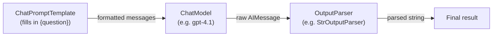
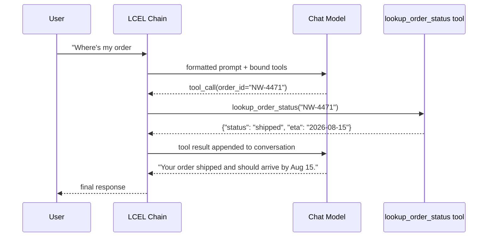

# 2. LangChain Fundamentals

Once you're calling a model with real prompts, real parsing, and more than one provider, you
start rebuilding the same plumbing everywhere: prompt templating, provider-specific request
formats, parsing the response back into something usable, chaining steps together. LangChain
is a library that standardizes that plumbing so you write your application logic once and
swap models/providers without rewriting everything around them.

## Learning objectives

- Explain what LangChain is for (standardized plumbing) and isn't (it doesn't make the model
  smarter, and it's the wrong tool for a single trivial call).
- Compose prompt → model → parser pipelines using LCEL (LangChain Expression Language).
- Understand the `Runnable` interface (`.invoke`, `.batch`, `.stream`) and why a shared
  interface across every component matters.
- Use output parsers to turn raw text into usable data (bridges to
  [Pydantic & Structured Outputs](../04-pydantic-and-structured-outputs/README.md)).
- Wire up basic tool/function calling with a chat model.
- Recognize when LangChain is overkill.

## Prerequisites

- [GenAI & LLM Basics](../01-genai-and-llm-basics/README.md)

## Core concepts

### 2.1 What LangChain solves

Recall the v0 Northwind call from Module 1 — a single hardcoded API call. The moment you need
any of the following, you're rebuilding infrastructure LangChain already provides:

- **Provider abstraction** — call OpenAI, Anthropic, or any other supported provider through
  one consistent interface, so switching providers is a config change, not a rewrite.
- **Prompt templating** — parameterized prompts with variables, reusable across calls.
- **Output parsing** — turning raw text/JSON back into typed Python objects reliably.
- **Chaining** — composing multiple steps (retrieve → format → call model → parse) into one
  callable pipeline.
- **Tool integration** — a standard way to describe and bind callable tools to a model.

What it deliberately does **not** solve: it doesn't make the underlying model better at
reasoning, and it adds an abstraction cost that isn't worth paying for a single one-off call
— in that case, just use the provider SDK directly (as Module 1's code example did).

### 2.2 Core building blocks

- **`ChatModel`** — a standardized wrapper around a provider's chat API. Every chat model,
  regardless of vendor, exposes the same `.invoke(messages)` shape.
- **`PromptTemplate` / `ChatPromptTemplate`** — a template with `{variables}` that renders
  into the final messages sent to the model.
- **`OutputParser`** — takes the raw model output and converts it into a usable shape (plain
  string, JSON, or a typed object — full treatment in Module 4).
- **`Runnable`** — the common interface every one of the above implements: `.invoke()` (one
  input → one output), `.batch()` (many inputs, run concurrently), `.stream()` (yield output
  incrementally as it's generated).

### 2.3 LCEL: composing with the pipe operator

LCEL lets you compose `Runnable`s with the `|` operator, the same way you'd pipe shell
commands — output of one stage becomes input to the next.



Each stage is swappable independently: change the model without touching the prompt, change
the parser without touching the model. `RunnablePassthrough` lets input flow through
unmodified alongside a transformation (useful for keeping the original question available
after a retrieval step — see Module 7). `RunnableLambda` wraps arbitrary Python functions as
a pipeline stage.

### 2.4 Batch and streaming execution

Because every component shares the `Runnable` interface:

- `.batch([input1, input2, ...])` runs multiple inputs concurrently instead of a manual loop
  — directly relevant once Northwind needs to process many support tickets at once.
- `.stream(input)` yields tokens as they're generated, which is what makes a chat UI feel
  responsive instead of waiting for the full response.

### 2.5 Tool calling with `bind_tools`

A chat model can be given a set of callable tools (functions) it may choose to invoke instead
of responding directly. `bind_tools` attaches tool schemas to a model so the model can return
a structured "call this tool with these arguments" response instead of plain text. This is
the seed of everything in [Agents 101](../05-agents-101/README.md) — for now, treat it as:
the model can request a function call, your code executes it, and you feed the result back.

## Scenario walkthrough

Rebuilding "Northwind Support Copilot" v1 as a LangChain LCEL chain: a prompt template with a
`{question}` variable, piped into a chat model, piped into a string output parser — the exact
same behavior as Module 1's raw API call, but now composable and provider-agnostic. Then we
add one tool, `lookup_order_status(order_id)`, bound to the model, so a question like "where's
my order #NW-4471?" produces a tool call instead of a guessed answer.



## Code example

```python
from langchain_openai import ChatOpenAI
from langchain_core.prompts import ChatPromptTemplate
from langchain_core.output_parsers import StrOutputParser

model = ChatOpenAI(model="gpt-4.1", temperature=0.2)

prompt = ChatPromptTemplate.from_messages([
    ("system", "You are a helpful support assistant for Northwind."),
    ("user", "{question}"),
])

chain = prompt | model | StrOutputParser()

answer = chain.invoke({"question": "Do you accept returns on opened electronics?"})
print(answer)

# Batch: process multiple tickets concurrently
answers = chain.batch([
    {"question": "Do you ship internationally?"},
    {"question": "How long does a refund take?"},
])
```

```python
from pydantic import BaseModel, Field

class LookupOrderStatus(BaseModel):
    """Look up the current shipping status of a Northwind order."""
    order_id: str = Field(description="The Northwind order ID, e.g. NW-4471")

def lookup_order_status(order_id: str) -> dict:
    return {"status": "shipped", "eta": "2026-08-15"}  # placeholder for a real DB call

model_with_tools = model.bind_tools([LookupOrderStatus])

response = model_with_tools.invoke("Where's my order #NW-4471?")
for call in response.tool_calls:
    if call["name"] == "LookupOrderStatus":
        result = lookup_order_status(**call["args"])
        print(result)
```

## Production pitfalls

- **Over-abstracting a single call.** If your app is genuinely one prompt in, one response
  out, with one provider, LCEL adds indirection without benefit — use the SDK directly.
- **Forgetting that `.batch()` still costs real tokens/money per item.** Concurrency helps
  latency, not cost.
- **Treating tool calling as reliable by default.** The model can hallucinate arguments or
  call the wrong tool — Module 4 (structured outputs/validation) and Part 2's guardrails
  module both exist partly because of this.
- **Chain sprawl.** Long, deeply nested LCEL chains become as hard to debug as callback hell
  if you don't name/structure steps clearly — this is one of the pressures that pushes toward
  LangGraph for anything with branching or loops (next module).

## Key takeaways

- LangChain standardizes prompt templating, model calls, output parsing, and tool binding
  behind one `Runnable` interface.
- LCEL composes these with `|`, giving you swappable, independently testable pipeline stages.
- `.invoke`/`.batch`/`.stream` are available on everything because everything implements
  `Runnable`.
- Tool calling via `bind_tools` lets a model request function execution instead of just text
  — the seed of agent behavior.
- LangChain is plumbing, not intelligence — skip it for trivial single-call use cases.

## Exercises

1. Rewrite Module 1's raw `OpenAI` client call as an LCEL chain, and add a second prompt
   variable (e.g. `{tone}`) to control response style.
2. Add a second tool (`check_return_eligibility(order_id, item)`) and reason through what the
   model needs to decide which tool to call, if either.
3. Explain, given the `Runnable` interface, why `.batch()` doesn't reduce total token cost
   the way it reduces wall-clock latency.
4. Identify a point where this chain would need a loop (e.g. "if the tool call fails, retry
   with a clarifying question to the user") — and note that LCEL alone can't express this
   cleanly. Keep this in mind for the next module.

Next: [LangGraph Fundamentals](../03-langgraph-fundamentals/README.md)
