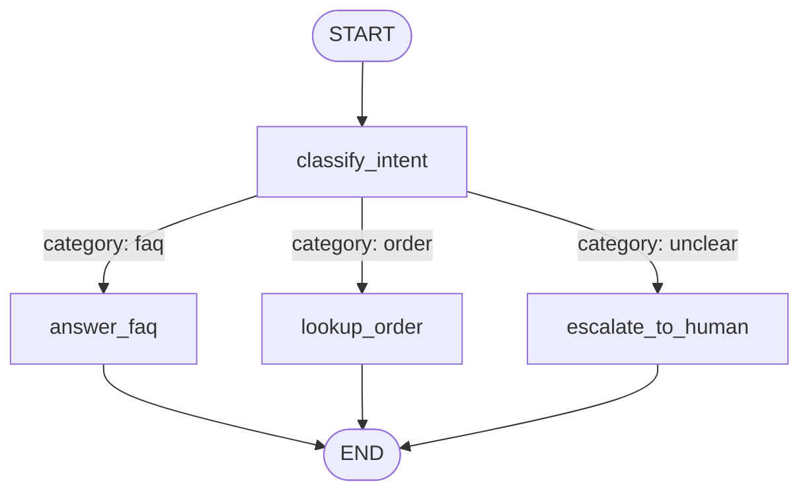
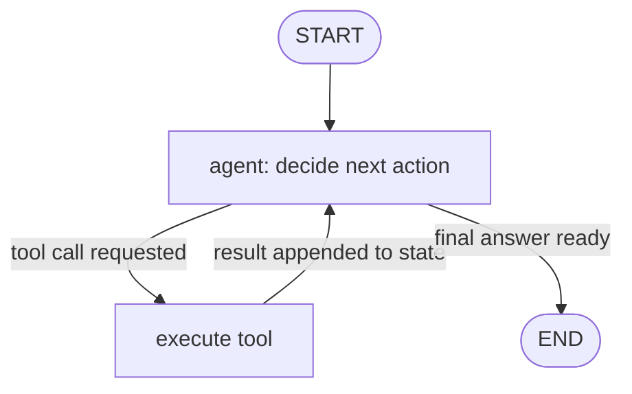

# 3. LangGraph Fundamentals

The last exercise in Module 2 surfaced the limit of LCEL: a chain is a straight line. Real
agent behavior needs branching ("which tool, if any?"), loops ("retry until valid"), and
state that persists across steps. LangGraph models your application as an explicit **state
machine** — a graph of nodes and edges — which is what production agents and workflows
actually are under the hood.

## Learning objectives

- Explain why graphs, not linear chains, are the right model for agents and workflows.
- Define a `StateGraph`: a typed state schema, nodes, edges, and conditional edges.
- Implement cycles — the core capability a DAG-only chain framework can't express.
- Use checkpointing to persist and resume graph state across turns/calls.
- Read and draw a LangGraph state-machine diagram for a given agent or workflow.

## Prerequisites

- [LangChain Fundamentals](../02-langchain-fundamentals/README.md)

## Core concepts

### 3.1 The limit of linear chains

An LCEL chain is `A | B | C` — a fixed sequence. It cannot express "if the tool call fails,
go back and ask a clarifying question" or "keep retrying until the output validates" without
awkward workarounds. Those are exactly the shapes real agents need: **conditional branching**
and **cycles**. LangGraph exists to make both first-class.

### 3.2 Core concepts: state, nodes, edges

- **State** — a typed schema (a `TypedDict` or Pydantic model) representing everything the
  graph carries between steps: conversation messages, retrieved data, intermediate results.
  Every node reads from and writes to this shared state.
- **Nodes** — plain functions (or LCEL runnables) that take the current state and return an
  update to it. A node might call a model, call a tool, or run arbitrary Python.
- **Edges** — connections that say "after this node, go to that node." A normal edge is
  unconditional; a **conditional edge** runs a function on the current state to decide which
  node comes next.
- **`START` / `END`** — sentinel nodes marking where execution begins and terminates.



### 3.3 Cycles

Because edges can point backward, a graph can loop — e.g. "call a tool, check whether the
result is good enough, and if not, retry with adjusted input" — up to some bounded number of
iterations. This is the structural basis of the ReAct agent loop covered in the next module
and is impossible to express cleanly with a linear LCEL chain.



### 3.4 Persistence and checkpointing

A **checkpointer** saves graph state after each step, keyed by a `thread_id`. This means a
graph run can be paused and resumed later — the state doesn't live only in memory for the
duration of one function call. This is the foundation for:

- Multi-turn conversations that resume correctly across separate requests.
- Human-in-the-loop workflows (pause before a sensitive action, resume after approval —
  covered fully in [Advanced Agent Architectures](../../part-2-advanced-engineering/01-advanced-agent-architectures/README.md)).
- Long-term memory, since persisted state is something you can inspect and build on
  ([Context & Memory Management at Scale](../../part-2-advanced-engineering/02-context-and-memory-management-at-scale/README.md)).

### 3.5 Streaming and inspecting state

LangGraph can stream intermediate state after each node executes, not just final tokens —
useful for showing "the agent is looking up your order..." progress in a UI, and essential
for debugging multi-step runs (a theme returned to in
[LLMOps: Observability & Security](../../part-2-advanced-engineering/07-llmops-observability-and-security/README.md)).

## Scenario walkthrough

Northwind Support Copilot as a graph: classify the incoming message's intent, then route to
one of three nodes — answer from FAQ, look up an order, or escalate to a human — each a
distinct path rather than one monolithic prompt trying to handle everything. This is still a
*workflow* (fixed routing), not yet an *agent* (dynamic looping) — that distinction is
formalized in [Workflows vs Agents](../06-workflows-vs-agents/README.md).

## Code example

```python
from typing import TypedDict, Literal
from langgraph.graph import StateGraph, START, END
from langchain_openai import ChatOpenAI

class SupportState(TypedDict):
    message: str
    category: Literal["faq", "order", "unclear"]
    response: str

model = ChatOpenAI(model="gpt-4.1", temperature=0)

def classify_intent(state: SupportState) -> dict:
    # In practice this returns structured output — see Module 4
    category = "order" if "order" in state["message"].lower() else "faq"
    return {"category": category}

def answer_faq(state: SupportState) -> dict:
    return {"response": "Here's our general policy information..."}

def lookup_order(state: SupportState) -> dict:
    return {"response": "Your order status: shipped, ETA Aug 15."}

def escalate_to_human(state: SupportState) -> dict:
    return {"response": "Connecting you with a human agent."}

def route(state: SupportState) -> str:
    return state["category"]

graph = StateGraph(SupportState)
graph.add_node("classify_intent", classify_intent)
graph.add_node("answer_faq", answer_faq)
graph.add_node("lookup_order", lookup_order)
graph.add_node("escalate_to_human", escalate_to_human)

graph.add_edge(START, "classify_intent")
graph.add_conditional_edges("classify_intent", route, {
    "faq": "answer_faq",
    "order": "lookup_order",
    "unclear": "escalate_to_human",
})
graph.add_edge("answer_faq", END)
graph.add_edge("lookup_order", END)
graph.add_edge("escalate_to_human", END)

app = graph.compile()
result = app.invoke({"message": "Where's my order #NW-4471?"})
print(result["response"])
```

## Production pitfalls

- **Unbounded cycles.** A retry loop without a max-iteration guard can spin forever (and
  burn tokens/money) on a persistently failing condition — always cap loop iterations.
- **State schema sprawl.** Cramming every possible field into one giant state `TypedDict`
  makes nodes hard to reason about — keep state focused on what's actually shared.
- **Forgetting checkpointing means nothing without a `thread_id`.** Without a stable thread
  identifier per conversation/session, "persistence" doesn't actually resume anything
  meaningfully.
- **Debugging invisible state transitions.** Without streaming/tracing intermediate state,
  a multi-node graph failure is as opaque as a black box — instrument early rather than
  after something breaks in production.

## Key takeaways

- LangGraph models applications as explicit state machines: typed state, nodes, edges,
  conditional edges.
- Cycles are the key capability over linear chains — the structural basis of agent loops.
- Checkpointing persists state by `thread_id`, enabling resumable conversations,
  human-in-the-loop pauses, and long-term memory.
- A routed-but-fixed graph (this module's example) is a workflow; a graph where the model
  decides the path dynamically is an agent — next modules formalize this distinction.

## Exercises

1. Extend the example graph with a validation node after `lookup_order` that loops back to
   re-fetch if the result is empty, with a max of 2 retries.
2. Draw (on paper or in Mermaid) a state diagram for a graph that handles a multi-step return
   request: verify order → check eligibility → issue refund → confirm to user, including
   what happens at each failure point.
3. Explain why `thread_id`-keyed checkpointing is necessary for a support bot serving many
   concurrent users, and what would go wrong without it.

Next: [Pydantic & Structured Outputs](../04-pydantic-and-structured-outputs/README.md)
