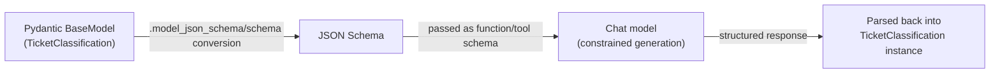
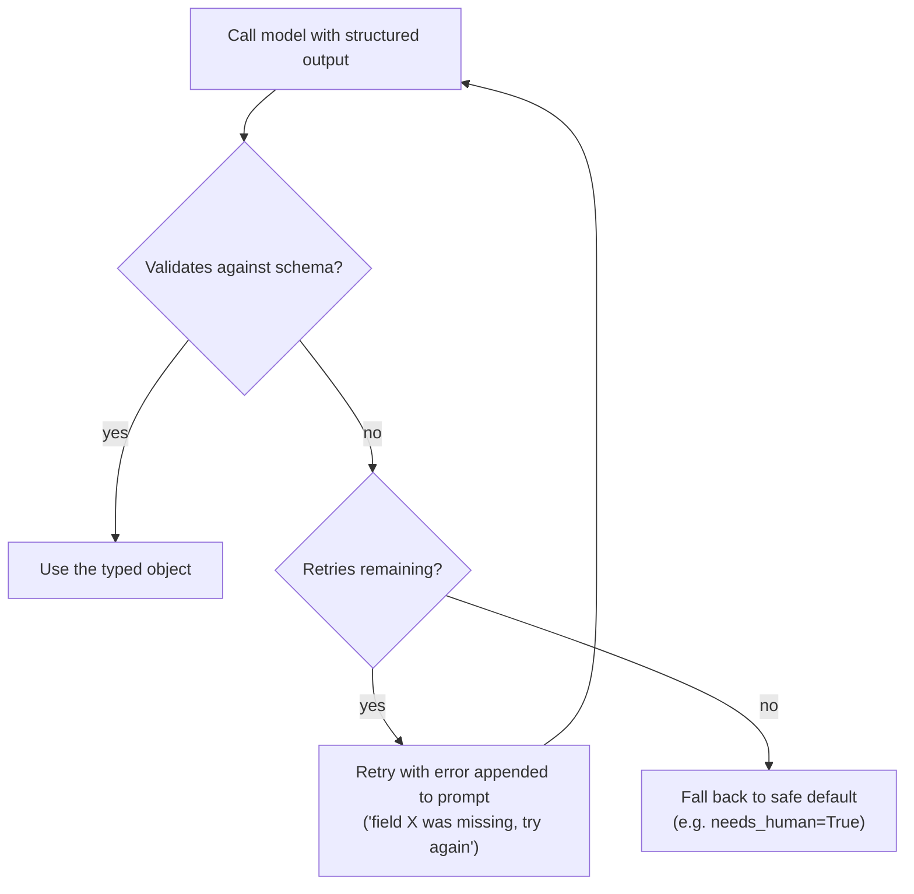

# 4. Pydantic & Structured Outputs

The `classify_intent` node in Module 3 used a string match as a placeholder
(`"order" in message.lower()`) precisely because we hadn't covered a reliable way to get
typed data out of a model yet. Free-text LLM output can't be safely passed to code — APIs,
databases, and downstream agent logic need typed, validated data. Structured outputs turn
"the model said something" into "the model returned an object your program can trust."

## Learning objectives

- Define and validate data shapes with Pydantic v2 `BaseModel`.
- Force a model to return typed data using `with_structured_output` and understand what's
  happening underneath (function/tool-calling schemas).
- Handle validation failures: retries, repair prompts, fallback defaults.
- Design nested and constrained schemas (enums, `Field` constraints, optional fields) for
  reliable extraction.
- Explain why structured outputs are the backbone of reliable tool calling and agents.

## Prerequisites

- [LangChain Fundamentals](../02-langchain-fundamentals/README.md)

## Core concepts

### 4.1 Why raw text output doesn't scale

Asking a model to "reply with JSON" and then `json.loads()`-ing the response works until it
doesn't: the model wraps the JSON in markdown fences, adds a conversational preamble, uses
inconsistent field names, or emits a field with the wrong type. Every one of these is a
silent runtime failure waiting to happen in downstream code. Structured outputs remove this
class of bug by constraining generation itself, not just hoping the model behaves.

### 4.2 Pydantic v2 basics

Pydantic's `BaseModel` defines a schema with Python type hints, and validates data against it
at runtime:

```python
from pydantic import BaseModel, Field
from typing import Literal

class TicketClassification(BaseModel):
    category: Literal["faq", "order", "billing", "unclear"]
    priority: Literal["low", "medium", "high"]
    needs_human: bool = Field(description="True if this requires human judgment")
    extracted_order_id: str | None = Field(default=None, description="Order ID if mentioned")
```

`Field()` adds constraints and — critically for structured outputs — a `description` that
becomes part of the schema shown to the model, guiding what it should extract.

### 4.3 From schema to model constraint

Under the hood, `with_structured_output` converts your Pydantic model into a JSON Schema and
passes it to the provider's function/tool-calling API, telling the model: "your response must
match this exact schema." The model isn't just asked nicely to produce JSON — its output is
constrained (to varying degrees depending on the provider) to conform to the schema.



### 4.4 Handling validation failures

Even with structured output support, generation can fail validation (a provider might not
guarantee schema conformance, or a field might violate an additional constraint your schema
encodes). The standard pattern: catch the validation error, and either retry with a "repair"
prompt describing what went wrong, or fall back to a safe default (e.g. `needs_human=True`).



### 4.5 Nested schemas and enums

Real extraction tasks need more than flat fields: nested objects (e.g. a list of line items),
enums (`Literal[...]` or Python `Enum`) to constrain a field to a fixed set of values, and
optional fields for data that may not be present. Constraining categorical fields to an enum
is one of the highest-leverage reliability techniques in this module — it eliminates an
entire class of "the model returned a category I didn't expect" bugs.

## Scenario walkthrough

Northwind Support Copilot needs to classify an incoming ticket into a structured shape before
routing (replacing Module 3's placeholder string match):
`{category, priority, needs_human, extracted_order_id}`. We define the schema, call the model
with `with_structured_output`, and wire a retry loop for validation failures — directly
completing the `classify_intent` node left unfinished in Module 3.

## Code example

```python
from langchain_openai import ChatOpenAI
from pydantic import BaseModel, Field, ValidationError
from typing import Literal

class TicketClassification(BaseModel):
    category: Literal["faq", "order", "billing", "unclear"]
    priority: Literal["low", "medium", "high"]
    needs_human: bool
    extracted_order_id: str | None = Field(default=None)

model = ChatOpenAI(model="gpt-4.1", temperature=0)
structured_model = model.with_structured_output(TicketClassification)

def classify_intent(message: str, max_retries: int = 2) -> TicketClassification:
    last_error = None
    for attempt in range(max_retries + 1):
        try:
            prompt = message if last_error is None else (
                f"{message}\n\n(Previous attempt failed validation: {last_error}. "
                "Please try again with a valid response.)"
            )
            return structured_model.invoke(prompt)
        except ValidationError as e:
            last_error = str(e)
    # Fallback: safe default that routes to a human instead of failing silently
    return TicketClassification(
        category="unclear", priority="medium", needs_human=True
    )

result = classify_intent("Where's my order #NW-4471? It's been two weeks.")
print(result)
# category='order' priority='medium' needs_human=False extracted_order_id='NW-4471'
```

## Production pitfalls

- **Trusting structured output as guaranteed-valid without a validation/retry path.**
  Provider guarantees vary; always handle the failure case explicitly rather than assuming
  the schema is always honored.
- **Schemas with too many optional/loosely-typed fields.** The looser the schema, the less
  benefit you get — prefer enums and required fields wherever the domain allows it.
- **Silent fallback to defaults that mask real failures.** A fallback like
  `needs_human=True` is good practice, but if you don't log/alert on how often the fallback
  fires, you won't notice the extraction is degrading.
- **Field descriptions that don't actually guide the model.** A vague `description` produces
  vague extraction — write descriptions as if instructing a new employee, not documenting
  code.

## Key takeaways

- Structured outputs constrain generation to a schema instead of hoping free text parses
  correctly.
- Pydantic `BaseModel` + `Field` descriptions define both the validation rules and the
  guidance shown to the model.
- Always pair structured output calls with a validation-failure path: retry with the error,
  or fall back to a safe default.
- Enums/`Literal` types are the single highest-leverage constraint for reliable
  classification-style extraction.
- This module's schema-and-validate pattern is the backbone of reliable tool calling —
  directly setting up [Agents 101](../05-agents-101/README.md).

## Exercises

1. Extend `TicketClassification` with a nested `sentiment: Literal["positive","neutral","negative"]`
   field and a `suggested_response_tone` field, and write the `Field` descriptions.
2. Simulate a validation failure (e.g. a model that sometimes returns `priority: "urgent"`,
   outside the allowed enum) and trace through the retry-then-fallback logic by hand.
3. Design a Pydantic schema for extracting structured data from a multi-item return request
   (order ID, list of items with reason codes, refund vs exchange preference).
4. Explain why constraining `category` to a `Literal` is more reliable than asking the model
   to "pick one of: faq, order, billing, unclear" in free text.

Next: [Agents 101](../05-agents-101/README.md)
