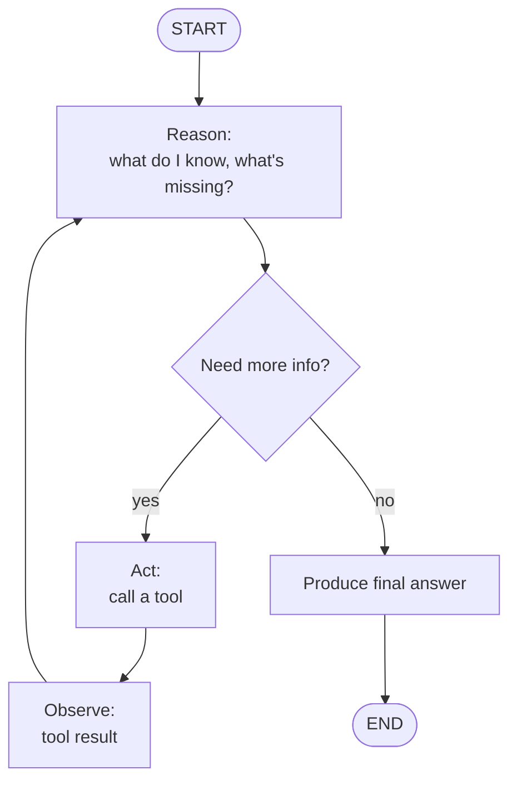
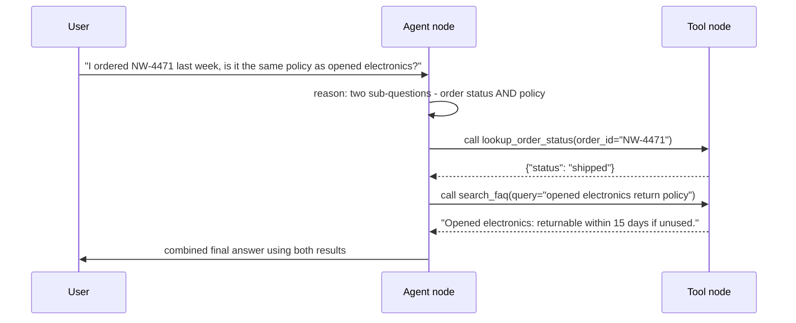

# 5. Agents 101

Everything so far has been building toward this: a graph (Module 3) whose nodes make
reliable typed decisions (Module 4) can now be assembled into something that decides *what to
do next* rather than following a fixed route. That's an agent — the pattern this entire
course's "agent" modules build on.

## Learning objectives

- Define an agent precisely: an LLM in a loop that observes, decides, acts (via tools), and
  repeats until done.
- Explain the ReAct pattern (reason → act → observe) and why it works.
- Build a single-agent tool-calling loop in LangGraph.
- Distinguish an agent's stopping conditions (goal met, max iterations, human handoff).
- Recognize the core failure modes of naive agents at a beginner level (infinite loops, tool
  misuse, hallucinated arguments).

## Prerequisites

- [LangGraph Fundamentals](../03-langgraph-fundamentals/README.md)
- [Pydantic & Structured Outputs](../04-pydantic-and-structured-outputs/README.md)

## Core concepts

### 5.1 Chain vs workflow vs agent, sharpened

Module 3's graph routed a message to one of three fixed nodes based on a classification — the
*path* was still predetermined once the classification was made. An **agent** goes further:
at each step, the model itself decides which action to take next (which tool to call, or
whether to respond directly), and that decision can change based on what happens along the
way. The defining property is a **loop with model-driven branching**, not a fixed route.

### 5.2 The ReAct loop

ReAct (Reason + Act) is the canonical agent pattern: the model reasons about the current
state, chooses an action (typically a tool call), observes the result, and repeats — looping
until it decides it has enough information to give a final answer.



In LangGraph, this loop is exactly the cyclic agent↔tool graph shown in Module 3 §3.3 — ReAct
isn't a separate framework, it's a specific way of using the graph primitives you already
know.

### 5.3 Tools as typed functions

Every tool an agent can call should be a typed function with a clear, constrained input
schema — directly reusing Module 4's Pydantic patterns. A well-described tool schema is the
single biggest lever over whether the agent calls it correctly:

```python
class LookupOrderStatus(BaseModel):
    """Look up the current shipping status of a Northwind order."""
    order_id: str = Field(description="Northwind order ID, formatted like NW-####")
```

Vague tool descriptions produce vague tool usage — the model can only be as precise as the
schema and description let it be.

### 5.4 Building a single agent in LangGraph

An agent graph typically has two nodes in a loop: an **agent node** (calls the model with the
current message history and bound tools; the model decides whether to respond or call a tool)
and a **tool node** (executes whatever tool was requested and appends the result to the
message history). A conditional edge after the agent node checks whether the model requested
a tool call or produced a final answer.

### 5.5 Stopping conditions

An agent loop needs an explicit way to stop, or it can run indefinitely:

- **Goal met** — the model produces a final answer instead of a tool call.
- **Max iterations** — a hard cap on loop count, protecting against runaway loops (a
  misbehaving agent that keeps calling tools without converging).
- **Human handoff** — the agent explicitly decides it can't proceed and escalates (this
  becomes a first-class pattern in
  [Advanced Agent Architectures](../../part-2-advanced-engineering/01-advanced-agent-architectures/README.md)).

### 5.6 Failure modes, previewed

Even a well-built single agent can: loop without making progress (repeatedly calling the same
tool with the same arguments), pick the wrong tool for the task, or hallucinate plausible but
wrong arguments (e.g. inventing an order ID instead of asking the user for one). Module 4's
schema validation catches malformed arguments; catching *wrong-but-valid* arguments and loop
behavior needs the guardrail and evaluation patterns covered in Part 2.

## Scenario walkthrough

Northwind Support Copilot as a real agent, given two tools — `lookup_order_status` and
`search_faq` — and asked a free-form question. Unlike Module 3's fixed router, the agent
itself decides, possibly across multiple steps, whether it needs to call a tool, which one,
and when it has enough information to respond.



## Code example

```python
from typing import Annotated
from typing_extensions import TypedDict
from langgraph.graph import StateGraph, START, END
from langgraph.graph.message import add_messages
from langgraph.prebuilt import ToolNode
from langchain_openai import ChatOpenAI
from langchain_core.tools import tool

@tool
def lookup_order_status(order_id: str) -> dict:
    """Look up the current shipping status of a Northwind order."""
    return {"status": "shipped", "eta": "2026-08-15"}

@tool
def search_faq(query: str) -> str:
    """Search Northwind's FAQ/policy documents for an answer."""
    return "Opened electronics: returnable within 15 days if unused."

tools = [lookup_order_status, search_faq]
model = ChatOpenAI(model="gpt-4.1", temperature=0).bind_tools(tools)

class AgentState(TypedDict):
    messages: Annotated[list, add_messages]

def agent_node(state: AgentState) -> dict:
    return {"messages": [model.invoke(state["messages"])]}

def should_continue(state: AgentState) -> str:
    last = state["messages"][-1]
    return "tools" if getattr(last, "tool_calls", None) else "end"

graph = StateGraph(AgentState)
graph.add_node("agent", agent_node)
graph.add_node("tools", ToolNode(tools))
graph.add_edge(START, "agent")
graph.add_conditional_edges("agent", should_continue, {"tools": "tools", "end": END})
graph.add_edge("tools", "agent")  # loop back after tool execution

app = graph.compile()
result = app.invoke({"messages": [("user", "Where's my order #NW-4471 and can I return opened electronics?")]})
print(result["messages"][-1].content)
```

Note the `max_iterations` guard is not shown here for brevity — in production, always compile
with a recursion/iteration limit (e.g. LangGraph's `recursion_limit`) to guarantee the loop
terminates.

## Production pitfalls

- **No iteration cap.** Always set a hard maximum on agent loop iterations; a plausible-but-
  wrong tool result can cause the model to retry indefinitely.
- **Too many tools bound at once.** Tool selection accuracy degrades as the tool list grows;
  this specific failure mode motivates the supervisor/multi-agent pattern in Part 2.
- **Ambiguous tool descriptions causing wrong tool selection** — reread §5.3 whenever an
  agent picks the wrong tool; it's almost always a description problem, not a "the model is
  bad" problem.
- **No cost visibility.** Every loop iteration is another model call — an agent that loops 8
  times to answer one question costs 8x a single call, with no built-in warning.

## Key takeaways

- An agent is a loop where the model decides the next action, not a fixed route.
- ReAct (reason → act → observe → repeat) is the canonical loop shape, directly expressed as
  a LangGraph cycle.
- Well-typed, well-described tools (Module 4's patterns) are the biggest lever on tool-call
  accuracy.
- Always bound agent loops with a max-iteration guard — unbounded loops are a real production
  risk, not a theoretical one.

## Exercises

1. Add a third tool, `escalate_to_human(reason: str)`, and reason about what tool description
   would make the agent choose it appropriately (not too eagerly, not too rarely).
2. Trace through what happens if `lookup_order_status` returns an error for a malformed order
   ID — does the current loop handle it gracefully, or does it need an explicit branch?
3. Estimate the cost (in model calls) of a worst-case 3-tool-call agent run vs Module 3's
   fixed single-classification workflow for the same question, and discuss when the extra
   cost of agent autonomy is justified.

Next: [Workflows vs Agents](../06-workflows-vs-agents/README.md)
