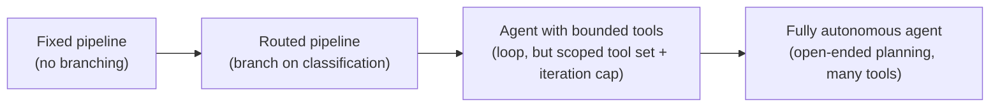
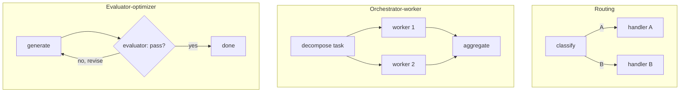

# 6. Workflows vs Agents

The Module 5 exercise asked you to compare the cost of a worst-case agent run against
Module 3's fixed workflow for the same question — that comparison is the entire subject of
this module. "Just use an agent" is a common and expensive mistake. Most production GenAI
features are better built as deterministic workflows with LLM steps than as fully autonomous
agents. Knowing which to reach for, and being able to justify it, is a senior-level skill.

## Learning objectives

- Place a given task on the workflow ↔ agent autonomy spectrum.
- Explain the cost/latency/reliability/predictability trade-offs at each end of the spectrum.
- Implement the standard workflow patterns in LangGraph: prompt chaining, routing,
  parallelization, orchestrator-worker, evaluator-optimizer.
- Decide, given a real requirement, whether a workflow, an agent, or a hybrid is the right
  call — and defend that decision.

## Prerequisites

- [Agents 101](../05-agents-101/README.md)

## Core concepts

### 6.1 The autonomy spectrum



Module 3's classify-then-route graph sits at **B**. Module 5's ReAct agent sits at **C**. As
you move right, you gain flexibility to handle cases you didn't explicitly anticipate — and
you lose predictability, add latency (more model calls per request), add cost, and make
testing harder (the same input can legitimately take different paths across runs).

### 6.2 Why agents cost more

Every point on the spectrum trades determinism for adaptability. A fixed pipeline runs the
same N model calls every time — you can benchmark and budget it precisely. An agent's model
call count is *data-dependent*: a hard question might take 6 tool calls, an easy one might
take 1. This variability makes agents harder to capacity-plan and cost-forecast — a concern
that resurfaces concretely in
[Scaling GenAI Systems](../../part-3-system-design/05-scaling-genai-systems/README.md).

### 6.3 Standard workflow patterns

These patterns (formalized by Anthropic's workflow taxonomy) cover the vast majority of
production LLM pipelines without needing full agent autonomy:

- **Prompt chaining** — a fixed sequence of LLM calls, each step's output feeding the next
  (e.g. draft → critique → revise). This is just an LCEL-style chain, expressed as a linear
  LangGraph path.
- **Routing** — classify the input, then dispatch to a specialized fixed path per category
  (exactly Module 3's example).
- **Parallelization** — run independent LLM calls concurrently and aggregate (e.g. checking a
  message against three separate policy classifiers at once, using `.batch()` or parallel
  graph branches).
- **Orchestrator-worker** — a central step breaks a task into subtasks and dispatches each to
  a worker step, then aggregates results. Looks agent-*like* but the decomposition logic can
  be a single bounded call, not an open-ended loop.
- **Evaluator-optimizer** — one step generates, another step evaluates the output against
  criteria and requests a revision if it fails, looping a bounded number of times.



Every one of these can be built with the LangGraph primitives from Module 3 — the difference
from an agent isn't the tooling, it's whether the *routing/looping logic* is fixed by you or
decided dynamically by the model at runtime.

### 6.4 Decision framework

Ask, in order:

1. **Task variability** — is the set of things that can happen roughly enumerable? If yes,
   route/workflow. If the space of possible needed actions is genuinely open-ended, lean
   agent.
2. **Auditability requirement** — does this need to be explainable/predictable (compliance,
   high-stakes decisions)? Fixed workflows are far easier to audit and test exhaustively.
3. **Tolerance for error** — can a wrong path cost real money/trust (e.g. an unbounded agent
   issuing a refund it shouldn't)? Prefer bounding autonomy around risky actions.
4. **Cost ceiling** — is there a hard per-request cost budget? Fixed workflows are
   predictable; agents are not, without additional bounding.

In practice, most production systems are **hybrids**: a fixed outer workflow (e.g. Module 3's
router) that dispatches into a bounded agent only for the sub-task that genuinely needs
dynamic tool use — not "the whole app is one big autonomous agent."

## Scenario walkthrough

Northwind's ticket triage, modeled two ways. First as a fixed workflow: classify → route by
category (Module 3's exact graph) — cheap, predictable, fully testable with a fixed test
suite of example tickets. Then contrasted with the Module 5 agentic version, which can handle
novel multi-part questions a fixed router can't anticipate, at the cost of unpredictable
latency and spend. What actually ships to Northwind's production support line: the fixed
router for the 90% of tickets that fall into known categories, with a bounded agent
(Module 5's version, capped at 4 iterations) as one branch of that router for the "unclear"
category — not a single all-purpose agent replacing everything.

## Code example

```python
# Orchestrator-worker: decompose a multi-part question into sub-questions,
# answer each independently (in parallel), then synthesize — bounded, not agentic.
from langgraph.graph import StateGraph, START, END
from typing import TypedDict
from langchain_openai import ChatOpenAI

class TriageState(TypedDict):
    question: str
    sub_answers: list[str]
    final_answer: str

model = ChatOpenAI(model="gpt-4.1", temperature=0)

def decompose(state: TriageState) -> dict:
    # Fixed decomposition call, NOT an open-ended agent loop
    return {"sub_answers": []}  # placeholder: would call model once to split into subtasks

def synthesize(state: TriageState) -> dict:
    combined = "\n".join(state["sub_answers"])
    return {"final_answer": f"Combining: {combined}"}

graph = StateGraph(TriageState)
graph.add_node("decompose", decompose)
graph.add_node("synthesize", synthesize)
graph.add_edge(START, "decompose")
graph.add_edge("decompose", "synthesize")
graph.add_edge("synthesize", END)
app = graph.compile()
```

## Production pitfalls

- **Reaching for an agent by default.** The most common over-engineering mistake in this
  space — most tasks don't need open-ended autonomy, and every unnecessary degree of freedom
  is a new failure surface.
- **Under-bounding a hybrid system's agent branch.** Even the "unclear category" agent branch
  in the scenario above needs its own iteration cap and tool scope — hybrids don't get a pass
  on Module 5's pitfalls.
- **No fallback path when a workflow's fixed routing genuinely doesn't fit.** A pure workflow
  with no escape hatch (like an "unclear" branch) will force-fit inputs into the wrong
  category rather than admit uncertainty.
- **Not measuring the cost delta before choosing agent autonomy.** "It felt more flexible" is
  not a substitute for actually comparing model-call counts and latency across the same test
  set for both designs.

## Key takeaways

- The workflow ↔ agent spectrum trades predictability/cost for adaptability — pick a point on
  it deliberately, not by default.
- Prompt chaining, routing, parallelization, orchestrator-worker, and evaluator-optimizer
  cover most production needs without full agent autonomy.
- Decide using task variability, auditability needs, error tolerance, and cost ceiling — in
  that order.
- Most real systems are hybrids: a fixed outer structure with a bounded agent only where
  genuinely needed.

## Exercises

1. Take three Northwind ticket categories (shipping, returns, technical support) and decide,
   with justification, which points on the spectrum each belongs at.
2. Implement the evaluator-optimizer pattern for a "write a policy-compliant response" task:
   a generator node and an evaluator node that loops back up to 3 times.
3. Argue the counter-case: describe a real scenario where a fully autonomous agent is the
   right call despite the cost/predictability trade-offs, and explain what makes it different
   from the Northwind triage case.

Next: [Basic RAG Pipeline](../07-basic-rag-pipeline/README.md)
