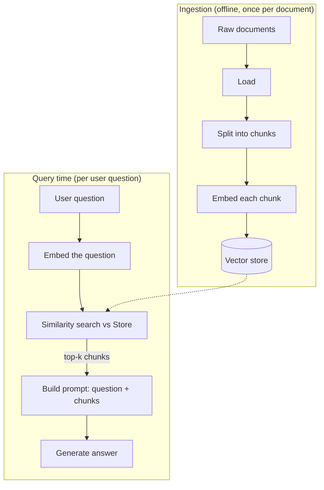

# 7. Basic RAG Pipeline

Module 1 flagged the core problem directly: the model doesn't actually know Northwind's
return policy — it's a next-token predictor, not a lookup against real company data.
Retrieval Augmented Generation (RAG) is the standard pattern for grounding answers in your
own documents instead of the model's training data (frozen at some cutoff) or its
imagination (hallucination).

## Learning objectives

- Explain the problem RAG solves: knowledge cutoff, private/proprietary data, hallucination
  reduction, and source attribution.
- Build the naive RAG pipeline end to end: ingest → chunk → embed → store → retrieve →
  augment → generate.
- Make basic chunking decisions (fixed-size vs recursive/semantic, chunk size and overlap
  trade-offs).
- Explain retrieval quality at a beginner level (recall@k, relevance) well enough to reason
  about whether a pipeline is "working."
- Recognize naive RAG's failure modes, setting up
  [Advanced Production RAG](../../part-2-advanced-engineering/04-advanced-production-rag/README.md).

## Prerequisites

- [LangChain Fundamentals](../02-langchain-fundamentals/README.md)
- Read alongside: [Vector Databases](../08-vector-databases/README.md)

## Core concepts

### 7.1 What RAG solves

Three concrete failures RAG addresses, all traceable to Module 1 §1.1:

- **Knowledge cutoff** — the model was trained on data up to some date; it can't know about a
  policy change from last week.
- **Private data** — the model was never trained on Northwind's internal return policy PDF at
  all; there's nothing to "recall."
- **Hallucination on specifics** — even when the model has *some* related knowledge, it will
  produce fluent, plausible-sounding specifics (exact day counts, exact conditions) that may
  simply be wrong.

RAG's fix: retrieve the actual relevant text at query time and put it directly into the
prompt, so the model is answering from evidence in front of it rather than from memory.

### 7.2 The naive RAG architecture



### 7.3 Ingestion: chunking

Documents are too long to embed as a single unit and retrieve usefully (§1.2's context
budget, plus embeddings lose precision over very long text). **Chunking** splits documents
into smaller pieces before embedding:

- **Fixed-size chunking** — split every N characters/tokens, simple but can cut a sentence or
  idea in half.
- **Recursive/structure-aware chunking** — split on natural boundaries (paragraphs, then
  sentences, then words, only falling through to a smaller unit if a chunk is still too big)
  — generally the better default.
- **Overlap** — chunks share a bit of content at their boundaries (e.g. 10-20%) so an idea
  spanning a chunk boundary isn't lost entirely from either chunk.

Chunk size is a trade-off: too small loses context (a chunk with just "...within 15 days."
with no subject); too large dilutes the embedding's specificity and wastes context-window
budget when retrieved. There's no universal right answer — it depends on document structure
and query style, revisited with real tuning guidance in
[Metadata Filtering & Query Construction](../../part-2-advanced-engineering/04-advanced-production-rag/01-metadata-filtering-and-query-construction/README.md).

### 7.4 Query time: embed, search, retrieve

The user's question is embedded with the *same* embedding model used at ingestion (mixing
embedding models breaks similarity comparisons — the vectors aren't in the same space). A
similarity search against the vector store (Module 8) returns the **top-k** most similar
chunks.

### 7.5 Augmentation and generation

The retrieved chunks are inserted into the prompt alongside the original question — typically
with an instruction to answer *only* using the provided context, and ideally to cite which
chunk supported each claim (source attribution, useful for user trust and for debugging
retrieval quality).

### 7.6 Retrieval quality, briefly

**Recall@k** asks: of the chunks that would actually answer the question, how many appear in
the top-k retrieved? Low recall@k means the right information exists in your corpus but isn't
surfacing — a retrieval problem, not a generation problem. This distinction (retrieval
failure vs generation failure) is the first diagnostic question to ask whenever a RAG answer
is wrong, and it's exactly what
[Corrective RAG](../../part-2-advanced-engineering/04-advanced-production-rag/04-corrective-rag-crag/README.md)
automates.

## Scenario walkthrough

Northwind Support Copilot answering "what's your return policy for opened electronics?" by
grounding in the actual policy PDF instead of guessing (Module 1's original failure case,
now fixed): the PDF is chunked and embedded once at ingestion; at query time the question is
embedded, the most similar chunk (containing the actual 15-day opened-electronics policy) is
retrieved, and the final prompt tells the model to answer using only that chunk.

## Code example

```python
from langchain_community.document_loaders import PyPDFLoader
from langchain_text_splitters import RecursiveCharacterTextSplitter
from langchain_openai import OpenAIEmbeddings, ChatOpenAI
from langchain_community.vectorstores import Chroma
from langchain_core.prompts import ChatPromptTemplate
from langchain_core.output_parsers import StrOutputParser
from langchain_core.runnables import RunnablePassthrough

# --- Ingestion (run once per document) ---
docs = PyPDFLoader("northwind_return_policy.pdf").load()
splitter = RecursiveCharacterTextSplitter(chunk_size=500, chunk_overlap=75)
chunks = splitter.split_documents(docs)

embeddings = OpenAIEmbeddings(model="text-embedding-3-small")
vector_store = Chroma.from_documents(chunks, embeddings)
retriever = vector_store.as_retriever(search_kwargs={"k": 4})

# --- Query time ---
prompt = ChatPromptTemplate.from_template(
    "Answer the question using ONLY the context below. "
    "If the answer isn't in the context, say you don't know.\n\n"
    "Context:\n{context}\n\nQuestion: {question}"
)
model = ChatOpenAI(model="gpt-4.1", temperature=0)

def format_docs(docs) -> str:
    return "\n\n".join(d.page_content for d in docs)

rag_chain = (
    {"context": retriever | format_docs, "question": RunnablePassthrough()}
    | prompt
    | model
    | StrOutputParser()
)

answer = rag_chain.invoke("Do you accept returns on opened electronics?")
print(answer)
```

## Production pitfalls

- **No fallback when retrieval finds nothing relevant.** Without an explicit "if the context
  doesn't answer this, say so" instruction, the model will often answer from its own
  (possibly wrong) knowledge anyway — silently defeating the point of RAG.
- **Chunk size chosen arbitrarily and never revisited.** Chunking quality has an outsized
  effect on recall@k; treat it as a tunable parameter, not a one-time default.
- **Mixing embedding models between ingestion and query.** Vectors from different embedding
  models are not comparable — this is a subtle bug that silently produces garbage retrieval.
- **No source attribution.** Without showing which chunk backed an answer, you can't debug a
  wrong answer (was it a retrieval failure or a generation failure?) and users can't verify
  claims.
- **Treating naive RAG as the final architecture.** This pipeline plateaus quickly on real
  corpora — ambiguous queries, wrong-scope chunks, and multi-hop questions all need the
  techniques in Part 2 Module 4.

## Key takeaways

- RAG grounds generation in retrieved evidence instead of relying on model memory, fixing
  knowledge cutoff, private-data, and hallucination-on-specifics problems.
- The naive pipeline is: ingest → chunk → embed → store (once) and embed query → search →
  augment → generate (per request).
- Chunking strategy (size, overlap, structure-awareness) materially affects retrieval
  quality.
- Recall@k separates retrieval failures from generation failures — always diagnose which one
  you're looking at before trying to fix a wrong answer.
- This is a starting point, not an endpoint — naive RAG's failure modes motivate all of
  Advanced Production RAG in Part 2.

## Exercises

1. Chunk the same document at 200, 500, and 1500 characters and manually inspect a few chunks
   for each — identify a case where a small chunk size loses necessary context.
2. Modify the prompt template to require the model to cite which numbered chunk supported
   each claim in its answer.
3. Construct a query you'd expect to have low recall@k against a policy-document corpus (e.g.
   a question phrased very differently from the document's wording), and explain why.
4. Explain, given §7.6, how you'd tell whether a wrong answer from this pipeline was a
   retrieval failure or a generation failure, using only the chunks that were retrieved.

Next: [Vector Databases](../08-vector-databases/README.md)
