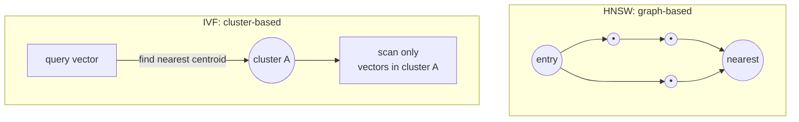

# 8. Vector Databases

Module 7's pipeline treated the "vector store" as a black box:
`Chroma.from_documents(...)` and `.as_retriever()`. This module opens that box. RAG and
semantic memory both depend on finding "similar" vectors among potentially millions, fast —
understanding how vector databases actually index and search data is what lets you reason
about recall, latency, and cost trade-offs instead of treating retrieval quality as
unexplainable.

## Learning objectives

- Explain similarity metrics (cosine similarity, dot product, Euclidean/L2 distance) and when
  they diverge in practice.
- Explain why exact k-nearest-neighbors doesn't scale, and what approximate nearest neighbor
  (ANN) search trades away to fix that.
- Compare index types conceptually: HNSW (graph-based) and IVF (+ product quantization,
  cluster-based).
- Compare popular vector databases/libraries on the axes that matter for a real decision.
- Pick a vector store for a given scenario and justify the choice.

## Prerequisites

- [GenAI & LLM Basics](../01-genai-and-llm-basics/README.md)

## Core concepts

### 8.1 Recap: embeddings as points in space

From Module 1 §1.4: an embedding model maps text to a vector such that similar meaning means
nearby vectors. A vector database's entire job is: given a query vector, find the `k` stored
vectors nearest to it, fast, at scale, optionally filtered by metadata.

### 8.2 Similarity metrics

- **Cosine similarity** — measures the angle between two vectors, ignoring magnitude. Most
  common default for text embeddings, especially when embeddings are normalized.
- **Dot product** — similar to cosine but sensitive to vector magnitude; equivalent to cosine
  similarity if vectors are pre-normalized to unit length (which is why many systems
  normalize embeddings and then just use dot product for speed).
- **Euclidean / L2 distance** — straight-line distance between points; more sensitive to
  magnitude differences, less common for text embeddings but standard for some other domains.

The practical implication: **if your embeddings aren't normalized, cosine and dot product can
give different rankings** — always check which metric your embedding model was
trained/recommended for, and configure your vector store to match. A mismatch here is a
quiet, hard-to-notice cause of degraded retrieval quality.

### 8.3 Why exact search doesn't scale

Exact k-nearest-neighbors means comparing the query vector against *every* stored vector —
`O(n)` per query. At 10 thousand documents this is fine. At 10 million chunks (the scale
Part 3's "Ledger" system targets), brute-force search becomes too slow for interactive
queries. **Approximate Nearest Neighbor (ANN)** search trades a small amount of recall
(you might miss the *actual* single closest vector occasionally) for orders-of-magnitude
faster lookups, by building an index structure that avoids comparing against everything.

### 8.4 Index types

**HNSW (Hierarchical Navigable Small World)** — builds a multi-layer graph where each vector
is a node connected to its approximate neighbors; search "navigates" the graph from a coarse
top layer down to a fine bottom layer, homing in on the nearest neighbors without scanning
every vector. Generally excellent recall/latency trade-off, higher memory usage, index build
is more expensive to update incrementally at very high write rates.

**IVF (Inverted File Index)** — clusters vectors into buckets (via k-means-style
clustering) at index build time; a query first finds the closest cluster centroid(s), then
only searches within those buckets. Often paired with **Product Quantization (PQ)**, which
compresses vectors to reduce memory footprint at some further recall cost. Generally lower
memory than HNSW, faster to build/update, sometimes lower recall for the same latency budget.



Neither is universally "better" — HNSW tends to win on recall/latency when memory isn't the
binding constraint; IVF(+PQ) tends to win when the corpus is too large to fit an HNSW graph
affordably in memory. This trade-off is revisited concretely at the 10M+ document scale in
[Database Scaling Strategies](../../part-3-system-design/10-database-scaling-strategies/README.md).

### 8.5 Metadata filtering

Most real vector databases support attaching metadata (key-value fields) to each vector and
filtering on it *alongside* the similarity search (e.g. "find similar vectors WHERE
`category = 'electronics'`"). This matters enormously for RAG precision — a brief preview
here, with the full technique in
[Metadata Filtering & Query Construction](../../part-2-advanced-engineering/04-advanced-production-rag/01-metadata-filtering-and-query-construction/README.md).
Not every vector store supports *pre-filtering* (filter before the ANN search narrows
candidates) as efficiently — some only support *post-filtering* (search first, then discard
non-matching results), which can silently return fewer than `k` results if the filter is
narrow. This is a real, easy-to-miss capability difference between vector stores.

### 8.6 Landscape comparison

| Store | Type | Notes |
|---|---|---|
| **pgvector** | Postgres extension | Vectors live next to your relational data; simplest ops story if you already run Postgres; scales less far than purpose-built stores |
| **Pinecone** | Managed, cloud-only | Fully managed ANN search, strong filtering support, usage-based pricing, no self-hosting option |
| **Weaviate** | Managed or self-hosted | Built-in hybrid search (Part 2 Module 4c), GraphQL-ish query API, good metadata filtering |
| **Milvus** | Self-hosted (or managed via Zilliz) | Built for very large scale, supports multiple index types, more operational complexity |
| **Qdrant** | Managed or self-hosted | Strong filtering performance, Rust-based, good middle ground on ops complexity |
| **Chroma** | Self-hosted, embedded-friendly | Simplest to start with locally/in a demo (used in Module 7's code), less proven at very large scale |
| **FAISS** | Library, not a database | No server, no persistence/metadata layer out of the box — a building block for a custom system, not a drop-in store |

Decision axes: managed vs self-hosted (ops burden vs control/cost), filtering support and
performance, scale ceiling, and pricing model (usage-based vs infrastructure cost).

## Scenario walkthrough

Two vector store decisions, same underlying question, different scale:

- **Northwind Support Copilot** (tens of thousands of policy/product docs, needs metadata
  filters by product category, wants minimal ops burden): a managed store like Pinecone or
  Weaviate is a reasonable default — the corpus is small enough that index choice barely
  matters, and minimizing operational work matters more.
- **"Ledger" capstone system** (tens of millions of document chunks, strict latency SLOs,
  heavy filtering by tenant and document type): this decision gets real teeth — sharding,
  index type, and self-hosted-vs-managed cost at that volume are all live trade-offs, deferred
  to [Database Scaling Strategies](../../part-3-system-design/10-database-scaling-strategies/README.md)
  where it's addressed properly with capacity math.

Same question ("which vector store"), very different answer depending on scale — a preview of
why this course treats "basics" (Part 1) and "at scale" (Part 3) as genuinely different
disciplines, not just more of the same.

## Code example

```python
from langchain_community.vectorstores import Chroma
from langchain_openai import OpenAIEmbeddings

embeddings = OpenAIEmbeddings(model="text-embedding-3-small")
vector_store = Chroma(embedding_function=embeddings, collection_name="northwind_docs")

# Upsert with metadata
vector_store.add_texts(
    texts=["Opened electronics: returnable within 15 days if unused."],
    metadatas=[{"category": "electronics", "doc_type": "return_policy"}],
    ids=["policy-electronics-001"],
)

# Query top-k with a metadata filter (pre-filtered narrowing before similarity ranking)
results = vector_store.similarity_search(
    query="can I return an opened item?",
    k=4,
    filter={"category": "electronics"},
)
for r in results:
    print(r.page_content, r.metadata)
```

## Production pitfalls

- **Mismatched similarity metric** — configuring the store for L2 distance when the embedding
  model expects cosine similarity silently degrades ranking quality without an obvious error.
- **Assuming pre-filtering when the store only post-filters** — a narrow metadata filter can
  return fewer than `k` results, or none, if the store searches first and filters after.
- **Choosing a store based on scale you don't have yet.** Over-engineering for "Ledger"-scale
  concerns on a Northwind-scale corpus adds operational cost for no retrieval benefit.
- **Never re-evaluating the choice as the corpus grows.** A store that was fine at 50k
  documents may not remain the right choice at 5M — treat this as a decision to revisit, not
  a one-time commitment.

## Key takeaways

- A vector database's core job is fast approximate nearest-neighbor search over embeddings,
  optionally combined with metadata filtering.
- Cosine similarity, dot product, and L2 distance can rank differently — match the metric to
  what your embedding model expects.
- HNSW (graph-based) and IVF+PQ (cluster-based) are the two dominant ANN index families, with
  a recall/latency/memory trade-off between them.
- Metadata filtering support (and whether it's pre- or post-filter) is a real differentiator
  between vector stores, not a minor detail.
- The right vector store choice depends heavily on scale — revisit this decision as your
  corpus grows, formalized fully in Part 3.

## Exercises

1. Explain why comparing an unnormalized dot product against normalized cosine similarity for
   the same pair of vectors could rank two candidate chunks in a different order.
2. For a given store from the landscape table, look up whether its metadata filtering is
   pre-filter or post-filter, and explain the practical consequence of that choice for a
   narrow filter (e.g. filtering to a single rare category).
3. Given a corpus growing from 50,000 to 5,000,000 chunks, argue at what rough point you'd
   reconsider a self-hosted-Chroma decision, and what you'd reconsider it in favor of.

Next: [Part 2 — Advanced GenAI Engineering](../../part-2-advanced-engineering/README.md)
