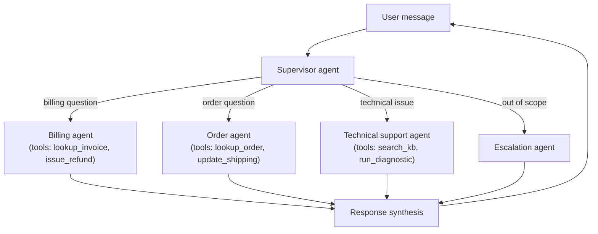
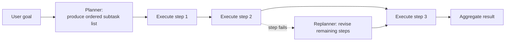
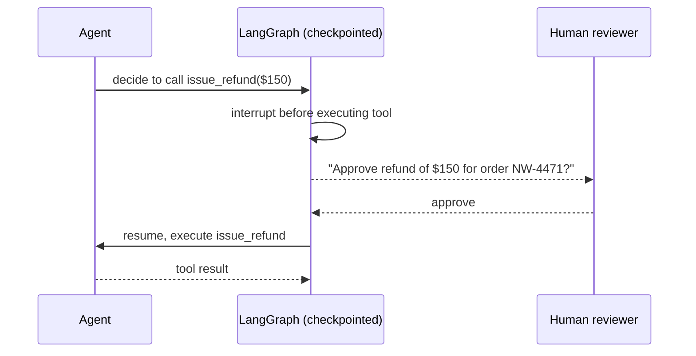

# 1. Advanced Agent Architectures

Module 5's exercises asked you to add a third tool and reason about description quality —
that keeps working at 3 tools. It stops working at 15. A single agent with a large,
heterogeneous tool set suffers from tool-selection confusion, context pollution (every tool
schema costs tokens, whether used or not), and no separation of concerns. Production agent
systems compose multiple specialized agents, add explicit planning, self-critique, and human
checkpoints — this module covers each pattern.

## Learning objectives

- Diagnose why single-agent designs break down as tool count and task complexity grow.
- Implement the supervisor/orchestrator-worker multi-agent pattern in LangGraph.
- Implement planner-executor separation (plan first, then execute steps).
- Implement a reflection/self-critique loop and know when the extra cost is worth it.
- Design human-in-the-loop checkpoints using LangGraph interrupts.
- Design agent-to-agent handoff: what state transfers between agents, what doesn't.

## Prerequisites

- [Agents 101](../../part-1-foundations/05-agents-101/README.md)
- [Workflows vs Agents](../../part-1-foundations/06-workflows-vs-agents/README.md)

## Core concepts

### 1.1 Why single agents break at scale

Picture Northwind's agent from Module 5 growing from 2 tools to 15: order lookup, refund
issuance, shipping updates, billing disputes, warranty lookup, product specs, FAQ search,
escalation, and more. Three concrete failure modes emerge:

- **Tool-selection confusion** — with many semantically similar tools (`issue_refund` vs
  `issue_partial_refund` vs `issue_store_credit`), the model's chance of picking correctly per
  call drops.
- **Context pollution** — every bound tool's schema is sent with *every* model call whether
  used or not; 15 verbose tool schemas burn a meaningful chunk of the context budget
  (Module 1 §1.2) before the actual conversation even starts.
- **No separation of concerns** — a bug in how the agent handles billing logic risks breaking
  order-lookup behavior too, because it's all one prompt and one set of instructions.

### 1.2 Supervisor / orchestrator-worker pattern

A **supervisor** agent doesn't do the work itself — it routes each request to one of several
**specialist sub-agents**, each with a small, focused tool set and its own system prompt. This
is Module 6's orchestrator-worker workflow pattern, but with LLM-driven (not fixed) routing,
and full agent loops as the workers instead of single calls.



Each sub-agent only ever sees its own small tool set — directly fixing §1.1's context
pollution and tool-selection confusion, at the cost of an extra routing hop (latency, and one
more model call).

### 1.3 Planner-executor separation

Instead of deciding one action at a time (ReAct's step-by-step loop), a **planner** step
produces an upfront plan (a sequence of subtasks), and an **executor** carries it out,
optionally replanning if a step fails. This trades some adaptability (the plan is fixed once
made) for auditability — you can show a user or reviewer the plan *before* any action
executes, valuable for higher-stakes actions.



### 1.4 Reflection / self-critique

A **generator** produces an output; a **critic** (often the same model with a different
prompt, or a separate smaller model) evaluates it against explicit criteria and requests a
revision if it fails — Module 6's evaluator-optimizer pattern, applied inside an agent's
final-answer step rather than a single generation task. This catches errors the generator
alone wouldn't self-correct, at roughly double (or more) the cost per handled request — worth
it for high-stakes outputs (compliance-sensitive answers), often not worth it for low-stakes
FAQ responses. Always measure the accuracy lift against the cost multiplier before adopting
this by default.

### 1.5 Human-in-the-loop

LangGraph's **interrupt** capability pauses graph execution at a designated point — e.g.
right before a `issue_refund` tool call — and waits for external approval before resuming,
using the checkpointing mechanism from
[LangGraph Fundamentals](../../part-1-foundations/03-langgraph-fundamentals/README.md) §3.4
to persist state across the pause. This turns "the agent might do something wrong" into "the
agent proposes, a human disposes," for the specific actions where that matters.



### 1.6 Agent-to-agent handoff

When the supervisor pattern hands off from one sub-agent to another (e.g. billing agent
realizes the real issue is a shipping problem), decide explicitly what state transfers:
usually the conversation history and any extracted facts (order ID, customer ID) transfer;
internal reasoning/scratchpad state usually should not, to avoid leaking one agent's
assumptions into another's context unnecessarily.

## Scenario walkthrough

Northwind Support Copilot evolves from Module 5's single 2-tool agent into a supervisor
routing to four specialists: billing, order, technical support, and escalation agents — each
with 2-4 tools instead of one agent holding all of them. A refund over $100 triggers a
human-in-the-loop interrupt before execution. The escalation agent itself uses no tools at
all — its only job is producing a clear handoff summary for a human agent, deliberately kept
simple rather than "smart," since escalation is the safety-net path.

## Code example

```python
from langgraph.graph import StateGraph, START, END
from langgraph.types import interrupt, Command
from typing import Annotated, Literal
from typing_extensions import TypedDict
from langgraph.graph.message import add_messages
from langchain_openai import ChatOpenAI

class SupervisorState(TypedDict):
    messages: Annotated[list, add_messages]
    route: Literal["billing", "order", "technical", "escalation"]

router_model = ChatOpenAI(model="gpt-4.1", temperature=0)

def supervisor(state: SupervisorState) -> dict:
    # In practice: structured output classifying into one of the 4 routes (Module 4 pattern)
    return {"route": "billing"}

def billing_agent(state: SupervisorState) -> dict:
    refund_amount = 150  # derived from the agent's reasoning in a real implementation
    if refund_amount > 100:
        approved = interrupt(
            {"question": f"Approve refund of ${refund_amount}?", "amount": refund_amount}
        )
        if not approved:
            return {"messages": [("assistant", "Refund not approved, escalating to a human.")]}
    return {"messages": [("assistant", f"Refund of ${refund_amount} issued.")]}

def route_to_specialist(state: SupervisorState) -> str:
    return state["route"]

graph = StateGraph(SupervisorState)
graph.add_node("supervisor", supervisor)
graph.add_node("billing", billing_agent)
# ... order, technical, escalation nodes omitted for brevity, same shape as billing_agent

graph.add_edge(START, "supervisor")
graph.add_conditional_edges("supervisor", route_to_specialist, {"billing": "billing"})
graph.add_edge("billing", END)

app = graph.compile(checkpointer=...)  # a real checkpointer is required for interrupt() to work
```

## Production pitfalls

- **Cost explosion from reflection loops applied everywhere.** Reserve self-critique for
  outputs where the accuracy lift justifies roughly doubling cost — not every generation
  needs a critic pass.
- **Supervisor becoming a bottleneck or single point of failure.** If the supervisor
  misroutes, every downstream specialist inherits the wrong context — invest in the
  supervisor's routing accuracy at least as much as any individual specialist.
- **Losing observability across agent handoffs.** A wrong final answer three hops into a
  multi-agent chain is hard to debug without tracing that shows which agent did what — this
  is picked up properly in
  [LLMOps: Observability & Security](../07-llmops-observability-and-security/README.md).
- **Forgetting a checkpointer when using `interrupt()`.** Human-in-the-loop pauses require
  persisted state (Module 3 §3.4) — without a real checkpointer, resuming after approval
  doesn't work.
- **Over-decomposing into too many specialist agents.** Each additional hop adds latency and
  a routing-error opportunity; specialize only where tool sets genuinely don't overlap.

## Key takeaways

- Single agents degrade with tool count due to selection confusion and context pollution —
  the supervisor pattern fixes both by giving each specialist a small, focused tool set.
- Planner-executor trades some adaptability for auditability — valuable when a plan should be
  inspectable before execution.
- Reflection/self-critique catches errors generation alone won't, at a real cost multiplier —
  apply it selectively, not universally.
- Human-in-the-loop interrupts require checkpointed state and are the standard way to gate
  high-risk actions without giving up automation for the rest of the flow.
- Explicit design of what state transfers on agent handoff prevents context leakage between
  specialists.

## Exercises

1. Design the tool sets for Northwind's four specialist agents such that no tool needs to
   exist on more than one agent, and identify any request type that would require handoff
   between two of them.
2. Add a reflection step to the billing agent's refund response that checks it against a
   "never promise a refund timeframe we can't guarantee" rule, and reason about whether this
   is worth the added cost for this specific action.
3. Sketch the state fields that should and shouldn't transfer when the technical support
   agent hands off to the billing agent mid-conversation.

Next: [Context & Memory Management at Scale](../02-context-and-memory-management-at-scale/README.md)
