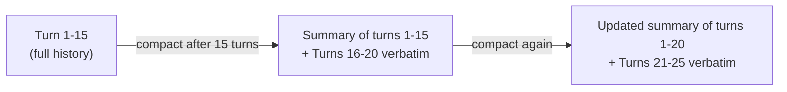
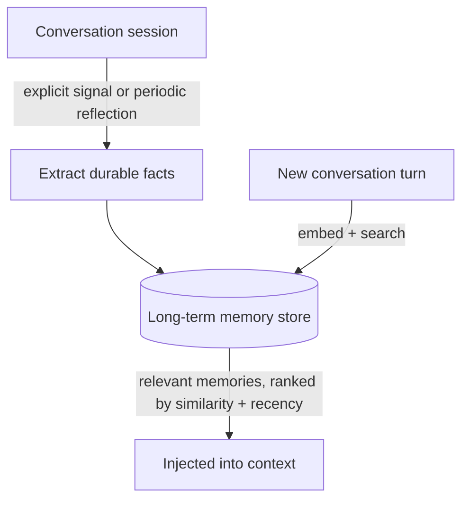

# 2. Context & Memory Management at Scale

Module 1's supervisor pattern reduces tool count per agent, but a long troubleshooting
session — many tool calls, many results, many turns — still accumulates messages inside a
single agent's state until it presses against the context window (Module 1 §1.2). Context
windows are finite and expensive, and conversations/agent runs outlive any one window.
Without deliberate context and memory management, agents forget critical facts, re-fetch
redundant data, or blow the token budget mid-task.

## Learning objectives

- Distinguish context (what's in the current model call) from memory (what persists across
  turns or sessions).
- Classify memory types: short-term (working/conversation) and long-term (episodic, semantic,
  procedural).
- Implement context compaction: summarization, sliding windows, relevance-based pruning, and
  tool-output truncation.
- Design a memory store's write and retrieval logic, independent of any one vendor.
- Recognize context-rot failure modes: lost-in-the-middle, stale facts, contradictory memory.

## Prerequisites

- [Advanced Agent Architectures](../01-advanced-agent-architectures/README.md)

## Core concepts

### 2.1 Context vs memory — precise definitions

**Context** is everything sent to the model in a single call — system prompt, conversation
history, retrieved documents, tool schemas, tool outputs. It exists only for that call and is
rebuilt (from something) every time. **Memory** is anything that persists *beyond* a single
call, and gets selectively pulled back into context when relevant. Conflating them causes a
specific bug: treating "it's in the conversation history" as equivalent to "the agent will
remember it forever" — history gets truncated or summarized away (§2.3), while memory
(§2.4) is explicitly designed to survive.

### 2.2 Why context fills up fast in agent loops

Recall Module 1's specialist agents and Module 5's ReAct loop: every tool call and its result
gets appended to the message history and resent on every subsequent model call within that
loop. A troubleshooting session with 10 tool calls, each returning a moderately sized result,
can consume a large fraction of even a generous context window before the conversation
concludes — and unlike a single long document, this growth is open-ended and hard to predict
upfront.

### 2.3 Compaction techniques

- **Rolling summarization** — periodically (e.g. every N turns) replace older messages with
  an LLM-generated summary, keeping only recent turns verbatim plus the running summary.
- **Sliding window + summary** — keep the last K messages in full, everything older
  compressed into a single summary block that updates as the window slides.
- **Selective retrieval into context** — instead of keeping full history resident, store it
  externally (§2.5) and retrieve only the relevant pieces per turn, similar in spirit to RAG
  but over the conversation's own history.
- **Tool-output truncation** — large tool results (e.g. a big JSON payload) are summarized or
  truncated to the fields actually needed before being appended to history, rather than kept
  in full indefinitely.



### 2.4 Memory taxonomy

- **Working memory** — the current task's active state; roughly equivalent to context itself
  during one session.
- **Episodic memory** — records of specific past interactions ("this customer asked about a
  return three weeks ago and it was denied").
- **Semantic memory** — general facts/preferences learned over time, decoupled from any one
  conversation ("this customer prefers email over SMS notifications").
- **Procedural memory** — learned strategies about *how* to do something effectively (less
  common in application-level agents today, more relevant as agents self-improve over many
  runs).

### 2.5 Memory store design

A memory store needs explicit answers to three questions:

1. **Write triggers** — when does something get written to long-term memory? Options: after
   every turn (expensive, noisy), on explicit signals (user states a preference), or via a
   periodic "reflection" pass that extracts durable facts from a completed session.
2. **Retrieval** — typically vector search over stored memories (reusing
   [Vector Databases](../../part-1-foundations/08-vector-databases/README.md)) combined with
   recency and/or importance scoring, so the most relevant *and* most recent memories surface,
   not just the most semantically similar ones.
3. **Merge/conflict handling** — what happens when a new fact contradicts a stored one (e.g.
   customer's address changed)? Naive systems accumulate contradictions silently; better ones
   version or overwrite based on recency and explicit conflict detection.



## Scenario walkthrough

Two distinct problems, same underlying system: Northwind Support Copilot needs to (1)
remember a customer's stated shipping preference ("always leave packages with the doorman")
across sessions weeks apart — a semantic long-term memory write-then-retrieve — while also
(2) managing a single 40-tool-call troubleshooting session about a complex multi-item order
issue without hitting the context limit mid-session — rolling summarization plus tool-output
truncation. These are genuinely different mechanisms solving genuinely different problems,
which is exactly why §2.1's distinction matters in practice, not just in definition.

## Code example

```python
from langgraph.checkpoint.memory import MemorySaver
from langchain_openai import ChatOpenAI, OpenAIEmbeddings
from langchain_community.vectorstores import Chroma

# --- Short-term: LangGraph checkpointing handles working memory within a session ---
checkpointer = MemorySaver()  # in production: a persistent checkpointer, not in-memory

# --- Long-term: a simple vector-backed semantic memory store ---
embeddings = OpenAIEmbeddings(model="text-embedding-3-small")
memory_store = Chroma(embedding_function=embeddings, collection_name="customer_memory")

def write_memory(customer_id: str, fact: str) -> None:
    memory_store.add_texts(texts=[fact], metadatas=[{"customer_id": customer_id}])

def retrieve_memory(customer_id: str, query: str, k: int = 3) -> list[str]:
    results = memory_store.similarity_search(
        query, k=k, filter={"customer_id": customer_id}
    )
    return [r.page_content for r in results]

# Explicit-signal write trigger
write_memory("cust-8821", "Prefers packages left with the building doorman.")

# Retrieval at the start of a new session
relevant_facts = retrieve_memory("cust-8821", "where should I deliver this package?")
```

```python
model = ChatOpenAI(model="gpt-4.1", temperature=0)

def summarize_if_needed(messages: list, max_turns: int = 15) -> list:
    if len(messages) <= max_turns:
        return messages
    older, recent = messages[:-max_turns], messages[-max_turns:]
    summary_prompt = f"Summarize this conversation history concisely, keeping key facts:\n{older}"
    summary = model.invoke(summary_prompt).content
    return [("system", f"Earlier conversation summary: {summary}")] + recent
```

## Production pitfalls

- **Memory poisoning.** A wrong or outdated fact written to long-term memory persists and
  silently corrupts future sessions until explicitly corrected — write triggers need some
  confidence threshold, not "write everything."
- **Unbounded memory growth.** Without eviction/expiry, a memory store grows indefinitely,
  degrading retrieval precision (more near-duplicate/stale memories competing for top-k) and
  cost — full treatment of this at scale in
  [Memory & State at Scale](../../part-3-system-design/07-memory-and-state-at-scale/README.md).
- **Retrieving irrelevant memories that derail the agent.** A memory retrieved by shaky
  semantic similarity but wrong in context can mislead the agent more than having no memory
  at all — combine similarity with recency/confidence, don't rely on similarity alone.
- **Summarizing away information that turns out to matter later.** Aggressive compaction is a
  lossy operation — there's no way to fully avoid this trade-off, only tune how aggressively
  you compact against how much context budget you can afford to spend.

## Key takeaways

- Context is per-call and rebuilt every time; memory persists beyond a call and is
  selectively pulled back in — conflating them causes real bugs.
- Compaction (summarization, sliding windows, truncation) manages context growth within a
  single long session.
- Memory stores need explicit write triggers, retrieval logic (similarity + recency), and
  conflict handling — not just "save everything to a vector store."
- This module's patterns are conversation/session-scale; the same problems at
  millions-of-users scale need dedicated infrastructure, covered in Part 3.

## Exercises

1. Design write triggers for Northwind's memory store that avoid writing low-confidence or
   noisy facts (e.g. a one-off complaint vs a stated durable preference).
2. Modify the summarization example to preserve specific fact types (order IDs, customer
   preferences) verbatim even when older turns are compacted away.
3. Describe a concrete scenario where retrieving a semantically similar but contextually
   wrong memory would produce a worse outcome than retrieving nothing.

Next: [Caching in Agents](../03-caching-in-agents/README.md)
