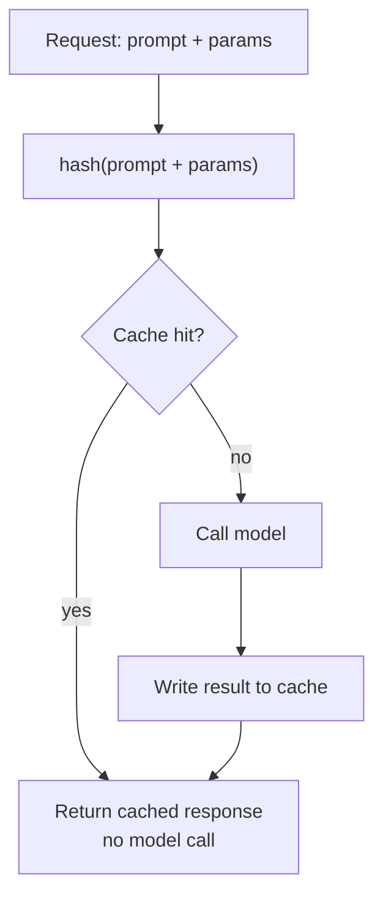
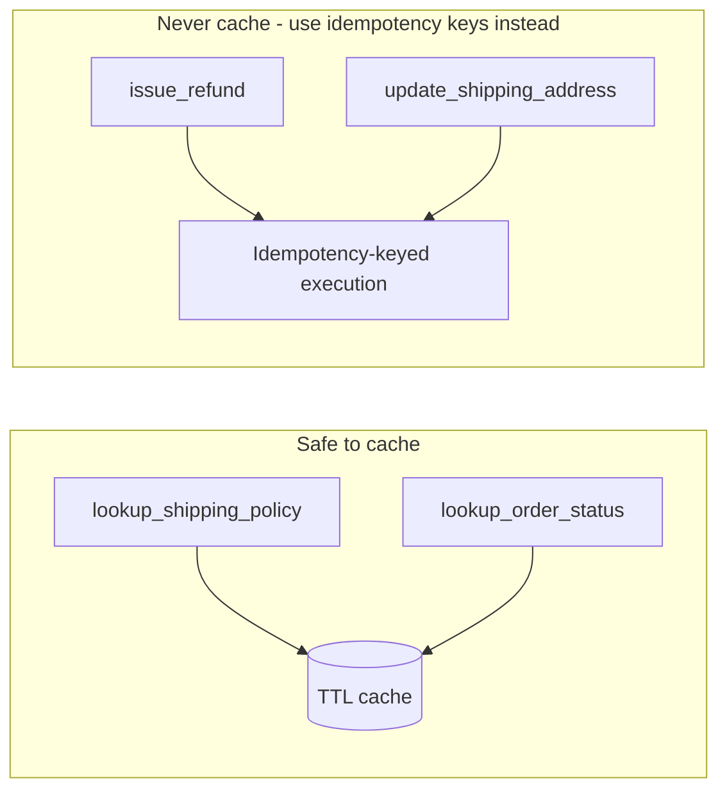

# 3. Caching in Agents

Module 2's 40-tool-call troubleshooting session isn't just a context problem — every one of
those calls is also a real latency and dollar cost. LLM calls are the slowest and most
expensive part of an agent loop. Caching — at the prompt, response, and tool-call level — is
often the single highest-leverage optimization available before you touch infrastructure at
all.

## Learning objectives

- Distinguish provider-side prompt caching from application-level response caching.
- Implement exact-match response caching for deterministic sub-tasks.
- Explain semantic caching conceptually and know its risk profile, ahead of its full system
  design in Part 3.
- Cache tool calls safely: idempotency, staleness windows, never caching writes.
- Design a cache invalidation strategy: TTL, event-driven invalidation, versioning.

## Prerequisites

- [Advanced Agent Architectures](../01-advanced-agent-architectures/README.md)

## Core concepts

### 3.1 Where the cost actually goes

In an agent loop (Module 5/Module 1's patterns), every iteration is at minimum one model call
plus, often, one tool call. A session with 8 loop iterations makes 8 model calls whether or
not the underlying question set repeats across users — and support questions repeat *a lot*
("what's your return policy" gets asked constantly). Caching exploits that repetition.

### 3.2 Provider-side prompt caching

Many providers let you mark a prefix of your prompt (e.g. a long, unchanging system prompt or
tool schema block) as cacheable — the provider stores its internal processed representation
of that prefix and reuses it on subsequent calls sharing the same prefix, reducing cost and
latency for the *processing* of that portion. This helps with the fixed parts of every call
(system prompt, tool definitions) but does **not** cache the actual response — a different
user question still requires full generation. It's a partial optimization, not a substitute
for the application-level caching in §3.3.

### 3.3 Application-level exact caching

For deterministic sub-tasks — a classification call, a lookup with no side effects — cache
the full input→output mapping: hash the prompt + parameters, check the cache before calling
the model, write the result to the cache after. This fully eliminates the model call on a
cache hit, unlike prompt caching which only speeds up part of it.



### 3.4 Semantic caching, previewed

Exact caching only helps when the *literal* input repeats. **Semantic caching** looks up the
cache by embedding similarity instead of exact match — "what's your return policy" and "can I
return something" could hit the same cached answer. This is powerful (much higher hit rate)
and risky (a false-positive similarity match can serve a confidently wrong cached answer to a
different question). Treat this as a preview only — the full architecture, threshold tuning,
and invalidation-at-scale treatment is in
[Semantic Caching at Scale](../../part-3-system-design/08-semantic-caching-at-scale/README.md).

### 3.5 Caching tool calls with side effects

The critical rule: **only cache read tools, never write tools.** `lookup_shipping_policy` is
safe to cache with a long TTL — the answer doesn't change often and calling it twice causes
no harm either way. `create_refund` must never be served from cache — a cached "successful
refund" response for a call that didn't actually execute this time is a direct financial bug.
For tools that must be safely retried (e.g. a flaky network call to a write endpoint), use
**idempotency keys** instead of caching: the underlying system recognizes a repeated request
with the same key and returns the original result without re-executing the side effect.



### 3.6 Invalidation strategies

- **TTL (time-to-live)** — simplest; a cached entry expires after a fixed duration. Good
  default for content that changes rarely and unpredictably (policy documents).
- **Event-driven invalidation** — a cache entry is explicitly busted when the underlying data
  changes (e.g. a policy document update event clears related cache entries) — needs an
  event source, formalized in
  [Event-Driven Architecture](../../part-3-system-design/04-event-driven-architecture/README.md).
- **Content versioning** — cache keys include a version identifier tied to the underlying
  data (e.g. document version); a new version naturally produces a cache miss without needing
  to explicitly delete old entries.

## Scenario walkthrough

Northwind Support Copilot caches `lookup_shipping_policy` (a read-only, rarely-changing tool)
with a 24-hour TTL — safe, meaningful cost reduction on a frequently called tool. It never
caches `create_refund` (a write) under any circumstance; instead, `create_refund` calls are
made idempotent using an idempotency key derived from `(customer_id, order_id,
request_timestamp_bucket)`, so a network retry after a timeout can't accidentally issue two
refunds for one request.

## Code example

```python
import hashlib
import json
import time
from functools import wraps

_cache: dict[str, tuple[float, dict]] = {}  # placeholder for Redis or similar in production

def cache_tool(ttl_seconds: int):
    def decorator(fn):
        @wraps(fn)
        def wrapper(*args, **kwargs):
            key_raw = json.dumps({"fn": fn.__name__, "args": args, "kwargs": kwargs}, sort_keys=True)
            key = hashlib.sha256(key_raw.encode()).hexdigest()
            cached = _cache.get(key)
            if cached and (time.time() - cached[0]) < ttl_seconds:
                return cached[1]
            result = fn(*args, **kwargs)
            _cache[key] = (time.time(), result)
            return result
        return wrapper
    return decorator

@cache_tool(ttl_seconds=86_400)  # safe: read-only, rarely changes
def lookup_shipping_policy(region: str) -> dict:
    return {"region": region, "policy": "Standard shipping 3-5 business days."}

# NEVER decorate a write tool like this:
def issue_refund(order_id: str, amount: float, idempotency_key: str) -> dict:
    # idempotency_key ensures a retried call doesn't double-refund,
    # without ever caching the response
    return {"order_id": order_id, "refunded": amount, "idempotency_key": idempotency_key}
```

## Production pitfalls

- **Caching a write tool "just to be safe" or by accident** (e.g. a generic caching decorator
  applied uniformly to all tools). This is the single most dangerous mistake in this module —
  audit every cached function for side effects explicitly.
- **No cache-key normalization.** Semantically identical requests with trivially different
  formatting (extra whitespace, different casing) miss the cache unnecessarily under exact
  matching — normalize inputs before hashing.
- **TTLs set without considering data change frequency.** A 24-hour TTL on a policy that
  changes hourly during a promotion serves stale answers; a 5-minute TTL on a policy that
  changes yearly wastes most of the caching benefit.
- **No cache hit-rate monitoring.** Without visibility into hit rate, you can't tell whether
  caching is actually saving money or just adding complexity for negligible benefit — this
  ties into [LLMOps: Observability & Security](../07-llmops-observability-and-security/README.md).

## Key takeaways

- Provider-side prompt caching speeds up processing of a shared prefix; it doesn't replace
  application-level response caching, which can skip the model call entirely.
- Only cache read (side-effect-free) operations; use idempotency keys, not caching, for safe
  retries of write operations.
- Semantic caching trades precision for much higher hit rates — powerful but risky; full
  treatment deferred to Part 3.
- Invalidation strategy (TTL, event-driven, versioned) should match how often the underlying
  data actually changes, not be a single default applied everywhere.

## Exercises

1. Classify each of Northwind's tools from Module 1 (`lookup_invoice`, `issue_refund`,
   `lookup_order`, `update_shipping`, `search_kb`, `run_diagnostic`) as cacheable or not, and
   justify each.
2. Design an idempotency key scheme for `update_shipping_address` and explain what happens if
   the same key is submitted twice with different address values.
3. Propose a TTL for `lookup_order_status` and justify it against how frequently order status
   actually changes in practice.

Next: [Advanced Production RAG](../04-advanced-production-rag/README.md)
