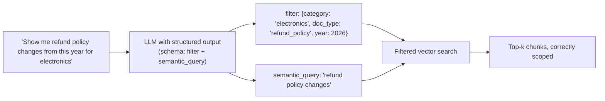

# 4a. Metadata Filtering & Query Construction

The overview's diagnostic cluster #1 was concrete: Northwind's electronics return policy
chunk getting retrieved for a furniture-return question. Both chunks discuss "return policy"
in similar language — they're semantically close. Pure vector similarity can't tell them
apart, because it has no notion of structured scope. Metadata filtering narrows the search
space *before* ranking, so similarity search only competes within the right subset.

## Learning objectives

- Design a metadata schema for a document corpus (category, date, source, access level, etc.).
- Combine pre-filtering (metadata predicate) with vector search in a single query.
- Implement query construction: turning a natural-language question into a structured filter
  plus a semantic query (the self-querying retriever pattern).
- Recognize when metadata filtering alone can't help — the ambiguity is semantic, not
  categorical — and hand off to HyDE/hybrid search.

## Prerequisites

- [Advanced Production RAG overview](../README.md)

## Core concepts

### 4a.1 Semantically close isn't the same as relevant

"Return policy for opened electronics" and "return policy for furniture" are close in
embedding space — both are about return policies. But only one is *correct* for a given
question. This is exactly the scope-collision failure: vector similarity is a proxy for
topical relatedness, not for satisfying structured constraints like "which product category."

### 4a.2 Designing a metadata schema

Metadata is attached during ingestion (Module 7's chunking step) and should be decided
deliberately, not as an afterthought: what fields does this corpus need to be sliced by?
Common fields: `category`/`product_type`, `doc_type` (policy vs FAQ vs spec sheet), `date` or
`version`, `source`, `access_level` (relevant later for
[Multi-Tenant User Management](../../../part-3-system-design/02-multi-tenant-user-management/README.md)).
High-cardinality fields (e.g. a unique order ID per chunk) are usually a poor metadata filter
candidate — they don't meaningfully narrow a *search space*, they're closer to an exact
lookup, which hybrid search (Module 4c) handles better.

### 4a.3 Filtered vector search: pre- vs post-filtering

Recall [Vector Databases](../../../part-1-foundations/08-vector-databases/README.md) §8.5:
**pre-filtering** applies the metadata predicate before or during the ANN search, so only
matching vectors are considered at all; **post-filtering** runs the similarity search first
and discards non-matching results afterward. Pre-filtering is almost always what you want —
post-filtering can return fewer than `k` results (or zero) if the filter is narrow relative to
the raw top-k pool. Confirm which behavior your vector store actually implements; it's a real,
often-undocumented difference between stores.

### 4a.4 Query construction

The hard part isn't applying a filter — it's *deriving* the filter from a natural-language
question. **Query construction** uses an LLM with structured output (directly reusing
[Pydantic & Structured Outputs](../../../part-1-foundations/04-pydantic-and-structured-outputs/README.md))
to translate a free-form question into `{filter: {...}, semantic_query: "..."}`. This is the
**self-querying retriever** pattern.



### 4a.5 When metadata filtering can't help

If the ambiguity is genuinely semantic rather than categorical — e.g. "can I get my money
back" doesn't map to any structured field, it's a wording/phrasing gap — metadata filtering
has nothing to narrow. That's a job for HyDE (next module), not this one. Diagnosing *which*
kind of ambiguity you're facing (categorical vs semantic) determines which of 4a or 4b
actually fixes a given failure.

## Scenario walkthrough

Northwind's product documentation spans roughly 40 product categories across policy, FAQ, and
spec-sheet document types — around 50,000 chunks total. Adding `product_category` and
`doc_type` metadata at ingestion and filtering on both before similarity ranking collapses the
effective search space from 50,000 chunks to roughly 500 for a typical scoped question,
directly resolving diagnostic cluster #1 from the module overview without touching the
embedding model or chunking strategy at all.

## Code example

```python
from pydantic import BaseModel, Field
from typing import Optional
from langchain_openai import ChatOpenAI

class RetrievalQuery(BaseModel):
    """Structured filter + semantic query extracted from a user question."""
    product_category: Optional[str] = Field(default=None, description="e.g. electronics, furniture")
    doc_type: Optional[str] = Field(default=None, description="policy, faq, or spec_sheet")
    semantic_query: str = Field(description="The core question, for similarity search")

model = ChatOpenAI(model="gpt-4.1", temperature=0)
query_constructor = model.with_structured_output(RetrievalQuery)

parsed = query_constructor.invoke(
    "Do you accept returns on opened electronics?"
)
# RetrievalQuery(product_category='electronics', doc_type='policy',
#                semantic_query='returns on opened items')

def build_filter(q: RetrievalQuery) -> dict:
    f = {}
    if q.product_category:
        f["product_category"] = q.product_category
    if q.doc_type:
        f["doc_type"] = q.doc_type
    return f

results = vector_store.similarity_search(
    query=parsed.semantic_query,
    k=4,
    filter=build_filter(parsed),
)
```

## Production pitfalls

- **Over-constraining the filter.** If the query constructor is too aggressive (e.g. extracts
  a category the user didn't actually mean), a correct chunk in the wrong "guessed" category
  gets excluded entirely — worse than not filtering. Consider falling back to an unfiltered
  search if the filtered search returns zero results.
- **Metadata schema decided too late.** Retrofitting metadata onto an already-ingested corpus
  means a full re-ingestion pass — decide the schema during initial ingestion design.
- **High-cardinality fields used as filters.** Filtering on a near-unique field barely narrows
  the search space and adds query-construction complexity for little benefit.
- **Assuming every vector store pre-filters efficiently.** Some post-filter, which silently
  changes result-count behavior on narrow filters — verify this for your specific store.

## Key takeaways

- Metadata filtering fixes *scope* mismatches; it doesn't fix *semantic phrasing* mismatches.
- Pre-filtering (narrow before ranking) is almost always preferable to post-filtering.
- Query construction (self-querying retriever) is what turns a natural-language question into
  a usable structured filter — it's a structured-output problem, not a new technique.
- Design the metadata schema during ingestion, not as an afterthought.

## Exercises

1. Design a metadata schema for a corpus of internal engineering runbooks (consider: team,
   service name, severity, last-reviewed date) and identify which fields are good filter
   candidates vs too high-cardinality.
2. Given the `RetrievalQuery` schema above, write a test case where the query constructor
   should leave `product_category` as `None` because the question isn't scoped to one
   category.
3. Design a fallback behavior for when a filtered search returns zero results — should the
   system retry unfiltered, ask a clarifying question, or say it doesn't know? Justify your
   choice for the Northwind scenario.

Next: [HyDE](../02-hyde/README.md)
