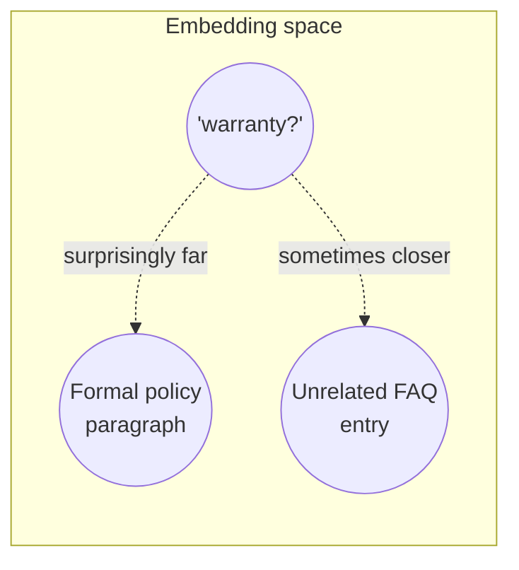
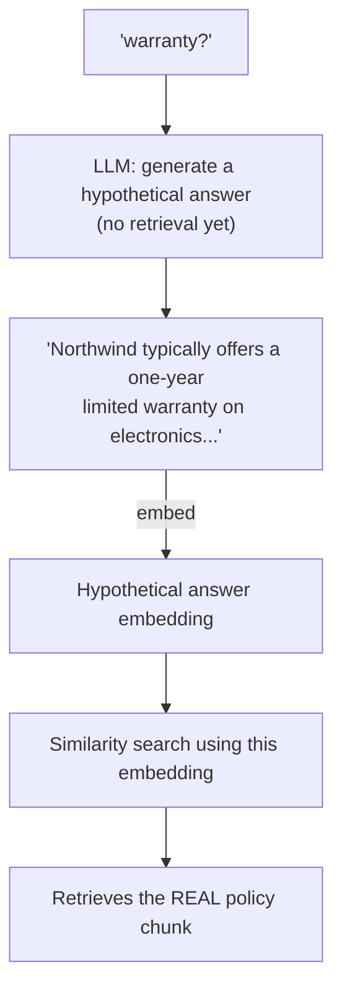

# 4b. HyDE (Hypothetical Document Embeddings)

The previous module's closing note flagged diagnostic cluster #2 as a different kind of
problem: "warranty?" isn't miscategorized, it's just too short and informally worded to embed
close to the well-formed policy paragraph that answers it. No metadata filter fixes a wording
gap. HyDE closes that gap by embedding a *hypothetical answer* instead of the raw query.

## Learning objectives

- Explain the query-document embedding asymmetry problem.
- Explain the HyDE technique: generate a hypothetical answer with an LLM, embed that instead
  of (or alongside) the raw query, then retrieve.
- Identify when HyDE helps (short/ambiguous/underspecified queries) vs when it hurts (precise
  queries, risk of the hypothetical drifting off-topic).
- Combine HyDE with metadata filtering and hybrid search rather than treating it as a
  standalone fix.

## Prerequisites

- [Metadata Filtering & Query Construction](../01-metadata-filtering-and-query-construction/README.md)

## Core concepts

### 4b.1 The asymmetry problem

Embedding models are trained largely on natural text pairs, and a terse query ("warranty?")
and a formal policy paragraph ("Northwind provides a limited one-year warranty covering
manufacturing defects...") don't share much surface-level linguistic structure even though
one answers the other. Their embeddings can end up farther apart than you'd intuitively
expect, because the model is matching *style and shape* as much as topic.



### 4b.2 HyDE mechanics

Instead of embedding the raw query, ask an LLM to generate a **hypothetical answer** to the
question — a plausible-sounding response, not necessarily factually correct — and embed *that*
for the similarity search. A generated formal-sounding hypothetical answer sits much closer in
embedding space to the real formal policy document than the terse original query did.



### 4b.3 Why it works despite being often factually wrong

The hypothetical doesn't need to be correct — it needs to be *stylistically and structurally*
similar to what a real answer looks like, because that's what makes it land near the real
document in embedding space. The actual factual grounding still comes from the retrieved real
document at generation time, not from the hypothetical itself, which is discarded after the
retrieval step.

### 4b.4 Failure modes

- **Hallucinated hypotheticals drifting off-topic** — if the LLM's hypothetical answer heads
  in a wrong direction entirely (misunderstanding the question), retrieval inherits that
  drift; this is more likely for genuinely ambiguous questions, ironically HyDE's target case.
- **Extra latency and cost** — HyDE adds one LLM call *before* retrieval even starts, on top
  of the eventual generation call — roughly doubling the LLM calls per query. Justify this
  against measured recall improvement on your own query set, per the overview's decision
  framework.
- **Not a fix for precise queries.** An already well-formed, specific query doesn't benefit
  much from HyDE and just pays the extra latency for no gain — apply it selectively (e.g. only
  when the query is short) rather than unconditionally.

## Scenario walkthrough

A Northwind customer asks "can I get my money back?" — Module 7's naive raw-query retrieval
misses the actual refund policy document because the phrasing is too far, in embedding space,
from the formal policy text. HyDE's generated hypothetical ("Refunds are available within 30
days of purchase for unopened items in original packaging...") lands close enough in embedding
space to correctly retrieve the real policy chunk, which is then used (not the hypothetical)
to generate the grounded final answer.

## Code example

```python
from langchain_openai import ChatOpenAI, OpenAIEmbeddings

model = ChatOpenAI(model="gpt-4.1", temperature=0.3)  # some variety is fine here
embeddings = OpenAIEmbeddings(model="text-embedding-3-small")

def hyde_retrieve(question: str, vector_store, k: int = 4):
    hypothetical = model.invoke(
        f"Write a short, plausible-sounding answer to this question, "
        f"as if it were an excerpt from a company policy document. "
        f"It's okay if some details are guessed.\n\nQuestion: {question}"
    ).content

    # Embed and search using the hypothetical, not the raw question
    return vector_store.similarity_search(hypothetical, k=k)

results = hyde_retrieve("can I get my money back?", vector_store)

# The REAL retrieved chunks (not the hypothetical) ground the final answer,
# reusing the RAG generation step from Basic RAG Pipeline
```

## Production pitfalls

- **Using the hypothetical as if it were factual.** It must never leak into the final answer
  directly — it's a retrieval aid only, discarded after the search step.
  Confirm your pipeline actually drops it before generation.
- **Applying HyDE unconditionally to every query.** Doubles LLM calls for queries that didn't
  need the help — gate it on a heuristic (e.g. query length) or only use it as CRAG's
  refine-and-retry action (Module 4d) rather than on every request.
- **Not measuring recall improvement before adopting.** HyDE's benefit is real but
  query-set-dependent — validate with an eval set (methodology in
  [LLMOps: Observability & Security](../../07-llmops-observability-and-security/README.md))
  rather than adopting on faith.
- **Ignoring the failure mode where the hypothetical itself is badly wrong.** For genuinely
  ambiguous queries, consider combining HyDE with metadata filtering (4a) to keep the search
  bounded even if the hypothetical drifts.

## Key takeaways

- Queries and their answers can be surprisingly far apart in embedding space due to
  stylistic/structural mismatch, not meaning mismatch.
- HyDE embeds a generated hypothetical answer instead of the raw query, closing that gap.
- The hypothetical is a retrieval aid only — factual correctness comes from the real retrieved
  document, not the hypothetical.
- Gate HyDE's use (short/ambiguous queries) rather than applying it to every request, given
  its added latency/cost.

## Exercises

1. Write a HyDE hypothetical by hand for the query "how long until my stuff ships" and
   compare, conceptually, how much closer it likely sits to a real shipping-policy document
   than the raw query does.
2. Design a heuristic for when to trigger HyDE automatically (e.g. query token count below a
   threshold) versus skipping it for already well-formed queries.
3. Explain why using a *higher* temperature for the hypothetical-generation call (as in the
   code example) is defensible, whereas Module 4's Pydantic extraction calls use temperature
   0 — what's different about the two tasks?

Next: [Hybrid Search](../03-hybrid-search/README.md)
