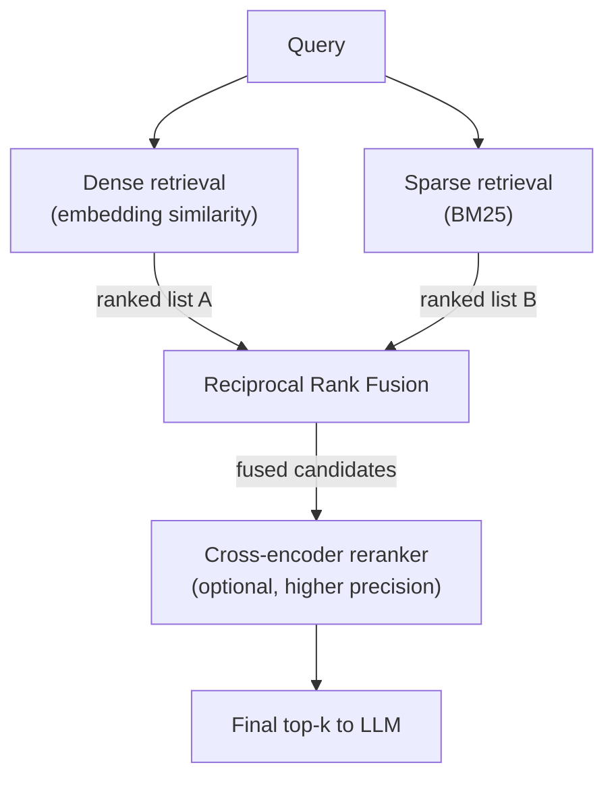

# 4c. Hybrid Search

Diagnostic cluster #3 from the overview was distinct from both prior clusters: order-ID and
SKU lookups missing the exact chunk, even with correct metadata scoping and even with HyDE.
The problem isn't scope (4a) or phrasing style (4b) — it's that dense vector search is
structurally weak at exact-token matching, which is precisely what an order ID or SKU lookup
needs. Sparse keyword search (BM25) is the reverse: great at exact matches, weak at semantic
paraphrase. Hybrid search runs both and fuses the results.

## Learning objectives

- Explain BM25 sparse retrieval conceptually and why it beats dense search on exact tokens.
- Run dense and sparse retrieval in parallel over the same corpus.
- Fuse two ranked lists with Reciprocal Rank Fusion (RRF) or weighted scoring.
- Add a reranking stage (cross-encoder) on top of fused candidates and explain the
  precision/latency trade-off.
- Decide the retrieval budget: how many candidates per retriever, how many survive reranking,
  how many reach the LLM.

## Prerequisites

- [HyDE](../02-hyde/README.md)

## Core concepts

### 4c.1 Dense vs sparse: structurally different strengths

Dense (embedding-based) retrieval is good at *semantic* matches — "how do I get my money
back" matching a "refund policy" document despite no shared words. It's structurally weak at
*exact* matches — an embedding model has no special mechanism for treating "NW-88213" as an
atomic, must-match-exactly token; it just becomes part of the general semantic representation,
diluted by everything else in the text. Sparse retrieval (BM25) is the reverse: strong on
literal term overlap, with no notion of synonymy or paraphrase.

### 4c.2 BM25 basics

BM25 scores a document against a query based on term frequency (how often query terms appear
in the document) weighted by inverse document frequency (rarer terms count for more) and
normalized for document length. No embedding model or learned representation involved — it's
a statistical scoring function over exact token overlap, which is exactly why it excels at IDs,
codes, and rare exact terms that dense retrieval washes out.

### 4c.3 Fusion: Reciprocal Rank Fusion

Running both retrievers gives two separately-scored ranked lists on different, incomparable
scales (BM25 scores and cosine similarities aren't directly comparable). **Reciprocal Rank
Fusion (RRF)** sidesteps this by fusing based on *rank position* rather than raw score:

```
RRF_score(doc) = Σ  1 / (k + rank_in_list_i)   across each ranked list the doc appears in
```

(`k` is a small constant, commonly 60, that dampens the impact of very high individual ranks.)
A document ranked highly in *either* list contributes meaningfully to its fused score, and a
document appearing in both lists' top ranks scores highest overall — exactly the behavior you
want when combining two retrievers with different strengths.



### 4c.4 Reranking

A **cross-encoder** reranker scores each `(query, candidate)` pair jointly (unlike embedding
similarity, which scores each independently and compares vectors afterward) — this is more
accurate but far more computationally expensive, so it's only applied to the fused candidate
set (e.g. top 20-30), not the whole corpus. The trade-off: reranking improves precision at the
top of the results at the cost of added latency per query — worth it when answer quality
matters more than shaving milliseconds, which is most RAG use cases outside of extremely
latency-sensitive ones.

### 4c.5 Setting the retrieval budget

A typical pipeline: retrieve ~20-50 candidates from each of dense and sparse retrieval, fuse
to a combined candidate pool, rerank down to the top 5-10, and pass those (not all fused
candidates) into the final generation prompt — balancing recall (cast a wide net early) against
context budget and reranking cost (narrow aggressively before the expensive/limited-budget
stages).

## Scenario walkthrough

A Northwind customer asks "status of order #NW-88213." Dense-only retrieval (Module 7's
pipeline) tends to drift toward generic "how to check order status" documentation instead of
anything containing the literal order ID (which likely isn't even indexed content — more on
this below). BM25 nails the literal ID match on a document or record containing it. Fusion +
reranking surfaces the correct chunk at the top. (Note: for structured lookups like exact order
status by ID, a direct database/API lookup, not RAG at all, is usually the *right* production
answer — this scenario illustrates hybrid search's mechanics using an ID-heavy example, but see
the pitfalls below for when RAG is the wrong tool entirely.)

## Code example

```python
from rank_bm25 import BM25Okapi
from langchain_community.vectorstores import Chroma

# Sparse index (BM25) over the same chunk corpus used for the dense vector store
tokenized_corpus = [chunk.page_content.lower().split() for chunk in all_chunks]
bm25 = BM25Okapi(tokenized_corpus)

def sparse_search(query: str, k: int = 20) -> list[int]:
    scores = bm25.get_scores(query.lower().split())
    ranked_indices = sorted(range(len(scores)), key=lambda i: scores[i], reverse=True)
    return ranked_indices[:k]

def dense_search(query: str, k: int = 20) -> list[int]:
    results = vector_store.similarity_search_with_score(query, k=k)
    return [chunk_id_of(doc) for doc, _ in results]

def reciprocal_rank_fusion(rank_lists: list[list[int]], k: int = 60) -> list[int]:
    scores: dict[int, float] = {}
    for ranked in rank_lists:
        for rank, doc_id in enumerate(ranked):
            scores[doc_id] = scores.get(doc_id, 0) + 1 / (k + rank)
    return sorted(scores, key=scores.get, reverse=True)

def hybrid_search(query: str, k_final: int = 8) -> list[int]:
    fused = reciprocal_rank_fusion([dense_search(query), sparse_search(query)])
    return fused[:k_final]  # optionally: rerank this pool with a cross-encoder before slicing
```

## Production pitfalls

- **Applying hybrid search to a problem better solved by a direct database lookup.** If your
  corpus has structured records with IDs, an exact-match database query is faster, cheaper,
  and more reliable than any retrieval technique — reach for RAG when the answer requires
  synthesizing unstructured text, not for exact-key lookups that a `WHERE order_id = ...`
  query already solves.
- **Comparing raw scores between dense and sparse instead of fusing by rank.** Score scales
  are incomparable; naive score-averaging without normalization produces poor fusion — use
  RRF or a properly calibrated weighted scheme.
- **Reranking the entire corpus instead of a narrowed candidate pool.** Cross-encoders don't
  scale to corpus-wide scoring — always narrow with dense/sparse retrieval first.
- **Not tuning the retrieval budget per stage.** Too narrow early (e.g. k=5 from each
  retriever) loses recall before fusion even has a chance to help; too wide late (passing 30
  chunks to the LLM) wastes context budget and reintroduces lost-in-the-middle risk (Module 1
  §1.2).

## Key takeaways

- Dense and sparse retrieval have complementary, not overlapping, strengths — hybrid search
  exploits that instead of picking one.
- BM25 requires no learned embeddings and excels precisely where dense retrieval is weakest:
  exact term/ID matching.
- Reciprocal Rank Fusion combines differently-scaled ranked lists by rank position, avoiding
  score-comparability problems.
- Reranking with a cross-encoder improves precision on a narrowed candidate pool, at a real
  latency cost worth paying in most RAG applications.
- Not every "find this specific thing" problem is a retrieval problem — some are direct
  database lookups in disguise.

## Exercises

1. Compute RRF scores by hand for a toy example: document A ranked 1st in dense and 3rd in
   sparse; document B ranked 5th in dense and 1st in sparse — which fuses higher, and why does
   that make sense?
2. Identify two more Northwind query types (beyond order IDs) where sparse retrieval likely
   outperforms dense retrieval alone.
3. Argue for or against adding a reranking stage to a latency-sensitive real-time chat feature
   versus an asynchronous batch-report-generation feature — where does the trade-off land
   differently?

Next: [Corrective RAG (CRAG)](../04-corrective-rag-crag/README.md)
