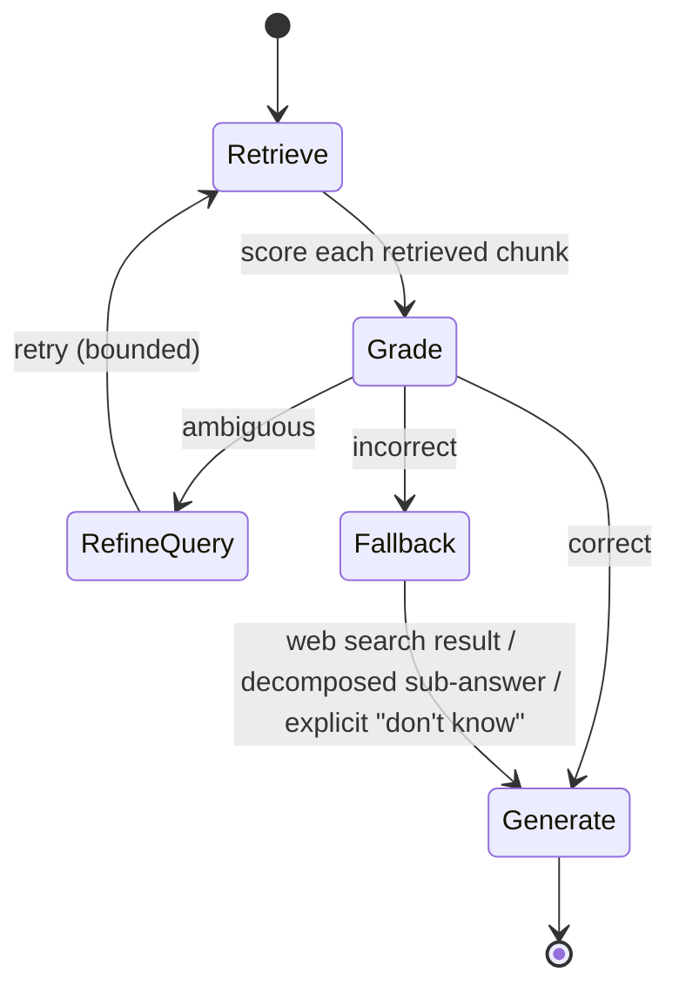

# 4d. Corrective RAG (CRAG)

Every technique so far — metadata filtering, HyDE, hybrid search — still assumes retrieval
*found something reasonable* and just tries to make that more likely. Diagnostic cluster #4
from the overview was different in kind: a cluster of confidently wrong answers traced back to
retrieval that returned an irrelevant or stale chunk, with the model happily generating from it
anyway. Nothing built so far catches that after the fact. CRAG adds a grading step that checks
retrieval quality and actively corrects course instead of generating from garbage context.

## Learning objectives

- Implement a retrieval-grading step that scores each retrieved chunk as
  correct/ambiguous/incorrect.
- Design the corrective branches: refine-and-retry on ambiguous, discard-and-fallback on
  incorrect, proceed on correct.
- Build this as an explicit LangGraph state machine — grading naturally maps to conditional
  edges and bounded loops.
- Explain the cost/latency trade-off of a grading+correction loop and when it's worth it.

## Prerequisites

- [Hybrid Search](../03-hybrid-search/README.md)
- [LangGraph Fundamentals](../../../part-1-foundations/03-langgraph-fundamentals/README.md)

## Core concepts

### 4d.1 The silent-failure problem

Basic RAG (Module 7) instructed the model to say "I don't know" if the context doesn't answer
the question — but that instruction relies entirely on the model correctly judging its own
retrieved context, which it does unreliably. A retrieved chunk that's topically adjacent but
actually wrong (an outdated policy version, a chunk about a similar-but-different product) can
still look, to the generation step, like sufficient grounding. Naive RAG has no explicit,
separate check on retrieval quality before generation — CRAG adds one.

### 4d.2 Architecture: retrieve → grade → route



Each retrieved chunk (or the retrieved set as a whole, depending on granularity) is graded
into one of three buckets:

- **Correct** — proceed to generation using this context, as in Module 7.
- **Ambiguous** — the chunk is plausibly relevant but not clearly sufficient; refine the query
  (e.g. via HyDE or query rewriting) and retry retrieval, bounded to a small number of
  attempts.
- **Incorrect** — the chunk doesn't actually answer the question; discard it and fall back —
  to a web search (if the domain allows it), to decomposing the question into sub-questions, or
  to an explicit "I don't have current information on this."

### 4d.3 Implementing the grader

The grader is a lightweight, low-latency classification call — structured output, directly
reusing [Pydantic & Structured Outputs](../../../part-1-foundations/04-pydantic-and-structured-outputs/README.md)
— not a full generation. Keep it cheap and fast, since it runs on every retrieval before the
(more expensive) generation step even happens.

```python
from pydantic import BaseModel
from typing import Literal

class RetrievalGrade(BaseModel):
    relevance: Literal["correct", "ambiguous", "incorrect"]
    reasoning: str  # short justification, useful for debugging/observability
```

### 4d.4 Implementing corrective actions with a retry budget

The refine-and-retry loop **must** be bounded (directly analogous to
[Agents 101](../../../part-1-foundations/05-agents-101/README.md) §5.5's stopping conditions)
— an unbounded "keep refining until correct" loop can spin indefinitely on a genuinely
unanswerable question. A typical bound: 1-2 refine attempts before falling through to the
fallback branch unconditionally.

## Scenario walkthrough

Aster Health, a fictional compliance-heavy healthcare/insurance company, runs a compliance bot
where a policy changed last week but the document index hasn't been reprocessed yet (an
ingestion-lag problem, more on preventing this in
[Event-Driven Architecture](../../../part-3-system-design/04-event-driven-architecture/README.md)).
A user asks about the new policy; retrieval returns the *stale* version of the document — still
topically about the right policy, but factually outdated. CRAG's grader flags this chunk as
**incorrect** (the grading prompt is designed to also flag content it can't confirm is current,
not just topical mismatch) and routes to the fallback branch, producing "I don't have current
information on this specific policy change — escalating to a specialist" instead of confidently
answering from outdated context. This is the difference between a naive RAG system that
silently gives wrong compliance guidance and one that knows what it doesn't know.

## Code example

```python
from langgraph.graph import StateGraph, START, END
from typing import TypedDict, Literal
from langchain_openai import ChatOpenAI

class CragState(TypedDict):
    question: str
    retrieved_chunks: list[str]
    grade: Literal["correct", "ambiguous", "incorrect"]
    refine_attempts: int
    answer: str

model = ChatOpenAI(model="gpt-4.1", temperature=0)
grader = model.with_structured_output(RetrievalGrade)

def retrieve(state: CragState) -> dict:
    chunks = vector_store.similarity_search(state["question"], k=4)
    return {"retrieved_chunks": [c.page_content for c in chunks]}

def grade(state: CragState) -> dict:
    result = grader.invoke(
        f"Question: {state['question']}\nRetrieved: {state['retrieved_chunks']}\n"
        "Grade whether this content correctly and currently answers the question."
    )
    return {"grade": result.relevance}

def refine_query(state: CragState) -> dict:
    # e.g. apply HyDE or an LLM query rewrite here
    return {"question": state["question"], "refine_attempts": state["refine_attempts"] + 1}

def fallback(state: CragState) -> dict:
    return {"answer": "I don't have current information on this — escalating to a specialist."}

def generate(state: CragState) -> dict:
    return {"answer": f"Grounded answer using: {state['retrieved_chunks']}"}

def route_on_grade(state: CragState) -> str:
    if state["grade"] == "correct":
        return "generate"
    if state["grade"] == "ambiguous" and state["refine_attempts"] < 2:
        return "refine"
    return "fallback"

graph = StateGraph(CragState)
graph.add_node("retrieve", retrieve)
graph.add_node("grade", grade)
graph.add_node("refine", refine_query)
graph.add_node("fallback", fallback)
graph.add_node("generate", generate)

graph.add_edge(START, "retrieve")
graph.add_edge("retrieve", "grade")
graph.add_conditional_edges("grade", route_on_grade, {
    "generate": "generate", "refine": "refine", "fallback": "fallback",
})
graph.add_edge("refine", "retrieve")
graph.add_edge("fallback", END)
graph.add_edge("generate", END)

app = graph.compile()
```

## Production pitfalls

- **Unbounded refine loops.** Always cap `refine_attempts` — a persistently ambiguous grade on
  a genuinely unanswerable question must terminate into fallback, not loop forever.
- **A grader that's as unreliable as the generator it's checking.** The grading call needs its
  own evaluation (does it actually catch bad retrievals in practice?) — don't assume adding a
  grading step automatically fixes accuracy without measuring it.
- **Applying CRAG's overhead uniformly regardless of stakes.** The grading step adds latency
  and cost to every single query — justified for Aster Health's compliance bot, likely
  unnecessary for Northwind's low-stakes FAQ traffic. Revisit the overview's decision framework
  per use case.
- **No visibility into how often each branch fires.** If fallback fires on 40% of queries,
  that's a retrieval quality problem worth fixing upstream (better chunking, hybrid search),
  not something CRAG alone should paper over indefinitely.

## Key takeaways

- CRAG adds an explicit grading step between retrieval and generation, closing the silent-
  failure gap naive RAG leaves open.
- Three-way grading (correct/ambiguous/incorrect) routes to generate, refine-and-retry, or
  fallback respectively.
- Refine loops must be bounded, exactly like agent loops in Part 1.
- CRAG's added latency/cost is justified in higher-stakes domains where a confidently wrong
  answer is costly — not a universal default.

## Exercises

1. Design the grading prompt to specifically catch staleness (Aster Health's scenario), not
   just topical irrelevance — what should the grader be told to look for?
2. Trace through what happens in the example graph if `refine_attempts` reaches its cap while
   still ambiguous — confirm the routing logic terminates correctly.
3. Propose a metric to track branch-fire rates (correct/ambiguous/incorrect proportions) in
   production, and explain what a rising "incorrect" rate over time would indicate about the
   underlying corpus or ingestion pipeline.

Next: [GraphRAG](../05-graphrag/README.md)
