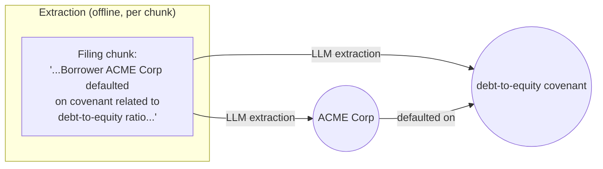
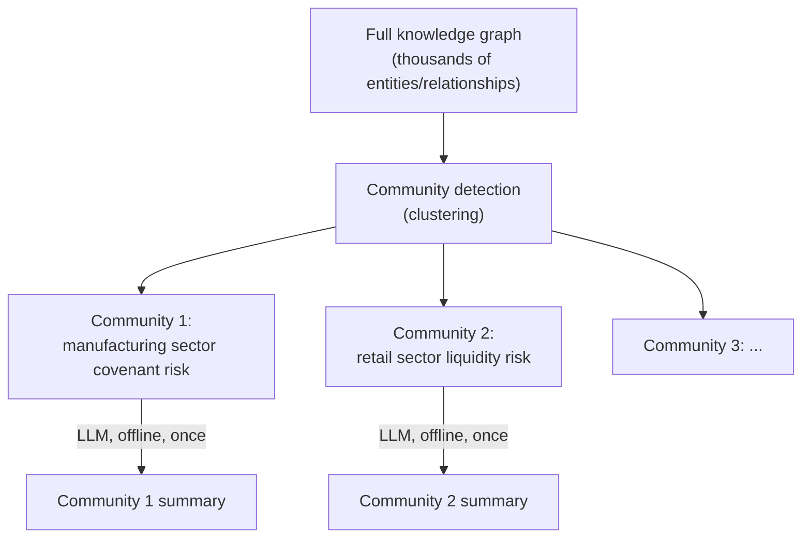

# 4e. GraphRAG

Every technique in this module so far — metadata filtering, HyDE, hybrid search, CRAG — makes
chunk-based retrieval more accurate. None of them change the fact that retrieval only ever
returns *isolated pieces* of a corpus. A question like "what are the major themes across all
customer complaints this quarter" has no single chunk, however perfectly retrieved, that
answers it. GraphRAG builds a knowledge graph over the corpus so retrieval can reason across
relationships, not just chunks — the last, and most expensive, technique in this module.

## Learning objectives

- Distinguish "local" questions (answerable from one region of the corpus) from "global"
  questions (require synthesizing across the whole corpus).
- Explain the GraphRAG pipeline: entity/relationship extraction → knowledge graph construction
  → community detection → community summarization → graph-aware retrieval.
- Understand the trade-off: GraphRAG's indexing cost and complexity vs the class of questions
  it unlocks.
- Decide, for a given corpus and question set, whether GraphRAG is worth the investment over
  hybrid search + CRAG.

## Prerequisites

- [Corrective RAG (CRAG)](../04-corrective-rag-crag/README.md)

## Core concepts

### 4e.1 Local vs global questions

- **Local**: "What is Northwind's return policy for opened electronics?" — one chunk, or a
  small set of chunks, fully answers this. Everything in Modules 4a-4d targets exactly this
  case.
- **Global**: "What are the common risk factors across all Q3 loan filings?" — no single
  filing, however well retrieved, answers this; it requires synthesizing patterns across
  potentially thousands of documents. This is the case chunk-based retrieval, however advanced,
  structurally cannot solve — it always returns a bounded top-k of chunks, never "everything,
  summarized."

### 4e.2 Building the graph

An offline indexing pass (separate from and prior to query time) uses an LLM to extract
**entities** (people, organizations, products, concepts mentioned in the corpus) and
**relationships** between them from each chunk, assembling these into a knowledge graph stored
in a graph database or graph-structured store.



### 4e.3 Community detection and summarization

Once the graph is built, a **community detection** algorithm clusters densely-connected
regions of the graph into related sub-topics (e.g. all entities/relationships related to a
particular industry sector's covenant defaults cluster together). Each community is then
**pre-summarized** by an LLM, offline, once — this is what makes global questions tractable at
query time: instead of reasoning over the raw graph live, the query hits pre-computed,
human-readable summaries of each relevant community.



### 4e.4 Query time: local vs global search

- **Local search** — for questions about a specific entity, traverse the graph outward from
  that entity, pulling in connected chunks/relationships as augmented context — a graph-aware
  variant of chunk retrieval, still fundamentally targeting local questions.
- **Global search** — for corpus-wide questions, route the query to the relevant pre-computed
  community summaries (potentially several of them), and synthesize an answer across those
  summaries rather than raw chunks. This is the mechanism that actually answers "what are the
  common risk factors across all Q3 filings."

### 4e.5 Cost reality check

Graph construction is an expensive **offline indexing job**: LLM calls for entity/relationship
extraction across the entire corpus, plus community summarization calls — for a 10-million-
document corpus, this is a substantial one-time (and ongoing, as new documents arrive) cost,
distinct from and additional to the embedding costs already paid for chunk-based RAG. Before
adopting GraphRAG, confirm — using the overview's diagnostic method — that your actual query
set includes a meaningful volume of genuinely *global* questions that hybrid search + CRAG
cannot answer. If it doesn't, the indexing investment doesn't pay off.

## Scenario walkthrough

The "Ledger" capstone system's compliance team asks: "what are the common risk factors across
all Q3 loan filings?" No single filing chunk answers this — CRAG would correctly grade any
single retrieved chunk as, at best, partially relevant, with no way to escalate to a
corpus-wide synthesis. GraphRAG's pre-computed community summaries (one per risk-factor
cluster identified during offline indexing) directly answer this class of question, which is
exactly why "Ledger" — not Northwind — is the system in this course that actually adopts
GraphRAG; Northwind's diagnostic pass in the module overview found no global-question failure
cluster, so it doesn't pay this indexing cost.

## Code example

```python
from pydantic import BaseModel
from langchain_openai import ChatOpenAI

class ExtractedRelationship(BaseModel):
    subject: str
    relation: str
    object: str

model = ChatOpenAI(model="gpt-4.1", temperature=0)
extractor = model.with_structured_output(ExtractedRelationship)

# --- Offline: build the graph, one chunk at a time ---
def extract_relationships(chunk_text: str) -> list[ExtractedRelationship]:
    # In practice: prompt for MULTIPLE relationships per chunk, not just one
    return [extractor.invoke(f"Extract a key entity relationship from:\n{chunk_text}")]

# graph_db.add_relationship(rel.subject, rel.relation, rel.object)  # to a graph store

# --- Offline: summarize each detected community (via a graph clustering library) ---
def summarize_community(entity_relationship_subset: list[ExtractedRelationship]) -> str:
    text = "\n".join(f"{r.subject} {r.relation} {r.object}" for r in entity_relationship_subset)
    return model.invoke(f"Summarize the common themes in these relationships:\n{text}").content

# --- Query time: global search routes to relevant community summaries ---
def global_search(question: str, community_summaries: list[str]) -> str:
    context = "\n\n".join(community_summaries)  # narrowed to relevant communities in practice
    return model.invoke(f"Using these summaries, answer: {question}\n\n{context}").content
```

## Production pitfalls

- **Adopting GraphRAG without a real global-question workload.** The single most common
  mistake with this technique — it's expensive and only pays off for a specific question
  shape.
- **Treating graph construction as a one-time job.** New documents keep arriving (see
  [Ingesting 10M+ Documents](../../../part-3-system-design/09-ingesting-10m-plus-documents/README.md));
  the graph and its community summaries need an incremental update strategy, not just an
  initial build.
- **Extraction quality silently degrading the graph.** LLM-based entity/relationship
  extraction makes mistakes; errors compound into the graph structure and downstream community
  summaries — this needs its own evaluation, not blind trust.
- **Using global search for local questions.** Routing a specific, narrow question through
  community summaries instead of direct chunk retrieval loses precision — the query router
  needs to correctly classify local vs global intent first.

## Key takeaways

- GraphRAG exists specifically for "global" questions requiring synthesis across a corpus —
  chunk-based retrieval, however advanced, cannot answer these by construction.
- The pipeline is offline graph construction (entity/relationship extraction) + community
  detection + community summarization, then query-time local or global search.
- This is the most expensive technique in the Advanced Production RAG module — validate real
  need against real query patterns before adopting it.
- Local questions should still route through chunk-based retrieval (4a-4d); GraphRAG augments,
  it doesn't replace, the rest of this module.

## Exercises

1. For a corpus of customer support tickets, propose two example global questions and two
   example local questions, and explain why each classification holds.
2. Sketch how you'd decide, at query time, whether an incoming question should route to local
   chunk-based retrieval or GraphRAG's global search.
3. Estimate (roughly) the extraction-call cost multiplier of adopting GraphRAG on a
   10-million-chunk corpus relative to the embedding cost already paid for chunk-based RAG, and
   discuss what this implies for deciding when the investment is justified.

Next: [LLM Guardrails](../../05-llm-guardrails/README.md)
