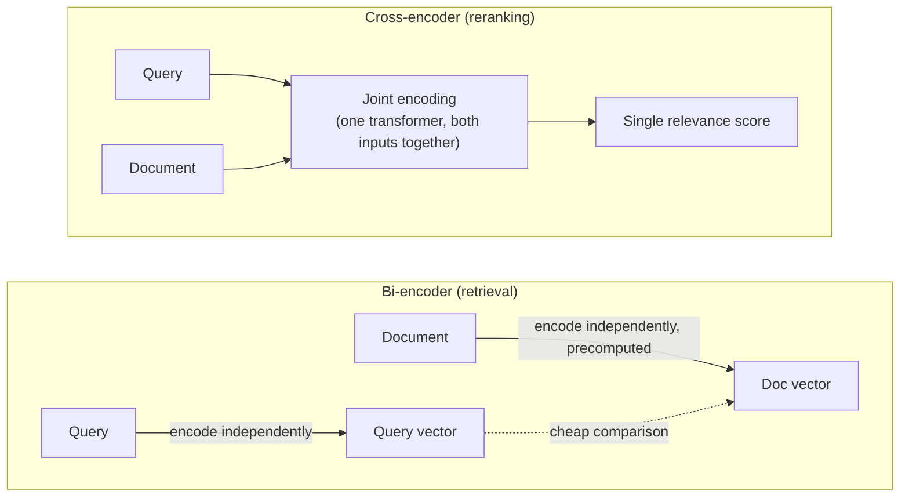

# 4f. Reranking

[Hybrid Search](../03-hybrid-search/README.md) closed on a gap it deliberately left open: RRF
fusion is good at getting the right candidates *somewhere* near the top of a combined pool, but
it isn't precise about which single one belongs in slot #1. That gap is exactly diagnostic
cluster #5 from the [overview](../README.md) — the correct chunk is retrieved, just not
reliably ranked where generation actually looks. Reranking is a dedicated, higher-precision
scoring pass that fixes this, and it applies just as directly to plain dense retrieval as it
does to a hybrid-fused pool.

## Learning objectives

- Explain why a retriever's top-k ordering is a coarse relevance signal, and why that's an
  inherent trade-off of how retrieval has to work at scale, not a bug to patch away entirely.
- Distinguish bi-encoders (used for initial retrieval) from cross-encoders (used for
  reranking), and why the same architecture can't efficiently do both jobs.
- Compare reranker types: cross-encoders, late-interaction models, and LLM-as-reranker.
- Set a reranking budget — pool size in, final k out — balancing precision against latency
  and cost.
- Know the landscape: managed rerank APIs vs self-hosted cross-encoder models.

## Prerequisites

- [Hybrid Search](../03-hybrid-search/README.md) — though reranking applies to dense-only
  retrieval too; hybrid search is the prerequisite because this module continues that one's
  candidate pool directly.

## Core concepts

### 4f.1 Why a retriever's ranking isn't the final answer

[Vector Databases](../../../part-1-foundations/08-vector-databases/README.md) established that
ANN search over millions of vectors is only tractable because embeddings are computed once,
independently, for query and document — a **bi-encoder**: encode the query, encode the
document, compare two fixed vectors with a cheap operation. That independence is exactly what
makes it fast enough to search a huge corpus. It's also exactly why it's imprecise: the model
never lets the query and a specific candidate document *interact* during encoding, so it can't
capture "this document answers this specific phrasing of the question better than that one" —
only a rough, pre-computed notion of general similarity. Hybrid search's RRF fusion (previous
module) makes this somewhat better by combining two independent signals, but it's still
combining two coarse rankings, not producing a precise one.

### 4f.2 Cross-encoders

A **cross-encoder** feeds the query and a single candidate through one transformer *together*,
letting the model attend across both simultaneously, and outputs one relevance score for that
specific pair. This is meaningfully more accurate than any bi-encoder comparison — but it
requires a full forward pass per `(query, candidate)` pair at query time, with nothing
precomputable in advance (unlike bi-encoder document embeddings, which are computed once at
ingestion). This is why cross-encoders can't replace initial retrieval — scoring every document
in a 10-million-chunk corpus this way per query is computationally infeasible — and instead run
only over an already-narrowed candidate pool (hybrid search's fused output, or a plain
dense-retrieval top-k).



### 4f.3 Late-interaction models: a middle ground

Models in the **ColBERT** family sit between the two extremes: instead of pooling a document
into one vector (bi-encoder) or requiring joint encoding at query time (cross-encoder), they
store **per-token** embeddings for each document, computed and cached once at ingestion — like
a bi-encoder. At query time, relevance is computed via a token-level "max similarity"
interaction between query tokens and stored document token embeddings — capturing much more
fine-grained matching than a single pooled vector, without paying a full cross-encoder forward
pass per candidate. The cost: significantly more storage (per-token embeddings instead of one
vector per document) and more complex retrieval infrastructure. Worth knowing this option
exists; most teams reach for cross-encoder reranking first, since it's simpler to add on top of
an existing bi-encoder retrieval pipeline without changing the ingestion-side storage format.

### 4f.4 LLM-as-reranker

A general-purpose chat model, prompted directly, can also rerank: **pointwise** (score each
candidate independently against the query, similar in shape to a cross-encoder call but using
a much larger, more general model) or **listwise** (show the model the whole candidate pool at
once and ask it to produce a ranked order, letting it compare candidates against each other
directly, not just each one against the query in isolation). This needs no dedicated
reranker model or training data, and listwise ranking in particular can catch relevance
distinctions a pairwise scorer misses — at meaningfully higher latency and cost than a
purpose-built reranker, since it's a full LLM call rather than a small specialized model.
Reserve this for smaller candidate pools or higher-stakes use cases where the extra cost is
justified, echoing the same cost/accuracy trade-off theme from
[Advanced Agent Architectures](../../01-advanced-agent-architectures/README.md)'s reflection
pattern.

### 4f.5 Setting the reranking budget

Directly continuing [Hybrid Search](../03-hybrid-search/README.md) §4c.4's retrieval budget:
retrieve a wide pool (~20-50 candidates from fusion), rerank the *whole pool* with a
cross-encoder (cheap enough per-candidate to afford this), and pass only the reranked top 5-10
into the final generation prompt. The narrowing happens in two stages for a reason — a cheap,
imprecise method (bi-encoder/fusion) casts a wide net affordably; an expensive, precise method
(cross-encoder) then spends its budget only on the already-likely-relevant candidates, not the
whole corpus.

### 4f.6 Landscape

- **Managed rerank APIs** (e.g. Cohere Rerank, Jina Reranker, Voyage rerank) — a single API
  call taking a query and candidate list, returning reranked scores; zero infrastructure,
  per-call pricing, and generally strong out-of-the-box quality.
- **Self-hosted cross-encoder models** (e.g. BGE-reranker and similar
  `sentence-transformers`-compatible models) — control over cost at high volume and the
  ability to fine-tune on domain-specific data, at the cost of hosting and serving the model
  yourself.

This mirrors the exact managed-vs-self-hosted trade-off already established for the
[LLM Gateway](../../06-llm-gateway/README.md) §6.5 and
[Vector Databases](../../../part-1-foundations/08-vector-databases/README.md) §8.6 — the same
decision axes (control, cost at scale, operational burden) recur, just applied to a new piece
of infrastructure.

## Scenario walkthrough

Continuing [Hybrid Search](../03-hybrid-search/README.md)'s example: a Northwind customer asks
"status of order #NW-88213." The fused pool from dense + BM25 retrieval reliably contains the
correct chunk somewhere in its top 20 — but not always at position #1, sometimes landing at
position #4 or #5 behind more generic "how to check order status" documentation that scores
well on both retrievers without actually answering this specific question. Since
[Basic RAG's](../../../part-1-foundations/07-basic-rag-pipeline/README.md) generation step
only receives the top handful of chunks, a correct answer sitting at position #5 might as well
not have been retrieved at all. A cross-encoder reranking pass over the fused pool — scoring
each candidate jointly against the literal query text — reliably promotes the exact-match
chunk to position #1, closing diagnostic cluster #5 from the module overview.

## Code example

```python
from sentence_transformers import CrossEncoder

reranker = CrossEncoder("BAAI/bge-reranker-base")  # self-hosted cross-encoder

def rerank(query: str, candidates: list[dict], k_final: int = 8) -> list[dict]:
    pairs = [(query, c["content"]) for c in candidates]
    scores = reranker.predict(pairs)
    ranked = sorted(zip(candidates, scores), key=lambda x: x[1], reverse=True)
    return [c for c, _ in ranked[:k_final]]

def retrieve_and_rerank(query: str) -> list[dict]:
    fused_pool = hybrid_search(query, k_pool=30)  # from the Hybrid Search module
    candidates = [get_chunk(doc_id) for doc_id in fused_pool]
    return rerank(query, candidates, k_final=8)
```

```python
# Managed API alternative — same shape, no model to host
import cohere

co = cohere.Client("YOUR_API_KEY")

def rerank_managed(query: str, candidates: list[dict], k_final: int = 8) -> list[dict]:
    response = co.rerank(
        query=query,
        documents=[c["content"] for c in candidates],
        top_n=k_final,
        model="rerank-english-v3.0",
    )
    return [candidates[r.index] for r in response.results]
```

## Production pitfalls

- **Reranking the whole corpus instead of an already-narrowed pool.** Cross-encoders don't
  scale to corpus-wide scoring — this is the same discipline
  [Hybrid Search](../03-hybrid-search/README.md) established: narrow with cheap retrieval
  first, rerank the pool second, never the other way around.
- **Treating a reranker's score as a correctness or groundedness signal.** A reranker measures
  *relevance* — how well a candidate matches the query — not whether the candidate is
  factually current or correct. That's a different check, handled by
  [Corrective RAG](../04-corrective-rag-crag/README.md)'s grading step, which runs *after*
  reranking in the pipeline, not instead of it.
- **Using a general-purpose reranker on a highly specialized domain without validating it.** A
  reranker trained on general web text can underperform on dense legal, medical, or technical
  corpora — validate reranking's actual lift on your own eval set (the same discipline
  [HyDE](../02-hyde/README.md) §4b.4 taught for its own added-call cost) rather than assuming
  it universally helps.
- **Ignoring the added latency in a tight interactive-SLO budget.** A reranking pass is one
  more call in the critical request path — factor it explicitly into the latency budget from
  [HLD Fundamentals for GenAI Systems](../../../part-3-system-design/01-hld-fundamentals-for-genai/README.md)
  §1.3 rather than discovering the SLO miss after the fact.

## Key takeaways

- Bi-encoder retrieval is fast because query and document are encoded independently; that same
  independence is why its ranking is coarse — reranking trades speed for precision on an
  already-narrowed pool.
- Cross-encoders score `(query, candidate)` pairs jointly for much higher precision, at a cost
  that only makes sense over a small candidate pool, never a full corpus.
- Late-interaction models and LLM-as-reranker are real alternatives with different
  cost/precision trade-offs — cross-encoder reranking remains the most common default.
- A reranker's score is a relevance signal, not a correctness signal — CRAG's grading is a
  separate, later check for a different kind of problem.

## Exercises

1. Given a fused pool where the correct chunk sits at position #5, walk through why RRF alone
   (Hybrid Search's technique) is structurally unlikely to reliably fix this, while a
   cross-encoder rerank pass is well-suited to it.
2. Compare the cost of reranking a pool of 30 candidates with a self-hosted cross-encoder
   against sending that same pool through a listwise LLM-as-reranker call — which scales
   better as pool size grows, and why?
3. Design a quick evaluation to check whether adding reranking to a specific pipeline is
   actually worth its added latency — what metric would you compare, before vs. after?

Next: [Corrective RAG (CRAG)](../04-corrective-rag-crag/README.md)
