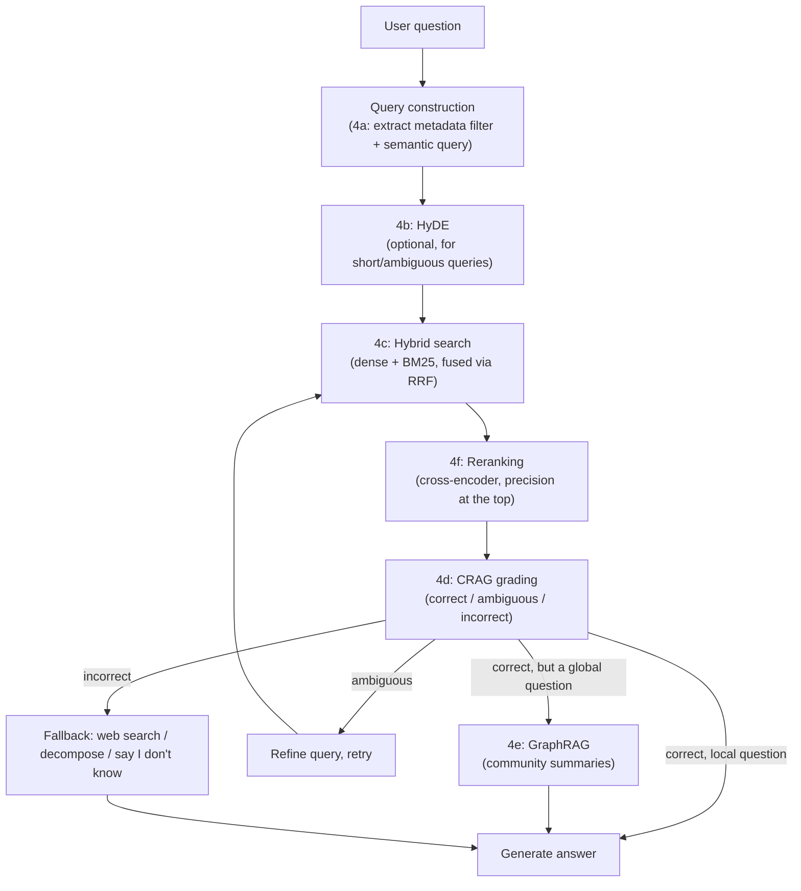

# 4. Advanced Production RAG

[Basic RAG Pipeline](../../part-1-foundations/07-basic-rag-pipeline/README.md) works on a
demo and plateaus in production. This module is a set of six targeted fixes, each aimed at a
specific naive-RAG failure mode you can actually diagnose — not a grab-bag of "advanced
techniques" to apply indiscriminately.

## Learning objectives

- Map each naive-RAG failure mode to the specific technique that fixes it.
- Combine structured metadata filtering with vector search to narrow the search space before
  ranking.
- Use HyDE to improve retrieval for short or ambiguous queries.
- Combine sparse (BM25) and dense retrieval with Reciprocal Rank Fusion (hybrid search).
- Apply a dedicated reranking stage to sharpen precision at the top of a retrieved candidate
  pool, whether it came from hybrid search or dense retrieval alone.
- Implement a self-correcting retrieval loop (CRAG) that grades and repairs bad retrievals.
- Explain when a corpus needs GraphRAG instead of chunk-based retrieval.

## Prerequisites

- [Basic RAG Pipeline](../../part-1-foundations/07-basic-rag-pipeline/README.md)
- [Vector Databases](../../part-1-foundations/08-vector-databases/README.md)

## Naive RAG failure taxonomy

| Symptom | Root cause | Fixed by |
|---|---|---|
| Retrieved chunk is topically similar but scoped to the wrong product/date/category | Vector similarity has no concept of structured scope | [4a. Metadata Filtering](01-metadata-filtering-and-query-construction/README.md) |
| Short or vaguely-worded queries retrieve nothing relevant | Query and answer text embed asymmetrically (Module 7 recap) | [4b. HyDE](02-hyde/README.md) |
| Exact IDs, SKUs, or error codes aren't retrieved by dense search | Dense embeddings are weak on exact-token matches | [4c. Hybrid Search](03-hybrid-search/README.md) |
| The correct chunk is retrieved but buried a few slots down, outside what generation actually reads | Bi-encoder/fusion ranking is a coarse relevance signal, not a precise one | [4f. Reranking](06-reranking/README.md) |
| Model confidently answers from irrelevant or stale retrieved chunks | Naive RAG has no self-check on retrieval quality | [4d. Corrective RAG (CRAG)](04-corrective-rag-crag/README.md) |
| Questions need reasoning across many documents, not one chunk | Chunk-based retrieval can't synthesize corpus-wide relationships | [4e. GraphRAG](05-graphrag/README.md) |

## Architecture: where each technique plugs in

Not every application needs every box in this diagram — §"deciding what you need" below.

## Scenario: diagnosing a plateau

Northwind Support Copilot's RAG accuracy plateaus at roughly 70% correct/grounded answers
during evaluation (evaluation methodology is covered in
[LLMOps: Observability & Security](../07-llmops-observability-and-security/README.md); for
now, assume a labeled test set of question/expected-answer pairs). A diagnostic pass over the
failures reveals five distinct clusters:

1. Wrong-product-scope retrievals (electronics policy chunk returned for a furniture
   question) → needs metadata filtering.
2. Short queries like "warranty?" retrieving nothing useful → needs HyDE.
3. Order-ID and SKU lookups missing the exact chunk → needs hybrid search.
4. A cluster of confidently wrong answers traced to a stale/irrelevant retrieved chunk with no
   fallback → needs CRAG.
5. A subtler cluster, found only once the first four are fixed and accuracy still stalls a
   few points short: the correct chunk *is* in the retrieved pool, just not consistently in
   the top slots that actually reach generation → needs reranking.

No individual cluster showed a "global reasoning across the whole corpus" failure pattern —
so GraphRAG isn't adopted for Northwind at this stage; see §"deciding what you need" below.
This diagnostic method — categorize failures before picking a technique — is the right way to
approach this module's sub-topics in any real system, rather than adopting all six by
default.

## Deciding what you need

- **Always worth doing** if you have any structured metadata at all: 4a (metadata filtering)
  is close to free and prevents an entire failure class.
- **Worth doing** if your query set includes short/ambiguous questions: 4b (HyDE) — adds one
  extra LLM call per query, so weigh the latency/cost cost against the recall gain measured
  on your own eval set.
- **Worth doing** if your corpus has exact identifiers users search for (IDs, codes, SKUs):
  4c (hybrid search).
- **Almost always worth doing** once retrieval returns more than a trivial candidate pool:
  4f (reranking) — one extra scoring pass over an already-narrowed pool, usually worth its
  added latency; skip only under a latency budget too tight to afford even one more fast call.
- **Worth doing for higher-stakes domains** where a confidently wrong answer is costly (Aster
  Health's compliance bot is the standing example in this course): 4d (CRAG) — the grading
  step adds latency and cost per query, justified when correctness matters more than speed.
- **Only worth doing** when your actual question set includes "global" questions needing
  synthesis across many documents, and the offline indexing cost is acceptable: 4e (GraphRAG)
  — the most expensive technique here by a wide margin; don't reach for it by default.

Next: [Metadata Filtering & Query Construction](01-metadata-filtering-and-query-construction/README.md)
