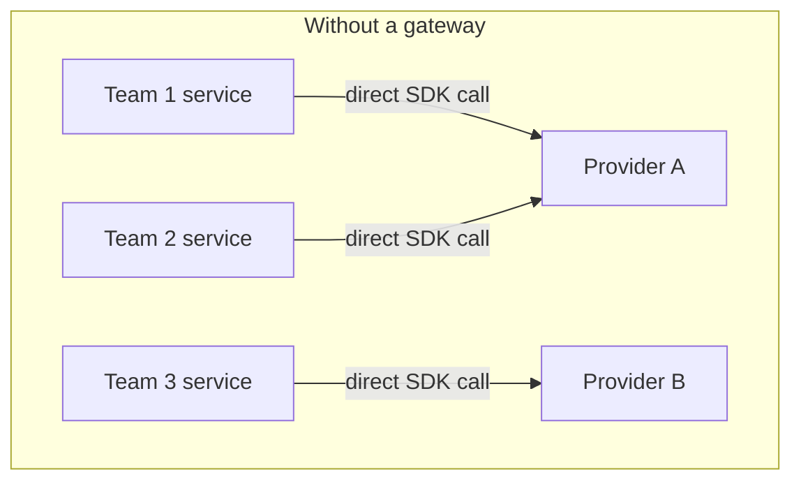
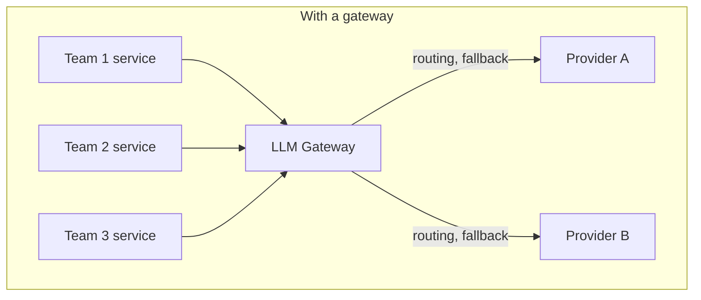

# 6. LLM Gateway

Module 3 introduced caching and Module 5 introduced guardrails as things every LLM call should
have. Implemented independently in every service that calls a model, both become duplicated,
inconsistent, and hard to audit. Once you have more than one model, one team, or one
environment, calling provider SDKs directly from every service becomes unmanageable — no
central auth, rate limiting, cost tracking, or failover. An LLM gateway is the reverse-proxy
layer that sits between your applications and every model provider, centralizing exactly these
cross-cutting concerns.

## Learning objectives

- Explain what an LLM gateway does: unified API across providers, auth/API-key management,
  rate limiting & quotas, cost tracking/attribution, caching, load balancing, and automatic
  fallback across models/providers.
- Design a gateway's request path and what metadata it attaches at each hop.
- Implement provider fallback and explain the trade-offs (response consistency across models).
- Know the landscape: self-hosted (e.g. LiteLLM proxy, Kong AI Gateway) vs managed (e.g.
  Portkey, Cloudflare AI Gateway) and how to choose.
- Explain per-team/per-tenant budget enforcement at the gateway layer.

## Prerequisites

- [Caching in Agents](../03-caching-in-agents/README.md)
- [LLM Guardrails](../05-llm-guardrails/README.md)

## Core concepts

### 6.1 The problem without a gateway

Picture Northwind's platform growing to five product teams, each independently calling model
providers directly from their own service code. Each team re-implements: API key management,
retry logic, rate-limit handling, cost logging, and (per Module 5) guardrail checks —
independently, inconsistently, and with no central visibility. When a provider has an outage,
five teams independently discover it and independently decide how to react. This duplication
and inconsistency is precisely what a gateway centralizes.





### 6.2 Gateway architecture

A gateway exposes a **unified request/response schema** regardless of the underlying
provider, with **provider adapters** translating to/from each vendor's actual API, and
**routing rules** deciding which provider/model handles a given request (by task type, cost
tier, or availability). Applications call the gateway exactly like they'd call one consistent
provider SDK — the gateway hides which actual model answered.

### 6.3 Cross-cutting concerns centralized

- **Auth** — one place issuing and revoking API keys/tokens for internal services, instead of
  each provider's own key sprawled across services.
- **Rate limiting/quotas** — enforced centrally per team/tenant/key, rather than each service
  independently guessing at provider limits.
- **Cost attribution** — every request logged with which team/tenant/feature triggered it,
  making Module 3's caching savings and per-team cost dashboards possible in the first place.
- **Response caching** — Module 3's caching patterns implemented once, centrally, instead of
  per-service.
- **Guardrail enforcement** — Module 5's input/output checks applied consistently at the
  gateway layer rather than reimplemented (and potentially forgotten) per service.

### 6.4 Reliability features

- **Automatic retries** with backoff on transient provider errors.
- **Fallback chains** — if the primary model/provider fails or is rate-limited, automatically
  retry against a configured fallback model, transparently to the calling service. This
  previews [High Availability & Reliability](../../part-3-system-design/06-high-availability-and-reliability/README.md),
  where circuit breakers and degradation ladders build directly on this gateway capability.
- **Circuit breaking** — after repeated failures from a provider, stop sending it traffic for
  a cooldown period rather than continuing to fail every request against it.

The trade-off worth naming explicitly: falling back from one model to a different model
changes response characteristics (tone, format adherence, latency) — a fallback isn't a silent
no-op substitution, and applications with strict structured-output requirements (Module 4)
need to validate that fallback models still conform to the expected schema.

### 6.5 Landscape: self-hosted vs managed

- **Self-hosted** (e.g. a LiteLLM proxy you run, Kong AI Gateway) — full control over routing
  logic and data flow (relevant for compliance), operational burden is yours.
- **Managed** (e.g. Portkey, Cloudflare AI Gateway) — zero infrastructure to run, faster to
  adopt, less control over exactly how requests are handled and where data transits.

Decision axes: control and compliance requirements, latency overhead the gateway itself adds,
existing infra investment, and cost.

### 6.6 Per-tenant budget enforcement, previewed

A gateway is the natural enforcement point for per-tenant cost quotas in a multi-tenant
platform — this is introduced here structurally and given full treatment in
[Multi-Tenant User Management](../../part-3-system-design/02-multi-tenant-user-management/README.md).

## Scenario walkthrough

Northwind's platform team puts every product team's LLM calls behind a gateway. Finance gets
accurate per-team cost dashboards for the first time, because every request is tagged with a
team identifier at the gateway (not something each team remembered to log themselves). When
the primary model provider has a regional outage, the gateway's configured fallback chain
automatically routes traffic to a secondary provider — no application code changes anywhere,
because every service was already calling the gateway's unified interface, not the primary
provider directly.

## Code example

```python
# Conceptual gateway routing config (the shape, not any single vendor's exact syntax)
gateway_config = {
    "routes": {
        "support-copilot": {
            "primary": {"provider": "openai", "model": "gpt-4.1"},
            "fallback": [{"provider": "anthropic", "model": "claude-sonnet"}],
            "rate_limit": {"requests_per_minute": 500},
            "cache": {"enabled": True, "ttl_seconds": 3600},
        },
    },
    "tenants": {
        "northwind-support-team": {"monthly_budget_usd": 5000},
        "northwind-marketing-team": {"monthly_budget_usd": 1000},
    },
}

# Application code calls the gateway's unified interface, unaware of the underlying provider
import httpx

def call_gateway(route: str, messages: list[dict], tenant_id: str) -> dict:
    response = httpx.post(
        "https://internal-gateway.northwind.example/v1/chat/completions",
        json={"route": route, "messages": messages},
        headers={"X-Tenant-Id": tenant_id, "Authorization": "Bearer GATEWAY_KEY"},
    )
    return response.json()
```

## Production pitfalls

- **Treating fallback as a drop-in equivalent model.** A fallback model can behave differently
  enough (format, tone, structured-output reliability) to break downstream parsing — test
  fallback paths, don't just configure and forget them.
- **Gateway as an unmonitored single point of failure.** Centralizing every call through one
  layer means a gateway outage takes down everything behind it — the gateway itself needs the
  availability treatment covered in Part 3 Module 6, including its own redundancy.
- **No cost attribution granularity.** Tagging only by team and not by feature/route makes it
  hard to find *which specific feature* is driving cost when a bill spikes.
- **Rate limits set without headroom for burst traffic.** Static per-tenant quotas that don't
  account for legitimate traffic spikes cause unnecessary throttling — revisited with
  autoscaling context in [Scaling GenAI Systems](../../part-3-system-design/05-scaling-genai-systems/README.md).

## Key takeaways

- A gateway centralizes auth, rate limiting, cost tracking, caching, guardrails, and provider
  routing/fallback — concerns that become unmanageable duplicated across services.
- Fallback across providers changes response characteristics; validate it doesn't silently
  break structured-output-dependent callers.
- Self-hosted gateways trade control for operational burden; managed gateways trade
  operational simplicity for less control — pick based on compliance and infra constraints.
- The gateway is the natural enforcement point for per-tenant budgets and quotas in a
  multi-tenant system.

## Exercises

1. Design a fallback chain for a structured-output-dependent feature (e.g. Module 4's ticket
   classification) and specify what validation must happen after a fallback model responds.
2. Sketch a cost-attribution schema (fields to log per request) that would let Finance answer
   "which specific feature is driving this month's spend increase."
3. Argue for self-hosted vs managed gateway for Aster Health's compliance-sensitive workload
   specifically, given the stricter data-handling requirements established in Module 5.

Next: [LLMOps: Observability & Security](../07-llmops-observability-and-security/README.md)
