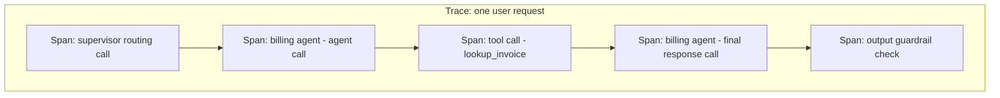

# 7. LLMOps: Observability & Security

Module 1's supervisor pattern warned that a wrong final answer three hops into a multi-agent
chain is hard to debug without tracing. Module 4d's CRAG grader needs its branch-fire rates
monitored to know if it's actually working. Module 5's guardrails need trigger-rate monitoring
to catch attack campaigns. Module 6's gateway needs cost/latency dashboards to be useful.
Every module in this part has pointed here: LLMOps is the discipline of tracing, evaluating,
and securing GenAI systems in production, closing the loop on everything built so far.

## Learning objectives

- Instrument an LLM application with tracing: spans for LLM calls, tool calls, and retrieval
  steps, linked into one trace per request.
- Define the core GenAI metrics to track: latency percentiles, token usage & cost, tool-call
  success rate, retrieval relevance, hallucination/groundedness rate.
- Build an evaluation pipeline: offline evals (golden datasets, LLM-as-judge) and online evals
  (production sampling, user feedback signals).
- Apply security practices specific to LLM apps: secret handling, sandboxed code execution,
  SSRF protection for URL-fetching tools, least-privilege tool scoping, audit logging.
- Debug a multi-agent trace to find the root cause of a bad output.

## Prerequisites

- [LLM Guardrails](../05-llm-guardrails/README.md)
- [LLM Gateway](../06-llm-gateway/README.md)

## Core concepts

### 7.1 Why traditional APM isn't enough

A traditional web request has one deterministic call stack. An agent request (Part 1 Module 5,
Part 2 Module 1) can branch differently on every run, loop a variable number of times, and
route through multiple specialist agents — there's no single "stack trace" without deliberate
instrumentation, because the *path itself* is only decided at runtime by the model.

### 7.2 Tracing architecture

A **trace** represents one user request end to end; a **span** represents one unit of work
within it (one LLM call, one tool call, one retrieval step). Nesting spans reconstructs exactly
what happened, in order, across an entire multi-agent run.



Standard approaches (OpenTelemetry-style conventions, or dedicated tools like LangSmith or
Langfuse) capture, per span: inputs, outputs, latency, token counts, and any errors —
queryable later per-trace or aggregated across traces.

### 7.3 Core metrics

- **Latency percentiles (p50/p95/p99)** — not just the average; tail latency is what users
  actually notice, and agent loops (Module 5) have especially variable latency.
- **Token usage & cost** — per request, per team/tenant (feeding Module 6's gateway cost
  dashboards).
- **Tool-call success rate** — how often a tool call executes without error, and separately,
  how often the *right* tool was chosen (a harder metric, usually eval-derived, §7.4).
- **Retrieval relevance** — a proxy for recall@k in production (Part 1 Module 7 §7.6), since
  ground truth isn't available live.
- **Groundedness/hallucination rate** — how often generated claims are actually supported by
  retrieved context, directly related to CRAG's grading (Module 4d) but measured across
  production traffic, not per-request.

### 7.4 Evaluation

- **Offline evals** — a golden dataset of question/expected-answer (or expected-behavior)
  pairs, run against the system before every deploy, catching regressions before they reach
  users. Directly answers the diagnostic need from the RAG overview's Northwind scenario
  (Module 4) — "accuracy plateaus at 70%" is itself an eval result.
- **LLM-as-judge** — using a model to score another model's output against criteria (e.g.
  "is this response grounded in the provided context? Yes/No"), useful for scaling evaluation
  beyond what human review can cover, but imperfect — it has its own failure modes (the judge
  can be wrong, biased toward certain response styles, or gameable) and needs its own periodic
  validation against human judgment.
- **Online evals** — sampling production traffic (not just the fixed golden set) and applying
  the same judge/checks, plus explicit user feedback signals (thumbs up/down) — catches drift
  and failure modes the offline set didn't anticipate.

### 7.5 Security checklist for LLM apps

- **Secrets never in prompts or logs.** API keys, tokens, and internal credentials must never
  appear in a prompt sent to a model or be captured verbatim in trace logs — treat traces as
  potentially sensitive data requiring the same handling rigor as any other log.
- **Sandboxed code execution tools.** If an agent has a code-execution tool, it must run in an
  isolated sandbox with no access to the host filesystem/network beyond what's explicitly
  needed — an agent that can be convinced (via injection, Module 5 §5.2) to execute arbitrary
  code is a severe risk if unsandboxed.
- **SSRF protection on URL-fetching tools.** A tool that fetches an arbitrary URL (e.g. "look
  up this webpage") can be manipulated into hitting internal-network addresses unless
  explicitly restricted to an allowlist of external domains — a classic Server-Side Request
  Forgery risk specific to tool-using agents.
- **Least-privilege tool permissions per agent.** Directly reusing Module 5 §5.5 — the
  strongest security guarantee is often "this agent structurally cannot do X," not a runtime
  check.
- **Full audit log of every tool call.** Who (which user/tenant), what (which tool, what
  arguments), and when — necessary both for security incident response and for compliance
  requirements in domains like Aster Health's.

### 7.6 Debugging a multi-agent trace

The practical payoff of §7.2's tracing: given a user-reported bad output, walk the trace
backward — which span produced the wrong claim? Was it a bad tool result, a misrouted
supervisor decision (Module 1), a retrieval failure the CRAG grader missed (Module 4d), or the
final generation step ignoring correct context? Tracing turns "the agent was wrong" (undebug-
gable) into "the `lookup_order_status` tool call at span 3 returned stale data" (fixable).

## Scenario walkthrough

Northwind's order-lookup agent starts giving wrong answers after a routine prompt tweak.
Without tracing, this is "the bot got worse" — no actionable next step. With tracing: pull
recent traces for affected users, compare span-level inputs/outputs against traces from before
the prompt change, and isolate that the *tool-selection* span is now, post-tweak, occasionally
choosing `search_faq` instead of `lookup_order_status` for order-status questions — the prompt
change altered tool-selection behavior in a way that wasn't caught because there was no offline
eval covering that specific tool-selection scenario. The fix — both patching the prompt and
adding this scenario to the golden eval set (§7.4) so this exact regression is caught
automatically before the next deploy — closes the loop this entire course has been building
toward.

## Code example

```python
from langsmith import traceable  # conceptual; Langfuse/OpenTelemetry follow the same shape
from langchain_openai import ChatOpenAI

model = ChatOpenAI(model="gpt-4.1", temperature=0)

@traceable(name="lookup_order_status_tool")
def lookup_order_status(order_id: str) -> dict:
    return {"status": "shipped", "eta": "2026-08-15"}

@traceable(name="billing_agent_call")
def billing_agent(messages: list) -> str:
    response = model.invoke(messages)
    return response.content

# --- A minimal LLM-as-judge eval ---
from pydantic import BaseModel
from typing import Literal

class GroundednessJudgment(BaseModel):
    grounded: Literal["yes", "no"]
    reasoning: str

judge = model.with_structured_output(GroundednessJudgment)

def eval_groundedness(answer: str, context: str) -> GroundednessJudgment:
    return judge.invoke(
        f"Context: {context}\nAnswer: {answer}\n"
        "Is every claim in the answer supported by the context? Answer yes or no with reasoning."
    )

golden_set = [
    {"question": "Where's my order #NW-4471?", "expected_tool": "lookup_order_status"},
    # ... a real golden set has many more, including edge cases from past regressions
]

def run_eval_suite(agent_fn, golden_set: list[dict]) -> float:
    correct = sum(1 for case in golden_set if agent_fn(case["question"]) == case["expected_tool"])
    return correct / len(golden_set)
```

## Production pitfalls

- **Shipping prompt/model changes without running the golden eval set first.** This module's
  scenario is exactly this mistake — a routine tweak regressed behavior with no automated
  catch before it reached users.
- **Trusting LLM-as-judge scores without periodic human validation.** The judge itself can
  drift or be systematically wrong on certain categories — spot-check it against human
  judgment regularly, not once at setup.
- **Treating traces as non-sensitive data.** Traces capture full prompts and outputs, which can
  include PII or other sensitive content — apply the same data-handling rigor as any other
  system log, especially for Aster Health-style compliance domains.
- **No SSRF allowlisting on URL-fetching tools.** An easy-to-miss gap that turns a convenience
  tool into an internal-network access vector.
- **Metrics without traces, or traces without metrics.** Aggregate metrics tell you *that*
  something regressed; traces tell you *why* — you need both, not one or the other.

## Key takeaways

- Tracing (spans nested into one trace per request) is what makes multi-agent, multi-step
  systems debuggable at all — without it, failures are unexplainable.
- Track latency percentiles, cost, tool success rate, retrieval relevance, and groundedness as
  core metrics, not just uptime.
- Offline evals (golden datasets) catch regressions before deploy; online evals catch drift
  after deploy; LLM-as-judge scales evaluation but needs its own periodic validation.
- LLM-specific security risks — injection-driven tool misuse, unsandboxed code execution,
  SSRF via fetch tools — need explicit controls, not just generic app security practices.
- This module closes the loop: every earlier module's "how do you know it's working" question
  is answered here.

## Exercises

1. Design three golden-set test cases specifically targeting tool-selection accuracy for
   Northwind's billing vs order agents (Module 1), including at least one ambiguous case.
2. Propose a validation method for periodically checking whether an LLM-as-judge's
   groundedness scores still agree with human judgment, without requiring 100% human review.
3. List the specific audit-log fields Aster Health's compliance bot needs to capture for every
   tool call, given the compliance stakes established across Module 5's guardrails module.
4. Walk through how you'd use tracing to distinguish a retrieval failure from a generation
   failure in a bad RAG answer — referencing the diagnostic distinction first raised in
   [Basic RAG Pipeline](../../part-1-foundations/07-basic-rag-pipeline/README.md) §7.6.

Next: [Part 3 — System Design for GenAI at Scale](../../part-3-system-design/README.md)
