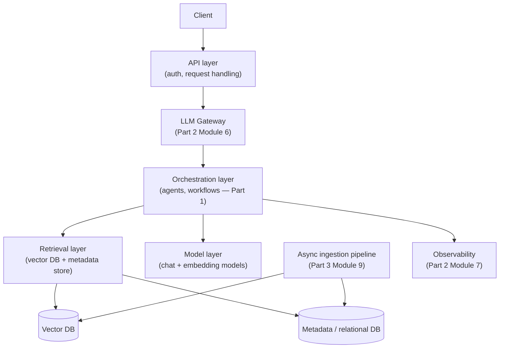
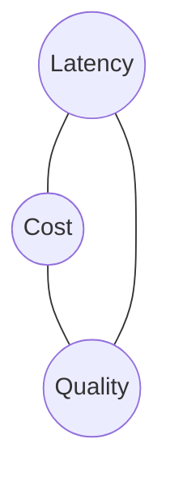

# 1. HLD Fundamentals for GenAI Systems

Parts 1 and 2 built and hardened a single logical system — Northwind's support copilot, with
Aster Health as the compliance-heavy counterpoint. Everything worked assuming a modest,
implicit scale. Part 3 removes that assumption: the same features now need to serve millions of
users and, for "Ledger" — this part's running capstone — tens of millions of documents. System
design for GenAI features follows the same discipline as any HLD — requirements, estimation,
component design, trade-offs — but with GenAI-specific variables (token costs, model latency,
embedding pipelines, non-deterministic outputs) that change the math.

## Learning objectives

- Run a requirements-gathering pass for a GenAI feature: functional requirements,
  non-functional requirements (latency SLOs, availability, cost ceiling, compliance), and
  explicit non-goals.
- Do back-of-envelope capacity estimation for a GenAI system: QPS, tokens/request, storage for
  embeddings/conversations, GPU/inference capacity.
- Break a GenAI system into its standard components and draw the component diagram.
- Reason about the GenAI-specific trade-offs an HLD must address: latency vs quality, cost vs
  accuracy, consistency vs freshness.

## Prerequisites

- All of Part 1 and Part 2.

## Core concepts

### 1.1 The HLD method, applied to GenAI

The method is the same one used in any system design exercise: **requirements → estimation →
high-level components → deep dive → trade-offs**. What changes for GenAI is the specific
variables that show up at each stage — this module establishes that mapping once, and every
subsequent Part 3 module assumes it.

### 1.2 Functional vs non-functional requirements

**Functional** — what the system does: answer questions grounded in documents, execute
multi-step agent workflows, remember user context across sessions. Largely a recap of *what*
Parts 1-2 built.

**Non-functional**, GenAI-specific:

- **Latency SLOs per feature type** — an interactive chat response has a much tighter budget
  (seconds) than an async batch summarization job (minutes) — not every feature shares one SLO.
- **Quality bar** — an explicit, measurable accuracy/groundedness target (recall the RAG
  eval methodology from
  [LLMOps: Observability & Security](../../part-2-advanced-engineering/07-llmops-observability-and-security/README.md)),
  not just "make it good."
- **Cost ceiling per request or per tenant** — GenAI cost is usage-driven (tokens, GPU-time) in
  a way most traditional API costs aren't; this needs its own explicit budget line.
- **Data residency/compliance requirements** — especially relevant for Aster Health-style
  domains; where data can live and which providers can process it become real constraints on
  the design, not afterthoughts.

**Non-goals** are just as important to state explicitly — e.g. "this design does not need to
support real-time voice" — since scope creep in a GenAI HLD is expensive (every added
capability tends to add model calls, not just code).

### 1.3 Capacity estimation, worked example

The estimation chain for a GenAI system: **QPS → tokens/sec → GPU-hours/inference capacity**,
plus separately, **storage** for embeddings and conversation history.

```
Assume: 50,000 daily active users, 10 messages/user/day average
→ 500,000 messages/day ≈ 5.8 messages/sec average (peak likely 3-5x average, say ~25/sec)
→ each message: ~1,500 input tokens (system prompt + history + retrieved context) + 300 output tokens
→ ~25 req/sec × 1,800 tokens ≈ 45,000 tokens/sec sustained at peak
→ against a hypothetical throughput of ~2,000 tokens/sec per inference replica,
  this suggests roughly 23 concurrent replicas needed at peak (before accounting for
  batching efficiency gains, covered in Server & Compute Scaling)
```

```
Storage: 10M document chunks × 1536-dimension embeddings × 4 bytes/float
≈ 10,000,000 × 1536 × 4 bytes ≈ 61 GB just for raw embedding vectors
  (before index overhead, which for HNSW-style indexes commonly adds a meaningful multiplier —
  covered concretely in Database Scaling Strategies)
```

This kind of estimation — rough, order-of-magnitude, explicitly stating assumptions — is
exactly what every later Part 3 module's "capacity math" sections do at a more specific level.

### 1.4 Standard component map



This is the same anatomy diagram from
[GenAI & LLM Basics](../../part-1-foundations/01-genai-and-llm-basics/README.md) §1.5, redrawn
with every box now something you can actually estimate capacity for and reason about scaling
independently — which is the entire point of Part 3.

### 1.5 The trade-off triangle

Every later module in Part 3 is, underneath its specific topic, about moving deliberately on
one triangle: **latency, cost, quality**. A bigger/more capable model improves quality at the
cost of latency and money. More retrieval/reflection steps (Part 2 Modules 1, 4d) improve
quality at the cost of latency and money. Aggressive caching (Part 3 Module 8) improves
latency and cost, with a quality risk if done carelessly (a wrong cache hit). Naming this
triangle explicitly here means every subsequent module's design decisions can be understood as
"which corner of the triangle is this optimizing, and what's it costing on the other two."



## Scenario walkthrough: framing "Ledger"

"Ledger" is this course's Part 3 capstone: a fintech platform where analysts query and reason
over 10M+ financial filings and contracts, serving thousands of concurrent analysts across
enterprise tenants, with strict availability and compliance requirements. Framing it now, using
this module's method:

- **Functional**: natural-language search and summarization over filings, multi-document risk
  analysis, a conversational agent that pulls structured data via tools alongside grounded
  document answers.
- **Non-functional**: sub-2-second p95 query latency for interactive search, a defined
  availability SLA (formalized in
  [High Availability & Reliability](../06-high-availability-and-reliability/README.md)), strict
  data isolation per enterprise tenant (formalized in
  [Multi-Tenant User Management](../02-multi-tenant-user-management/README.md)).
- **Non-goal**: real-time streaming filing ingestion at launch — batch/near-real-time ingestion
  is acceptable initially (revisited as a follow-up question in the capstone module).
- **Rough capacity estimate**: thousands of concurrent analysts, 10M+ document chunks,
  following the same estimation chain as §1.3 but at roughly 20x Northwind's assumed scale.

This framing is reused and refined through the rest of Part 3, and resolved fully, with a
complete architecture diagram and cost model, in
[Capstone: Full HLD Case Study](../12-capstone-case-study/README.md).

## Production pitfalls

- **Skipping explicit non-functional requirements.** "Make it fast and accurate" isn't a
  requirement — without a stated latency SLO and quality bar, there's no way to know whether a
  design decision (e.g. adding a CRAG grading step, Part 2 Module 4d) is worth its cost.
- **Estimating capacity from averages only, ignoring peak multipliers.** Real traffic is
  bursty — sizing for average QPS instead of peak QPS is one of the most common HLD mistakes,
  in GenAI systems as much as any other.
- **Treating cost as an afterthought instead of a stated ceiling.** GenAI cost scales with
  usage in a way that can surprise teams used to fixed infrastructure costs — state a budget
  early, and treat it as a real design constraint, not a number to check at the end.
- **Designing every component for the same latency/quality/cost point on the triangle.** Not
  every part of a GenAI system needs the same trade-off — an async ingestion pipeline can
  trade latency for cost efficiency in ways an interactive chat response cannot.

## Key takeaways

- The HLD method (requirements → estimation → components → deep dive → trade-offs) applies
  directly to GenAI systems, with token/GPU/embedding variables replacing or augmenting the
  usual estimation inputs.
- Non-functional requirements for GenAI need explicit latency SLOs, quality bars, and cost
  ceilings — not implicit assumptions.
- The standard GenAI component map (client → API → gateway → orchestration → retrieval/model
  layers → async ingestion → observability) is the same anatomy from Part 1 Module 1, now
  treated as independently scalable pieces.
- Every later Part 3 module trades off on the same latency/cost/quality triangle — naming it
  here makes every subsequent design decision legible.

## Exercises

1. Write functional and non-functional requirements (including at least one explicit non-goal)
   for a hypothetical "internal engineering knowledge assistant" used by 2,000 employees.
2. Do a rough capacity estimate (QPS, tokens/sec, storage) for that same assistant, stating
   your assumptions explicitly.
3. For each of the five Advanced Production RAG techniques (Part 2 Module 4), identify which
   corner(s) of the latency/cost/quality triangle they primarily trade against.

Next: [Multi-Tenant User Management](../02-multi-tenant-user-management/README.md)
