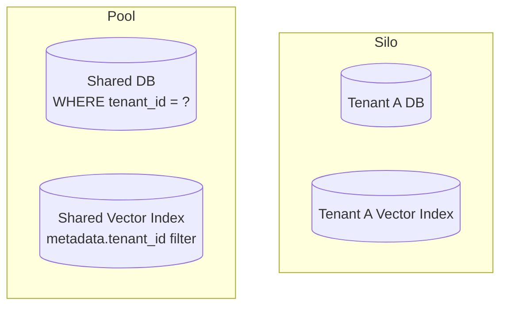

# 2. Multi-Tenant User Management

Module 1 framed "Ledger" as serving thousands of concurrent analysts across enterprise
tenants with strict data isolation. This module makes that concrete. A GenAI platform serving
many customers must guarantee one tenant's data, cost, and failures never leak into another's
— this touches auth, data isolation in every store including vector DBs, and rate limiting,
all specific to GenAI's extra data plane (embeddings, memory, conversation history) beyond
what a typical multi-tenant SaaS app has to isolate.

## Learning objectives

- Compare tenant isolation models — silo, pool, bridge — and pick one per data type.
- Design per-tenant data isolation in a vector database and the trade-offs of each approach.
- Design auth/authz for a GenAI platform, down to which tools an agent may call on a user's
  behalf.
- Implement per-tenant rate limiting and quota enforcement.
- Design session management for multi-turn conversations across many concurrent users.

## Prerequisites

- [HLD Fundamentals for GenAI Systems](../01-hld-fundamentals-for-genai/README.md)

## Core concepts

### 2.1 What's different about multi-tenancy in GenAI

A typical multi-tenant SaaS app isolates rows in a relational database by tenant ID. A GenAI
platform has to isolate that *and* vector indexes (a customer's confidential filings shouldn't
be retrievable, even accidentally, by another tenant's query), *and* conversation/agent
memory ([Context & Memory Management at Scale](../../part-2-advanced-engineering/02-context-and-memory-management-at-scale/README.md)),
*and* which tools an agent acting for one tenant is permitted to call. Each of these is an
extra tenant-scoped surface a typical SaaS isolation model doesn't have to think about.

### 2.2 Isolation models

- **Silo** — fully separate infrastructure per tenant (separate database instance, separate
  vector index, sometimes separate compute). Strongest isolation, highest cost and operational
  overhead, no risk of cross-tenant data leakage even from a bug.
- **Pool** — shared infrastructure, logical isolation via tenant ID on every record/query.
  Lowest cost, highest efficiency, isolation depends entirely on every code path correctly
  applying the tenant filter — a single missed filter is a data leak.
- **Bridge** — a hybrid: shared infrastructure for most tenants, dedicated silos for tenants
  with stricter compliance requirements (paying a premium for it, typically).



Different layers of the same system can reasonably use different models — e.g. compute
(pooled, stateless, cheap to isolate logically) vs a specific compliance-tier tenant's document
store (siloed, because the compliance requirement demands it).

### 2.3 Vector DB multi-tenancy specifically

Two concrete approaches, directly extending
[Vector Databases](../../part-1-foundations/08-vector-databases/README.md) §8.5's metadata
filtering:

- **Namespace/collection-per-tenant** — most vector stores support logically separate
  namespaces within one deployment; a query only ever searches within its tenant's namespace.
  Strong isolation (a bug in query construction can't accidentally search another tenant's
  namespace, because it's not the same index at all), some overhead per additional namespace.
- **Shared index + metadata filter** — all tenants' vectors live in one index, isolated only by
  a `tenant_id` metadata filter applied on every query (Part 2 Module 4a's pre-filtering
  pattern, now security-critical rather than just precision-critical). Cheaper and simpler
  operationally, but isolation now depends on *every single query* correctly applying the
  filter — a missed filter is a cross-tenant data leak, not just an accuracy bug.

For Aster Health/Ledger-style compliance-sensitive tenants, namespace-per-tenant (or full silo)
is usually the right default despite the extra cost — the blast radius of a missed filter in
the shared-index approach is too severe for that risk profile.

### 2.4 AuthN/AuthZ

- **AuthN** (who is this) — API keys for service-to-service, OAuth/JWT for end-user sessions.
- **AuthZ** (what can they do) — role-based access control extended down to *which tools an
  agent acting on a user's behalf may call* — directly extending
  [LLM Guardrails](../../part-2-advanced-engineering/05-llm-guardrails/README.md) §5.5's
  least-privilege tool design from a single-agent concern into a per-user, per-tenant
  permission system (a Ledger analyst at one enterprise tenant should never be able to trigger
  a tool call that touches another tenant's filings, regardless of what the agent "decides").

### 2.5 Per-tenant rate limiting and cost attribution

Directly reusing [LLM Gateway](../../part-2-advanced-engineering/06-llm-gateway/README.md)
§6.3 and §6.6: the gateway is the natural enforcement point for per-tenant quotas, now applied
concretely — each tenant gets a configured rate limit and budget, enforced centrally so no
single tenant's usage spike affects others' availability (the "noisy neighbor" problem, §2.7).

### 2.6 Session management

A conversation session needs to be resumable correctly regardless of which server instance
handles a given request — directly reusing
[LangGraph Fundamentals](../../part-1-foundations/03-langgraph-fundamentals/README.md) §3.4's
checkpointing concept, but now with the checkpoint store itself needing to be a shared,
tenant-isolated service reachable by any server instance, not an in-memory store tied to one
process. This is elaborated fully in
[Memory & State at Scale](../07-memory-and-state-at-scale/README.md).

### 2.7 Noisy neighbor

In a pooled model, one tenant's expensive workload (e.g. a huge ingestion job) can degrade
another tenant's query latency if they share compute/index resources without resource quotas.
Mitigations: queue prioritization (ingestion jobs run at lower priority than interactive
queries), per-tenant resource quotas (caps on concurrent requests or compute share), and — for
tenants where this risk is unacceptable — moving them to the silo model despite the extra cost.

## Scenario walkthrough

"Ledger" onboards its first three enterprise customers. Two go on a shared pooled tier:
compute is shared, and their document chunks live in one vector index isolated by a
`tenant_id` metadata filter enforced on every query — cost-efficient, acceptable risk profile
for these customers' compliance requirements. The third customer has a stricter compliance
requirement and goes on a dedicated silo: a fully separate vector index and a separate database
instance, at a higher price point that reflects the added infrastructure cost. The gateway
(Module 1's `tenants` config) enforces a per-tenant monthly budget for all three regardless of
tier, and when the third tenant kicks off a large historical-document backfill (previewing
[Ingesting 10M+ Documents](09-ingesting-10m-plus-documents/README.md)), it runs on a
lower-priority queue specifically so it can't degrade the other two tenants' interactive query
latency — even though, being siloed, it technically couldn't affect their *data* at all, it
could still affect shared *compute* if not for the priority queue.

## Code example

```python
from pydantic import BaseModel
from typing import Literal

class TenantConfig(BaseModel):
    tenant_id: str
    isolation_tier: Literal["pooled", "silo"]
    vector_namespace: str  # or a separate index/DB connection string if silo
    monthly_budget_usd: float
    max_concurrent_requests: int

def build_retrieval_filter(tenant: TenantConfig, base_filter: dict) -> dict:
    # Every query MUST include this — this is the single most important line in this module
    return {**base_filter, "tenant_id": tenant.tenant_id}

def authorize_tool_call(user_role: str, tenant_id: str, tool_name: str, target_tenant_id: str) -> bool:
    if tenant_id != target_tenant_id:
        return False  # structurally block any cross-tenant tool call, regardless of role
    allowed_tools_by_role = {
        "analyst": {"search_filings", "summarize_document"},
        "admin": {"search_filings", "summarize_document", "manage_users"},
    }
    return tool_name in allowed_tools_by_role.get(user_role, set())
```

## Production pitfalls

- **A single query path that forgets the tenant filter.** In the pooled model, this is a
  direct data leak, not just a bug — treat tenant-filter application as something to test
  exhaustively (every retrieval code path, every tool), not something to trust by convention.
- **Rate limits enforced per-user instead of per-tenant.** A tenant with many users can still
  overwhelm shared resources if limits aren't aggregated at the tenant level.
- **No priority differentiation between interactive and batch workloads sharing compute.** The
  noisy-neighbor scenario above — without explicit prioritization, a batch job degrades
  interactive latency for everyone sharing that compute pool.
- **Authorization checked only at the API layer, not at the tool-call layer.** A user's
  request might be correctly authorized at the API level but the *agent's* subsequent tool
  calls need their own authorization check — an agent acting on stale or cached permissions is
  a real risk in a long-running session.

## Key takeaways

- GenAI multi-tenancy has extra tenant-scoped surfaces beyond typical SaaS: vector indexes,
  conversation memory, and agent tool permissions.
- Silo/pool/bridge isolation models can be applied per layer, not uniformly across a whole
  system — match the model to each data type's actual risk profile.
- Vector DB isolation via namespace-per-tenant is stronger but costlier than shared-index +
  metadata filter; the latter's isolation guarantee is only as strong as its weakest query path.
- Authorization needs to extend down to individual tool calls an agent makes on a user's
  behalf, not stop at the API layer.
- The gateway (Part 2 Module 6) is the natural place to enforce per-tenant quotas and prevent
  noisy-neighbor effects.

## Exercises

1. For a new "Ledger" tenant requesting the cheapest possible tier, design the isolation model
   you'd offer and the specific risk you'd disclose to them in exchange for the cost savings.
2. Extend `authorize_tool_call` to support a "read-only auditor" role that can call
   `search_filings` but not `summarize_document` — and explain why authorization needs to be
   enforced at this layer even if the UI never exposes the disallowed action.
3. Design a noisy-neighbor mitigation for a scenario where two pooled tenants share a vector
   index and one starts issuing a much higher query volume than usual.

Next: [Database Design for GenAI Apps](../03-database-design-for-genai-apps/README.md)
