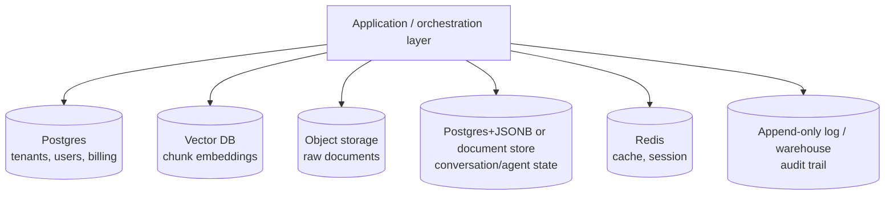
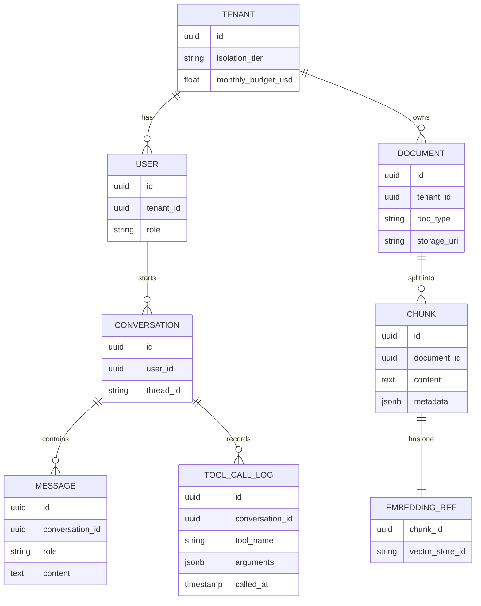

# 3. Database Design for GenAI Apps

Module 2's `TenantConfig` and isolation models assumed a schema of tenants, users, and
documents without ever specifying where any of it actually lives. A GenAI app's data isn't
just "rows in Postgres" — it's conversation history, embeddings, tool-call audit logs, cached
responses, and document metadata, each with different access patterns. Picking one database
for all of it is the most common early mistake; polyglot persistence, chosen deliberately, is
the fix.

## Learning objectives

- Enumerate the distinct data types a GenAI app produces and their access patterns.
- Justify a polyglot persistence design across relational, document/KV, vector, object, and
  cache stores.
- Design an entity-relationship schema for the core GenAI entities.
- Reason about consistency requirements per data type.

## Prerequisites

- [Multi-Tenant User Management](../02-multi-tenant-user-management/README.md)

## Core concepts

### 3.1 The data taxonomy

- **Tenancy/users/billing** — classic relational data: strong consistency required, moderate
  volume, complex relationships (joins across users, tenants, subscriptions).
- **Conversation/agent state** — append-heavy writes, read-recent access pattern (Part 1
  Module 3's checkpointing, Part 2 Module 2's memory).
- **Document chunks + embeddings** — write-once-per-ingestion, read via ANN search, not joins
  (Part 1 Module 8).
- **Tool-call audit logs** — write-heavy, append-only, rarely read except for debugging/
  compliance (Part 2 Module 7 §7.5).
- **Cache entries** — extremely high read/write throughput, short-lived, loss-tolerant (Part 2
  Module 3, Part 3 Module 8).

No single database engine is well-suited to all five access patterns simultaneously — this is
the concrete justification for polyglot persistence, not just a buzzword.

### 3.2 Polyglot persistence architecture



Each store is chosen for its access pattern, not out of technology preference — Postgres for
strongly-consistent relational data, a vector DB for ANN search, object storage for large raw
files, a fast KV/document store or Postgres+JSONB for semi-structured conversation state, Redis
for cache/session, and an append-only log or warehouse for audit trails that are written far
more than they're read.

### 3.3 Core ER schema



Note `EMBEDDING_REF` — the actual vector lives in the vector DB (Part 1 Module 8), not in
Postgres; this table just holds the join key connecting a chunk's relational metadata to its
vector-store identity, so metadata filtering (Part 2 Module 4a) can be applied from either
direction.

### 3.4 Consistency requirements per entity

| Entity | Consistency need | Why |
|---|---|---|
| `TENANT`, billing fields | Strict (strong consistency) | Financial correctness — a double-charge or missed charge is unacceptable |
| `USER`, `role` (authz) | Strict | Module 2's authorization checks must see current permissions immediately |
| `CONVERSATION`, `MESSAGE` | Mostly strict within one session | A user should see their own just-sent message immediately |
| `CHUNK`, `EMBEDDING_REF` | Eventual is fine | A few seconds' delay before a newly ingested document is searchable is acceptable |
| `TOOL_CALL_LOG` | Eventual, append-only | Audit logs don't need to be immediately queryable, just durably written |

This table is the seed of the CAP-trade-off discussion formalized fully in
[Database Scaling Strategies](../10-database-scaling-strategies/README.md) — decide which
entities can tolerate eventual consistency *before* scaling forces the decision on you under
pressure.

## Scenario walkthrough

Designing "Ledger"'s schema for millions of document chunks with metadata, linked to
embeddings in a separate vector store, plus per-analyst conversation history. Chunk metadata
(document type, filing date, tenant ID, filer name) lives in Postgres, queryable with standard
SQL for reporting and joined against tenant/user tables for access control. The chunk *vectors*
live in the vector DB, addressed by the shared `chunk_id`/`EMBEDDING_REF` join key — so a
metadata-filtered query (Module 2a's pattern) can either start from Postgres (find matching
chunk IDs by metadata, then fetch their vectors) or start from the vector DB (ANN search
first, then join back to Postgres for full metadata), depending on which is more selective for
a given query shape.

## Code example

```python
from sqlalchemy import create_engine, text

engine = create_engine("postgresql://ledger_app@db-host/ledger")

def get_chunk_ids_by_metadata(tenant_id: str, filer_name: str, filing_year: int) -> list[str]:
    with engine.connect() as conn:
        result = conn.execute(
            text("""
                SELECT c.id FROM chunk c
                JOIN document d ON c.document_id = d.id
                WHERE d.tenant_id = :tenant_id
                  AND d.metadata->>'filer_name' = :filer_name
                  AND d.metadata->>'filing_year' = :filing_year
            """),
            {"tenant_id": tenant_id, "filer_name": filer_name, "filing_year": str(filing_year)},
        )
        return [row.id for row in result]

# Then fetch corresponding vectors from the vector DB using these chunk IDs,
# or apply the same metadata as a filter directly at the vector DB if it supports it —
# whichever is more selective depends on the specific query (Part 2 Module 4a)
```

## Production pitfalls

- **Putting everything in one database "to keep it simple."** Works until the access patterns
  diverge enough that one store becomes a bottleneck for a use case it was never suited for —
  usually vector search performance degrading inside a general-purpose relational store at
  scale (revisited concretely in Module 10).
- **No shared join key between the relational metadata store and the vector store.** Without
  something like `EMBEDDING_REF`, you can't cheaply combine structured filtering with vector
  search — you end up either duplicating metadata into the vector store or losing the ability
  to filter efficiently.
- **Treating audit logs as needing the same consistency guarantees as billing data.** Over-
  engineering consistency for write-heavy, rarely-read data wastes throughput for no benefit.
- **Schema decided without an access-pattern review.** Design the schema around how data is
  actually queried (§3.1's taxonomy), not just its logical relationships.

## Key takeaways

- Different GenAI data types have genuinely different access patterns, justifying deliberate
  polyglot persistence rather than a single default database.
- A shared join key (like `chunk_id`) between relational metadata and vector storage is what
  makes combined structured + semantic queries possible.
- Consistency requirements vary sharply by entity — decide this explicitly per entity, not
  uniformly.
- This module's schema is the foundation every later Part 3 module (ingestion, scaling, memory)
  builds on and stresses at increasing scale.

## Exercises

1. Add a `feedback` entity (thumbs up/down on a message, referenced in Part 2 Module 7's
   online evals) to the ER diagram, and decide its consistency requirement.
2. For the two query strategies described in the scenario walkthrough (start from Postgres vs
   start from the vector DB), describe a query shape where each would be more efficient.
3. Explain why `EMBEDDING_REF` is modeled as a separate table/join rather than storing the
   vector directly as a column in `CHUNK`.

Next: [Event-Driven Architecture in GenAI Apps](../04-event-driven-architecture/README.md)
