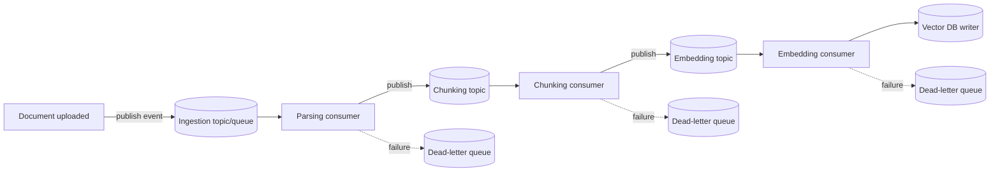
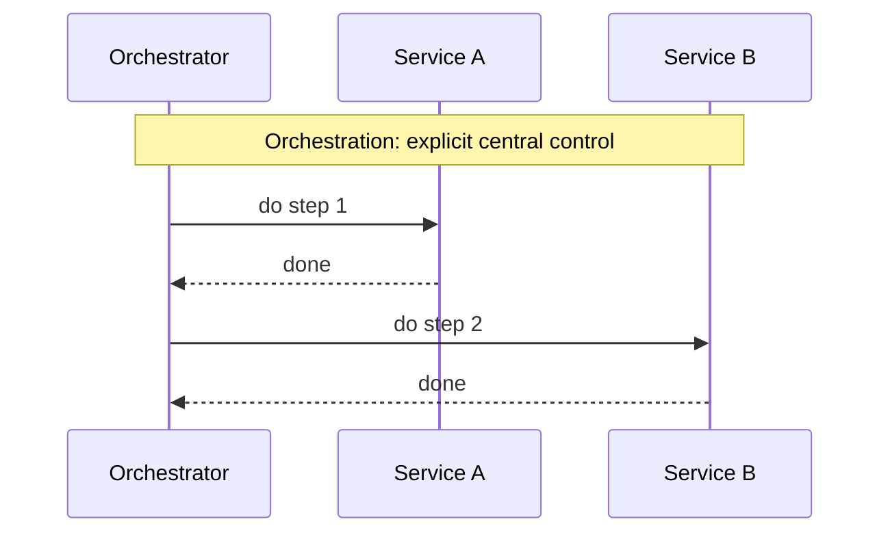
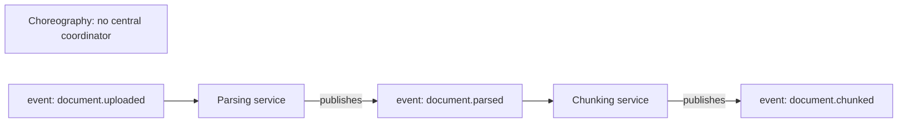

# 4. Event-Driven Architecture in GenAI Apps

Module 3's `CHUNK`/`EMBEDDING_REF` tables assumed documents get ingested somehow, without
specifying how. Document ingestion, embedding generation, and long-running agent workflows are
naturally asynchronous and bursty — doing them synchronously in the request path makes your API
as slow as your slowest LLM call. Event-driven architecture decouples "accept the work" from
"do the work."

## Learning objectives

- Identify which parts of a GenAI system should be synchronous vs asynchronous.
- Design an event-driven ingestion pipeline: producers, topics/queues, consumers,
  dead-letter queues.
- Compare orchestration vs choreography for multi-step GenAI workflows.
- Apply event sourcing where useful, without over-applying it everywhere.
- Design for idempotency and at-least-once delivery.

## Prerequisites

- [Database Design for GenAI Apps](../03-database-design-for-genai-apps/README.md)

## Core concepts

### 4.1 Sync vs async decision map

- **Synchronous**: user-facing query/response — the user is waiting, latency budget is tight
  (Module 1's per-feature SLOs).
- **Asynchronous**: document ingestion (Part 3 Module 9), embedding generation, batch
  evaluation runs (Part 2 Module 7), long agent workflows where the user doesn't need to watch
  every step complete in real time.

The test: if forcing the caller to wait for full completion would blow the latency SLO or
serve no purpose (nobody's watching), it belongs on the async side.

### 4.2 Event-driven ingestion pipeline



Each stage is an independently scalable consumer group — the embedding stage (typically the
bottleneck, being rate-limited by an external provider, previewed in
[Ingesting 10M+ Documents](../09-ingesting-10m-plus-documents/README.md)) can have more workers
than the parsing stage without either stage blocking the other. A **dead-letter queue (DLQ)**
per stage catches messages that repeatedly fail processing, so one malformed document doesn't
block the queue for everything behind it — it gets set aside for investigation instead.

### 4.3 Orchestration vs choreography

- **Orchestration** — a central coordinator explicitly directs each step of a multi-step
  workflow (this is exactly what LangGraph, Part 1 Module 3, does at the application level —
  and the same principle applies at the infrastructure level for cross-service workflows).
- **Choreography** — services independently react to events with no central coordinator; each
  service knows what event to listen for and what event to publish next, and the overall
  workflow emerges from those independent reactions.





Orchestration gives you a single place to see the full workflow state and add auditability
(valuable for Aster Health/Ledger-style compliance needs) at the cost of a coordinator being a
potential bottleneck. Choreography scales more organically (no central coordinator to scale)
but makes the *overall* workflow harder to observe — "what happened to this document" requires
piecing together events across services rather than reading one orchestrator's state. For
GenAI ingestion pipelines with real compliance/audit needs, **orchestration or a hybrid is
usually the better default** — the auditability requirement outweighs choreography's
scalability edge in most of this course's scenarios.

### 4.4 Event sourcing, selectively

**Event sourcing** stores the full sequence of events as the source of truth, with current
state derived by replaying them, rather than storing only current state. Useful specifically
for **agent action logs** — being able to replay exactly what an agent did and why (directly
extending [LLMOps: Observability & Security](../../part-2-advanced-engineering/07-llmops-observability-and-security/README.md)'s
tracing into a durable, replayable log) is valuable for debugging and compliance. Not every
piece of state in the system needs this treatment — applying event sourcing universally adds
real complexity (replay logic, snapshotting for performance) for entities that don't need
historical replay (Module 3's `TENANT` billing config, for instance, is fine as simple
current-state storage).

### 4.5 Idempotency and delivery guarantees

Most message queues guarantee **at-least-once delivery** — a message might be delivered and
processed more than once (e.g. after a consumer crash and retry). Processing must therefore be
**idempotent**: reprocessing the same "document chunked" event a second time must not create a
duplicate chunk record. Standard technique: an idempotency key (e.g. `document_id + stage`)
checked against a dedup table before processing, directly extending
[Caching in Agents](../../part-2-advanced-engineering/03-caching-in-agents/README.md) §3.5's
idempotent-write pattern from a single tool call to a whole pipeline stage.

## Scenario walkthrough

"Ledger" ingests a burst of 50,000 new filings overnight from a regulatory data feed. An
event-driven pipeline absorbs the burst: the upload step publishes 50,000 events to the
ingestion topic near-instantly and returns, rather than blocking on full processing. The
embedding stage — bottlenecked by the embedding provider's rate limit — processes its queue at
a steady, provider-limited rate over the following hours, while the parsing and chunking stages
(not rate-limited externally) keep pace well ahead of it, simply queuing up work for embedding
to catch up to. If the embedding consumer crashes partway through and restarts, the
idempotency-key/dedup-table check (§4.5) ensures already-embedded chunks aren't reprocessed and
duplicated. A downstream consumer failure on a handful of malformed filings routes those
specific messages to the DLQ rather than blocking the other 49,995.

## Code example

```python
import hashlib

def idempotency_key(document_id: str, stage: str) -> str:
    return hashlib.sha256(f"{document_id}:{stage}".encode()).hexdigest()

def process_embedding_event(event: dict, dedup_store, vector_store) -> None:
    key = idempotency_key(event["document_id"], "embedding")
    if dedup_store.exists(key):
        return  # already processed, safe no-op on redelivery
    try:
        chunks = event["chunks"]
        vectors = embed_chunks(chunks)  # calls the embedding provider
        vector_store.upsert(vectors)
        dedup_store.mark_done(key)
    except Exception as exc:
        publish_to_dlq(event, reason=str(exc))
        raise  # let the queue's retry/redelivery mechanism handle it up to a retry limit
```

## Production pitfalls

- **Processing logic that isn't actually idempotent.** At-least-once delivery is the norm for
  most queue systems — code that assumes exactly-once delivery will eventually double-process
  a message and corrupt state (duplicate chunks, double-charged usage).
- **No dead-letter queue, or a DLQ nobody monitors.** Without one, a single malformed message
  can block an entire queue; with one nobody watches, failures accumulate silently.
- **Choosing choreography for compliance-sensitive workflows without an audit trail plan.**
  The scalability benefit isn't worth losing "what happened to this document" traceability for
  Aster Health/Ledger-style requirements — prefer orchestration or add explicit event-sourced
  logging on top of choreography if you go that route.
- **Applying event sourcing everywhere "for consistency."** Adds real operational complexity
  (replay/snapshotting) that isn't justified for entities with no need for historical replay.

## Key takeaways

- Sync for user-facing latency-sensitive requests, async (event-driven) for bursty background
  work like ingestion — this decision should be explicit per feature, not accidental.
- Event-driven pipelines decouple each processing stage so the slowest stage (often embedding,
  rate-limited by a provider) doesn't block faster upstream stages.
- Orchestration favors auditability; choreography favors decoupled scalability — GenAI's
  compliance needs usually favor orchestration or a hybrid.
- At-least-once delivery is standard; idempotent processing (via dedup keys) is required to
  handle it safely, not optional.

## Exercises

1. Design the event schema (fields) for a `document.chunked` event that the embedding consumer
   would subscribe to.
2. Argue whether Northwind's much smaller-scale RAG ingestion (Part 1 Module 7) actually needs
   full event-driven infrastructure, or whether a simpler synchronous batch job is more
   appropriate at that scale — what's the crossover point?
3. Design a DLQ monitoring/alerting policy: what threshold of DLQ messages should trigger a
   page vs just a dashboard entry?

Next: [Scaling GenAI Systems](../05-scaling-genai-systems/README.md)
