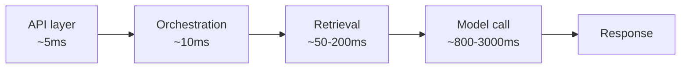
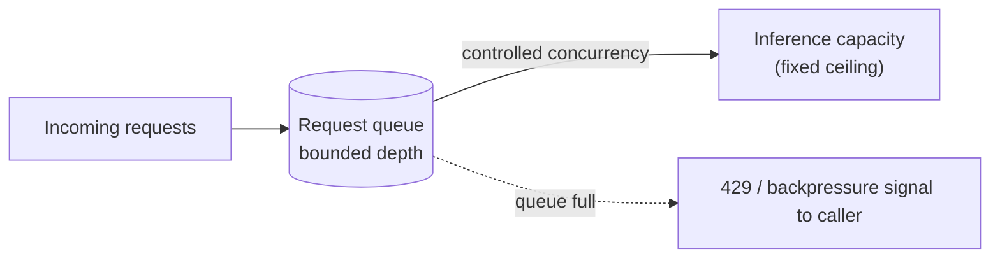

# 5. Scaling GenAI Systems

Module 4's embedding stage being "the bottleneck, rate-limited by an external provider" was
mentioned twice without being analyzed — this module is that analysis, generalized. Scaling a
GenAI system isn't just "add more servers": the bottleneck is usually the model call itself
(GPU-bound, expensive, slow), so scaling strategy has to account for request queuing,
batching, and load balancing across models/providers, not just stateless web-tier horizontal
scaling.

## Learning objectives

- Identify the actual bottleneck in a GenAI request path before choosing a scaling strategy.
- Design horizontal scaling for the stateless API/orchestration tier.
- Design request queuing and backpressure for bursty load against fixed inference capacity.
- Apply load balancing strategies across multiple model instances/providers.
- Reason about autoscaling GPU-backed inference workers: cold start cost, batching for
  throughput.

## Prerequisites

- [Event-Driven Architecture in GenAI Apps](../04-event-driven-architecture/README.md)

## Core concepts

### 5.1 Where the bottleneck actually is



In almost every GenAI request, the model call dominates total latency by an order of
magnitude over everything else. This has a direct consequence for scaling strategy: scaling
the API layer horizontally (trivial, well-understood, standard cloud-native practice) does
nothing for the actual bottleneck. Confirm where the time (and cost) actually goes — via the
tracing from
[LLMOps: Observability & Security](../../part-2-advanced-engineering/07-llmops-observability-and-security/README.md)
— before investing scaling effort anywhere.

### 5.2 Scaling the stateless tiers

The API and orchestration layers are stateless (assuming memory/session state is externalized,
per [Database Design for GenAI Apps](../03-database-design-for-genai-apps/README.md)) and
scale using standard, well-known techniques: more container replicas behind a load balancer,
autoscaling on request concurrency or CPU. This part of the system is not GenAI-specific and
is comparatively easy — the interesting scaling problems are in §5.3-5.5.

### 5.3 Queuing and backpressure against fixed capacity

A model provider (or a self-hosted inference fleet) has a hard capacity ceiling — a maximum
sustainable request rate. Unbounded concurrency from your API layer into a rate-limited
dependency doesn't scale throughput, it just produces rate-limit errors and, worse, can cause
cascading failure if those errors trigger naive retries that add even more load (directly
setting up [High Availability & Reliability](../06-high-availability-and-reliability/README.md)'s
retry-policy discussion). The fix: an explicit **queue** in front of inference capacity, with
**backpressure** — the system tells callers "wait" or "try later" rather than accepting
unlimited concurrent work it can't actually serve.



### 5.4 Load balancing across model instances/providers

Directly extending [LLM Gateway](../../part-2-advanced-engineering/06-llm-gateway/README.md)
§6.4's fallback chains into an active load-balancing strategy across *multiple concurrently
healthy* targets, not just failover to a backup on failure:

- **Round robin** — simplest, even distribution, ignores actual load per target.
- **Least outstanding requests** — routes to whichever instance currently has the fewest
  in-flight requests, better for uneven request durations (which is common — some prompts
  generate far more output tokens than others).
- **Cost-aware / latency-aware routing** — routes based on current cost or observed latency
  per provider, directly using the gateway's cost/latency tracking (Part 2 Module 6 §6.3).

This sits at or just behind the gateway layer — the gateway is where load balancing across
providers/models is naturally implemented, reusing infrastructure already built in Part 2.

### 5.5 GPU inference scaling

- **Request batching** — processing multiple requests together in a single forward pass
  dramatically improves GPU throughput compared to one-request-at-a-time; **continuous
  batching** (dynamically adding new requests into an in-progress batch as others complete
  rather than waiting for a fixed batch to fully finish) is the modern standard technique,
  detailed further in [Server & Compute Scaling](../11-server-and-compute-scaling/README.md).
- **Autoscaling triggers** — for GPU-backed inference workers, scaling on **queue depth**
  (how much work is waiting) is usually a better signal than CPU/GPU utilization alone, since
  utilization can look "fine" right up until the queue backs up sharply.
- **Cold start cost** — a new GPU worker instance can take meaningfully longer to become ready
  than a stateless API container (model loading, GPU initialization) — autoscaling policy needs
  to account for this lag, often via pre-warming for predictable load patterns rather than
  purely reactive scale-up.

## Scenario walkthrough

"Ledger" during quarter-end, when analyst query volume spikes roughly 8x over baseline.
Walking through what scales automatically versus what needs deliberate handling: the stateless
API tier autoscales horizontally without any special design (§5.2) and absorbs the spike
trivially. Embedding jobs from ongoing ingestion (Module 4's pipeline) queue gracefully — the
event-driven design means a backlog just means ingestion completes a bit later, with no user-
facing impact, since nobody is synchronously waiting on it. Interactive query inference
capacity is the genuine constraint: it can't scale up 8x within the request's latency SLO
(Module 1's sub-2-second p95) purely reactively, because GPU worker cold-start lag (§5.5) is
too slow relative to how fast the spike arrives. The practical answer for a *known, predictable*
spike like quarter-end: deliberate overprovisioning ahead of the event (pre-warmed capacity)
rather than relying on autoscaling alone — a capacity-planning decision, not just an
infrastructure one.

## Code example

```python
import asyncio

class BoundedInferenceQueue:
    def __init__(self, max_concurrency: int, max_queue_depth: int):
        self.semaphore = asyncio.Semaphore(max_concurrency)
        self.max_queue_depth = max_queue_depth
        self.current_queue_depth = 0

    async def submit(self, coro):
        if self.current_queue_depth >= self.max_queue_depth:
            raise QueueFullError("Inference capacity saturated, try again later")
        self.current_queue_depth += 1
        try:
            async with self.semaphore:
                return await coro
        finally:
            self.current_queue_depth -= 1

class QueueFullError(Exception):
    pass

# Usage: bound concurrent calls to a fixed-capacity model endpoint
queue = BoundedInferenceQueue(max_concurrency=50, max_queue_depth=500)

async def handle_request(prompt: str, model_call):
    return await queue.submit(model_call(prompt))
```

## Production pitfalls

- **Scaling the API tier and assuming it fixes latency.** If the model call dominates request
  time (§5.1), adding API replicas does nothing for the actual bottleneck — a wasted scaling
  effort that can even make things worse by increasing concurrent pressure on the real
  bottleneck.
- **Unbounded concurrency into a rate-limited provider.** Produces cascading failures under
  load rather than graceful degradation — always bound concurrency explicitly (§5.3's pattern).
- **Reactive-only autoscaling for predictable spikes.** Quarter-end-style known traffic
  patterns should be pre-provisioned for, not left to reactive autoscaling that can't keep pace
  with cold-start lag.
- **Ignoring queue depth as an autoscaling signal.** CPU/GPU utilization alone can look healthy
  right up until a queue backs up sharply — monitor and scale on queue depth directly for
  inference workloads.

## Key takeaways

- Identify the actual bottleneck (usually the model call) via tracing before choosing where to
  invest scaling effort.
- Stateless tiers scale with standard cloud-native techniques; inference capacity needs
  explicit queuing/backpressure because it has a hard ceiling.
- Load balancing across model instances/providers extends naturally from the gateway's
  fallback logic (Part 2 Module 6).
- GPU inference scaling depends on batching for throughput and queue-depth-based autoscaling,
  with cold-start lag that reactive scaling alone often can't outrun for sudden spikes.

## Exercises

1. Given the request-path latency breakdown in §5.1, calculate what percentage speedup halving
   the retrieval layer's latency would deliver versus halving the model call's latency, and
   explain what this implies about where to invest engineering time.
2. Design an autoscaling policy for a GPU inference fleet that uses queue depth as the primary
   signal, including what queue-depth threshold would trigger scale-up.
3. For "Ledger"'s predictable quarter-end spike, propose a pre-warming schedule and explain
   what signal would tell you it's time to scale back down afterward.

Next: [High Availability & Reliability](../06-high-availability-and-reliability/README.md)
