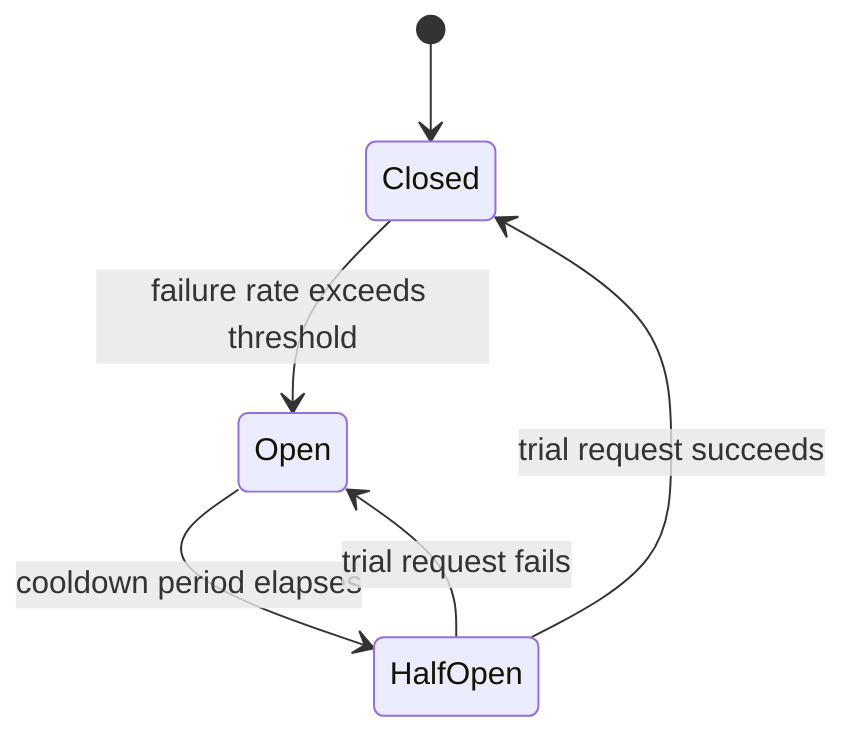
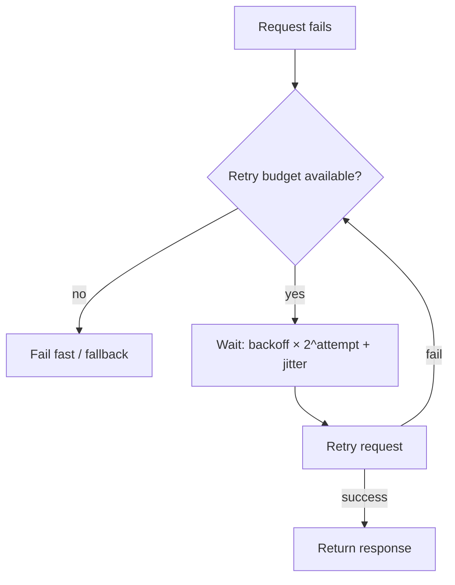
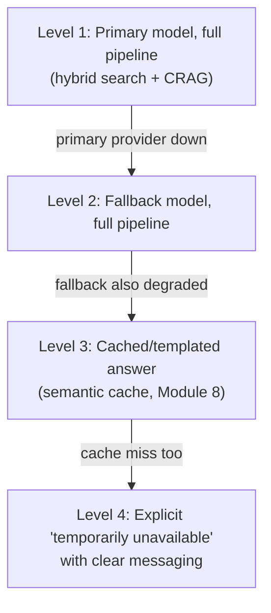

# 6. High Availability & Reliability

Module 5 §5.3 flagged it directly: naive retries against an already-struggling provider can
turn a partial outage into a cascading failure. This module is the full treatment. Model
providers have outages, rate limits get hit, and inference is slow enough that a naive retry
can make things worse, not better. GenAI availability engineering is largely about surviving
*your dependencies'* failures, not just your own.

## Learning objectives

- Define SLIs/SLOs/error budgets for a GenAI feature, and explain why availability alone isn't
  sufficient.
- Design redundancy across model providers and across regions.
- Implement circuit breakers around flaky dependencies to prevent cascading failure.
- Design retry policy correctly for LLM calls: backoff, jitter, idempotency, retry budgets.
- Plan graceful degradation instead of hard failure.

## Prerequisites

- [Scaling GenAI Systems](../05-scaling-genai-systems/README.md)

## Core concepts

### 6.1 What "available" means beyond uptime

A GenAI feature can be "up" (responding, low error rate) while still being effectively broken
— confidently wrong, ungrounded, or unhelpful. **SLIs (Service Level Indicators)** for a GenAI
system need to include quality signals, not just liveness: response latency, error rate, *and*
groundedness/accuracy rate (from
[LLMOps: Observability & Security](../../part-2-advanced-engineering/07-llmops-observability-and-security/README.md)'s
metrics). **SLOs** set targets against these SLIs; an **error budget** is the allowed amount of
SLO violation before it's treated as an incident. A fast, confidently wrong answer can be worse
for user trust than a slow correct one or an honest "I don't know" (Part 2 Module 4d's CRAG
fallback) — this is why quality SLIs belong in the availability conversation at all.

### 6.2 Redundancy design

- **Multi-provider model fallback** — directly reusing
  [LLM Gateway](../../part-2-advanced-engineering/06-llm-gateway/README.md) §6.4's fallback
  chains, now framed as an availability mechanism rather than just a gateway feature.
- **Multi-region deployment** — the stateless tiers (Module 5 §5.2) replicate across regions
  straightforwardly; the harder problem is state (memory, checkpoints — full treatment in
  [Memory & State at Scale](../07-memory-and-state-at-scale/README.md)) and the vector index
  itself, which needs its own replication strategy (previewed here, detailed in
  [Database Scaling Strategies](../10-database-scaling-strategies/README.md)).
- **Replicated vector indexes** — read replicas of the vector index so a single index node's
  failure doesn't take down retrieval entirely.

### 6.3 Circuit breakers

A circuit breaker tracks failures against a dependency and, past a threshold, stops sending it
traffic for a cooldown period — protecting both your system (no more requests hanging waiting
on a failing dependency) and the struggling dependency itself (no pile-on of retries making its
recovery harder).



- **Closed** — normal operation, requests flow through.
- **Open** — dependency is failing past threshold; requests fail fast (or route to fallback)
  without even attempting the call.
- **Half-open** — after a cooldown, a small number of trial requests test whether the
  dependency has recovered before fully reopening traffic.

The gateway (Part 2 Module 6) is the natural place to implement this centrally, per-provider,
rather than in every calling service independently.

### 6.4 Retry policy done right

- **Exponential backoff with jitter** — each retry waits longer than the last (exponential),
  with randomization (jitter) so many clients retrying simultaneously don't all hammer the
  recovering dependency at the same instant (the "thundering herd" problem).
- **Retry budgets** — a cap on total retries, both per-request and system-wide (e.g. "never
  more than 10% of total traffic can be retries") — an unbounded retry policy under a real
  outage *amplifies* load precisely when the dependency can least handle it.
- **Retry economics are different for LLM calls** than typical API calls: retrying a request
  that generates 500 output tokens re-does all of that generation work (and cost) — a failed
  long-generation request is expensive to retry blindly. Consider whether a *shorter* fallback
  response is more appropriate than a full retry in some failure paths.



### 6.5 Graceful degradation ladder

Rather than a binary up/down, define explicit degradation levels the system falls through as
dependencies fail:



Each level is a deliberate, tested fallback — not an accidental crash into an error page. The
goal is that users experience *reduced* quality/functionality during an incident, not a hard
outage, wherever that trade-off is acceptable for the specific feature.

## Scenario walkthrough

"Ledger"'s primary model provider has a 45-minute regional outage during business hours. The
circuit breaker (§6.3) trips after the failure-rate threshold is crossed within the first
handful of failed requests, moving to "open" and failing fast on further primary-provider calls
instead of letting every subsequent request hang waiting on a timeout. The gateway's fallback
chain (§6.2) routes traffic to a secondary provider — Level 2 on the degradation ladder,
somewhat different response characteristics but functioning. For the subset of requests where
even the fallback provider is saturated by the sudden traffic shift, the semantic cache (Module
8) serves recently-cached answers for repeated common questions — Level 3. Only for genuinely
novel questions with both providers unavailable does the system fall to Level 4's explicit
"temporarily degraded" messaging — a small fraction of total traffic, not the default
experience during the incident.

## Code example

```python
import time
import random

class CircuitBreaker:
    def __init__(self, failure_threshold: int, cooldown_seconds: float):
        self.failure_threshold = failure_threshold
        self.cooldown_seconds = cooldown_seconds
        self.failure_count = 0
        self.state = "closed"
        self.opened_at: float | None = None

    def call(self, fn, fallback_fn):
        if self.state == "open":
            if time.time() - self.opened_at > self.cooldown_seconds:
                self.state = "half_open"
            else:
                return fallback_fn()
        try:
            result = fn()
            if self.state == "half_open":
                self.state = "closed"
                self.failure_count = 0
            return result
        except Exception:
            self.failure_count += 1
            if self.failure_count >= self.failure_threshold:
                self.state = "open"
                self.opened_at = time.time()
            return fallback_fn()

def retry_with_backoff(fn, max_retries: int = 3, base_delay: float = 0.5):
    for attempt in range(max_retries):
        try:
            return fn()
        except Exception:
            if attempt == max_retries - 1:
                raise
            delay = base_delay * (2 ** attempt) + random.uniform(0, 0.3)  # exponential + jitter
            time.sleep(delay)
```

## Production pitfalls

- **Availability defined by uptime alone.** A system that's "up" but confidently wrong isn't
  actually meeting user needs — include quality SLIs in the SLO definition, not just latency
  and error rate.
- **Naive retries without a budget, during an active outage.** Amplifies load on an already-
  struggling dependency at the worst possible time — always cap total retry volume.
- **No jitter on backoff.** Synchronized retries from many clients create traffic spikes right
  when a recovering dependency is most fragile.
- **Degradation levels that were never tested.** A fallback path (Level 2, 3, or 4) that's
  never exercised until a real incident is a fallback path you don't actually know works —
  test degradation paths deliberately, not just hope they work when needed.
- **Circuit breaker thresholds tuned only for happy-path load.** A threshold that's too
  sensitive trips on normal transient errors; one that's too lenient doesn't protect against
  real outages — tune and validate against actual failure patterns.

## Key takeaways

- GenAI availability includes quality SLIs, not just uptime — a fast wrong answer isn't truly
  "available" in any useful sense.
- Circuit breakers prevent cascading failure by failing fast against a struggling dependency
  instead of piling on more load.
- Retry policy needs backoff, jitter, and an explicit budget — especially given how expensive a
  blind retry of a long LLM generation actually is.
- A tested, explicit degradation ladder (not a binary up/down) is what lets users experience
  reduced functionality instead of a hard outage during real incidents.

## Exercises

1. Define SLIs and SLOs (including a quality SLI) for "Ledger"'s interactive filing-search
   feature, and specify what would constitute an error-budget-exhausting incident.
2. Trace through the `CircuitBreaker` code example for a sequence of 5 failed calls followed by
   a cooldown period followed by 1 successful call — what state is the breaker in after each
   step?
3. Design a degradation ladder for Northwind's support copilot (lower stakes than Ledger) and
   compare it to this module's Ledger scenario — where does it make sense to have fewer levels?

Next: [Memory & State at Scale](../07-memory-and-state-at-scale/README.md)
