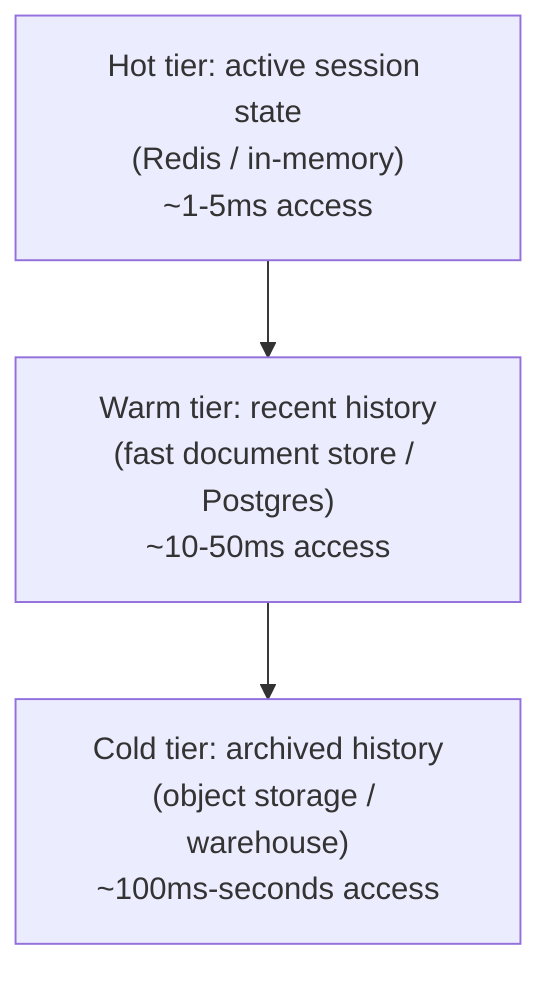

# 7. Memory & State at Scale

Module 2 §2.6 named the problem and deferred it here: a checkpoint store needs to be a shared,
tenant-isolated service reachable by any server instance, not an in-memory store tied to one
process. [Context & Memory Management](../../part-2-advanced-engineering/02-context-and-memory-management-at-scale/README.md)
covered memory for one agent, one conversation. This module covers memory infrastructure for
millions of concurrent users and long-lived agent state — a distributed systems problem, not a
prompting problem.

## Learning objectives

- Design a memory store architecture that scales horizontally across millions of users:
  partitioning strategy, storage engine choice, read/write access patterns.
- Separate hot state from cold state and design tiering between them.
- Design eviction and summarization policies that run as background jobs, not inline in the
  request path.
- Handle distributed state consistency for a single user's session across multiple server
  instances.
- Estimate memory infrastructure cost/capacity at scale.

## Prerequisites

- [Context & Memory Management at Scale](../../part-2-advanced-engineering/02-context-and-memory-management-at-scale/README.md)
- [Database Design for GenAI Apps](../03-database-design-for-genai-apps/README.md)

## Core concepts

### 7.1 From per-agent concept to infrastructure

Part 2 Module 2 designed *what* to write to memory and *how* to retrieve it, for one agent
serving conversations one at a time in the examples. At millions of concurrent users, the
questions change: where does this data physically live, how is it partitioned so no single
node becomes a bottleneck, and how does any server instance handling any request find the right
user's state fast.

### 7.2 Hot/warm/cold tiering



Not all conversation/memory data needs the same access latency: an in-progress conversation's
current state needs hot-tier speed (directly serving the interactive latency SLO from
[HLD Fundamentals](../01-hld-fundamentals-for-genai/README.md) §1.2); a conversation from three
weeks ago, rarely accessed, doesn't justify sitting in expensive hot storage indefinitely.
Tiering — with data migrating from hot to warm to cold as it ages — matches storage cost to
actual access frequency.

### 7.3 Partitioning strategy

Memory/session data is sharded — typically by user ID or tenant ID — so that reads/writes for
different users hit different partitions and no single partition absorbs disproportionate load.
The specific risk to design against: **hot partitions** from power users (a single very active
user or tenant generating far more read/write volume than a typical shard was sized for) —
addressed either with finer-grained partitioning for known high-volume tenants, or by moving
them to dedicated infrastructure (directly echoing
[Multi-Tenant User Management](../02-multi-tenant-user-management/README.md)'s silo option).

### 7.4 Externalizing state

For any server instance to serve any request (a precondition for the horizontal API scaling
described in [Scaling GenAI Systems](../05-scaling-genai-systems/README.md) §5.2), session
state must live in a shared external store, not in one server process's memory. The trade-off
against **sticky sessions** (routing a user's requests consistently to the same server
instance, which could then keep state locally): sticky sessions reduce external-store round
trips but reintroduce a scaling/availability coupling — if that specific server instance goes
down, that user's in-memory state is gone unless it was also persisted externally, which
defeats much of the purpose. Externalized state is the more robust default for a
horizontally-scaled system, at the cost of needing a fast, reliable shared store (§7.2's hot
tier).

### 7.5 Background jobs for maintenance

Summarization, compaction, and eviction (Part 2 Module 2 §2.3's techniques) are expensive
operations — running them inline, in the request path, adds latency to every conversation turn
for a maintenance task that doesn't need to happen synchronously. Moving this to background
jobs (directly reusing
[Event-Driven Architecture](../04-event-driven-architecture/README.md)'s async patterns —
e.g. a job triggered by a "conversation went idle" event) keeps the interactive path fast while
still keeping memory bounded and organized over time.

### 7.6 Capacity math

```
Assume: 5,000,000 monthly active users, average 500 messages/user/month retained in
warm-tier storage (older messages age into cold storage), ~200 bytes/message average
→ 5,000,000 × 500 × 200 bytes ≈ 500 GB in warm-tier storage
Hot tier (active sessions only, say 2% concurrently active at any moment):
→ 100,000 active sessions × ~10 KB average in-progress session state ≈ 1 GB in hot tier
```

The result is a useful sanity check: hot-tier storage (the expensive, low-latency tier) stays
comparatively small because only a small fraction of users are ever concurrently active,
while warm/cold tiers absorb the bulk of total data volume at much lower per-GB cost — this is
precisely why the tiering strategy in §7.2 matters economically, not just architecturally.

## Scenario walkthrough

A Northwind user's conversation spans three sessions over a week, handled by three different
server instances (normal behavior under horizontal scaling, §7.4) — each time, the relevant
conversation state and any long-term memory (Part 2 Module 2's semantic preferences) is
correctly reassembled from the externalized store, because no state lived only in any one
server's memory. A background job, triggered by an idle-conversation event a few hours after
the first session ends, compacts that session into a long-term summary (Part 2 Module 2 §2.3)
and moves the raw message history from hot to warm tier — invisibly, without adding latency to
any user-facing request.

## Code example

```python
import redis
from datetime import datetime, timedelta

hot_store = redis.Redis(host="session-cache", decode_responses=True)

def get_session_state(user_id: str, thread_id: str) -> dict | None:
    key = f"session:{user_id}:{thread_id}"
    raw = hot_store.get(key)
    if raw is None:
        return load_from_warm_tier(user_id, thread_id)  # fall through to Postgres/doc store
    return json.loads(raw)

def save_session_state(user_id: str, thread_id: str, state: dict, ttl_seconds: int = 3600) -> None:
    key = f"session:{user_id}:{thread_id}"
    hot_store.setex(key, ttl_seconds, json.dumps(state))  # hot tier, expires if idle

def partition_key(user_id: str, shard_count: int = 64) -> int:
    return hash(user_id) % shard_count  # simple hash-based partitioning by user_id

# Background job (triggered by an idle-conversation event, not inline in the request path)
def compact_idle_session(user_id: str, thread_id: str) -> None:
    state = load_from_warm_tier(user_id, thread_id)
    if datetime.now() - state["last_active"] > timedelta(hours=6):
        summary = summarize_conversation(state["messages"])
        archive_to_cold_tier(user_id, thread_id, state["messages"])
        write_summary_to_warm_tier(user_id, thread_id, summary)
```

## Production pitfalls

- **State living only in server process memory.** Breaks horizontal scaling and availability
  simultaneously — a server restart or scale-down event silently loses user state.
- **No hot-partition mitigation for power users/tenants.** A single very active tenant can
  overload a shard sized for average load — monitor per-shard load, not just aggregate load.
- **Maintenance jobs run inline.** Summarization/compaction triggered synchronously in the
  request path adds latency to every turn for work that could run asynchronously.
- **Tiering thresholds that don't match actual access patterns.** Moving data to cold storage
  too aggressively causes slow access for data users still reference somewhat often; too
  conservatively wastes hot/warm tier cost on rarely-accessed data — tune based on observed
  access patterns, not guesses.

## Key takeaways

- Memory infrastructure at scale is a partitioning, tiering, and externalized-state problem,
  distinct from the per-agent memory design decisions in Part 2.
- Hot/warm/cold tiering matches storage cost to actual access frequency, and capacity math
  typically shows hot-tier storage stays small relative to total data volume.
- Externalized state (not sticky sessions) is the more robust default for horizontally-scaled
  systems, enabling any server instance to serve any request.
- Maintenance operations (summarization, compaction, eviction) belong in background jobs, not
  the interactive request path.

## Exercises

1. Redo the capacity math in §7.6 for "Ledger"'s analyst scale (thousands of concurrent
   analysts, not millions of consumer users, but likely larger per-session state given
   document-heavy conversations) and note what changes about the tiering strategy.
2. Design a hot-partition mitigation for a single enterprise tenant whose usage volume is 50x
   a typical tenant's.
3. Argue for or against sticky sessions for a specific feature (e.g. a real-time streaming
   response) where the trade-off might favor sticky routing despite this module's general
   preference for externalized state.

Next: [Semantic Caching at Scale](../08-semantic-caching-at-scale/README.md)
