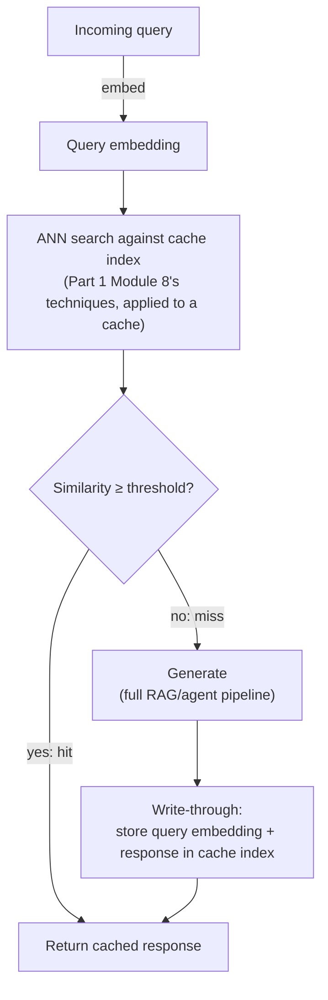

# 8. Semantic Caching at Scale

Module 6's degradation ladder put semantic caching at Level 3 — a real availability mechanism,
not just a cost optimization. [Caching in Agents](../../part-2-advanced-engineering/03-caching-in-agents/README.md)
§3.4 introduced semantic caching conceptually and deliberately deferred the real architecture
here. At scale it becomes real infrastructure: a vector-indexed cache serving millions of
lookups with strict latency and correctness requirements — a wrong cache hit here means a
wrong answer served confidently, to potentially many users.

## Learning objectives

- Design a semantic cache architecture: embed query → ANN lookup against a cache index →
  threshold decision → hit/miss → (miss) generate, then write-through.
- Choose and tune a similarity threshold, understanding the precision/recall trade-off.
- Design cache invalidation at scale: TTL, event-driven, versioning.
- Pick infrastructure for a semantic cache and justify against latency/cost requirements.
- Reason about when semantic caching is dangerous and should be scoped narrowly or disabled.

## Prerequisites

- [Caching in Agents](../../part-2-advanced-engineering/03-caching-in-agents/README.md)
- [Scaling GenAI Systems](../05-scaling-genai-systems/README.md)

## Core concepts

### 8.1 From concept to infrastructure

Part 2 Module 3 covered exact-match caching in depth and flagged semantic caching's risk
profile without building it out. At scale, semantic caching sits in front of the model layer
for *every* request (not just deterministic sub-tasks) — this changes it from an optimization
technique into a piece of core infrastructure with its own availability and correctness
requirements.

### 8.2 Full architecture



Note this reuses [Vector Databases](../../part-1-foundations/08-vector-databases/README.md)'
ANN search machinery directly — a semantic cache *is* a vector index, just one storing
`(query embedding → response)` pairs instead of `(chunk embedding → chunk text)` pairs.

### 8.3 Threshold tuning: the central trade-off

Set the similarity threshold too **loose** and semantically different-but-nearby queries
("what's your return policy" vs "what's your exchange policy") incorrectly hit the same cached
answer — a false-positive cache hit serving a confidently wrong response. Set it too **tight**
and the cache barely fires, most queries miss, and you lose most of the cost/latency benefit
that justified building this in the first place. There's no universal correct threshold — it
must be tuned against your own query distribution and validated by manually reviewing a sample
of hits near the threshold boundary to check for false positives, then monitored continuously
in production (via the groundedness/accuracy metrics from
[LLMOps: Observability & Security](../../part-2-advanced-engineering/07-llmops-observability-and-security/README.md)),
not set once and forgotten.

### 8.4 Invalidation at scale

- **TTL-only** — simplest, works for content that changes rarely and unpredictably; risk of
  serving stale answers for the TTL duration after an underlying change.
- **Event-driven invalidation** — a document-update event (from
  [Event-Driven Architecture](../04-event-driven-architecture/README.md)) explicitly busts
  related cache entries the moment source content changes, closing the staleness window that
  TTL-only leaves open — directly relevant to avoiding exactly the kind of stale-answer failure
  CRAG (Part 2 Module 4d) was built to catch on the retrieval side.
- **Versioned cache keys** — cache keys incorporate a document/index version identifier, so a
  new version naturally produces cache misses without needing explicit deletion of old entries
  — simpler to reason about than event-driven busting, at the cost of not immediately reclaiming
  space used by now-stale entries until they age out via TTL anyway.

### 8.5 Infrastructure choices

- **Redis + vector index hybrid** — Redis for the fast key-value response storage, paired with
  a vector index (or Redis's own vector search capability) for the similarity lookup — low
  latency, requires operating two coupled pieces of infrastructure.
- **A vector DB doubling as cache** — reuse the existing vector database infrastructure
  (already operated for RAG retrieval) with a separate collection/namespace for cache entries —
  simpler operationally (one less system to run), potentially higher latency than a
  purpose-built cache depending on the store.
- **A purpose-built semantic cache service** — increasingly available as a managed offering;
  trades control for reduced operational burden, similar to the managed-vs-self-hosted
  decision already made for the gateway (Part 2 Module 6 §6.5) and vector store (Part 1 Module
  8).

### 8.6 When not to semantically cache

- **Personalized answers** — a cached response for "what's in my cart" is specific to one
  user; semantic similarity across users' differently-worded-but-similar questions must never
  cross-contaminate personalized responses. Scope the cache key to include the user/tenant
  where personalization matters, or exclude these query types from semantic caching entirely.
- **Compliance-sensitive answers** — for Aster Health-style domains, a stale or slightly-off
  cached answer carries outsized risk; consider disabling semantic caching (falling back to
  exact-match only, or no caching) for the highest-stakes response categories.
- **Rapidly changing data** — if the underlying answer changes faster than your invalidation
  mechanism can realistically keep up with, the cache does more harm than good.

## Scenario walkthrough

"Ledger" analysts frequently ask near-duplicate questions about the same filing — "summarize
risk factors" and "what are the risk factors" are different strings but the same underlying
request. The semantic cache serves roughly 40% of such queries from cache in this scenario,
meaningfully cutting inference cost and latency for repeated questions across the analyst base.
When a filing is amended, a `filing.updated` event (Module 4's event-driven pattern)
invalidates the relevant cache entries — keyed by document ID, all cache entries whose queries
were answered using that document's content are busted within seconds, closing the staleness
window before analysts could be served an answer based on the superseded version.

## Code example

```python
from langchain_openai import OpenAIEmbeddings
import numpy as np

embeddings = OpenAIEmbeddings(model="text-embedding-3-small")
SIMILARITY_THRESHOLD = 0.93  # tuned against Ledger's own query distribution, not a universal default

def cosine_similarity(a: list[float], b: list[float]) -> float:
    a, b = np.array(a), np.array(b)
    return float(np.dot(a, b) / (np.linalg.norm(a) * np.linalg.norm(b)))

def semantic_cache_lookup(query: str, cache_index, k: int = 1) -> dict | None:
    query_vec = embeddings.embed_query(query)
    candidates = cache_index.similarity_search_with_score(query_vec, k=k)
    if not candidates:
        return None
    top_match, score = candidates[0]
    if score >= SIMILARITY_THRESHOLD:
        return {"response": top_match.metadata["response"], "cache_hit": True}
    return None

def semantic_cache_write(query: str, response: str, cache_index, document_version: str) -> None:
    query_vec = embeddings.embed_query(query)
    cache_index.add_texts(
        texts=[query],
        embeddings=[query_vec],
        metadatas=[{"response": response, "document_version": document_version}],
    )

def handle_query(query: str, cache_index, generate_fn, document_version: str) -> str:
    cached = semantic_cache_lookup(query, cache_index)
    if cached:
        return cached["response"]
    response = generate_fn(query)
    semantic_cache_write(query, response, cache_index, document_version)
    return response
```

## Production pitfalls

- **A threshold set once and never revisited.** Query distributions shift over time — a
  threshold validated at launch can drift into producing more false-positive hits as usage
  patterns change; monitor hit-quality continuously, not just at initial tuning.
- **Semantic caching personalized or compliance-sensitive responses by default.** Explicitly
  scope out or disable caching for these categories rather than applying one caching policy
  uniformly across every response type.
- **No cache-hit quality monitoring in production.** Without sampling and reviewing actual
  cache hits for correctness, a slowly-drifting threshold or an unexpected query-pattern shift
  can degrade answer quality silently.
- **Invalidation lag that outpaces content change frequency.** If TTL-only invalidation is used
  for genuinely fast-changing content, the cache serves stale answers more often than it should
  — match invalidation strategy to actual data volatility (§8.4).

## Key takeaways

- Semantic caching at scale is real infrastructure — a vector index over query embeddings,
  sitting in front of every request, not an optional micro-optimization.
- Threshold tuning is the central trade-off: too loose risks false-positive wrong answers, too
  tight loses most of the benefit — tune against real query data and monitor continuously.
- Event-driven invalidation closes the staleness window that TTL-only leaves open, when paired
  with the event-driven ingestion pipeline from Module 4.
- Some response categories (personalized, compliance-sensitive, rapidly-changing) should be
  explicitly excluded from semantic caching rather than caught by a uniform policy.

## Exercises

1. Propose a method for sampling and manually reviewing near-threshold cache hits in production
   to catch false positives before they accumulate into a real accuracy problem.
2. Design the cache-key scoping for a personalized feature (e.g. "what's the status of my
   recent orders") so that semantic similarity across different users' queries can never
   produce a cross-user cache hit.
3. For "Ledger," estimate the cost savings from a 40% cache hit rate given a rough per-query
   inference cost, and identify what monitoring you'd need to trust that this hit rate isn't
   coming at the expense of answer accuracy.

Next: [Ingesting 10M+ Documents](../09-ingesting-10m-plus-documents/README.md)
