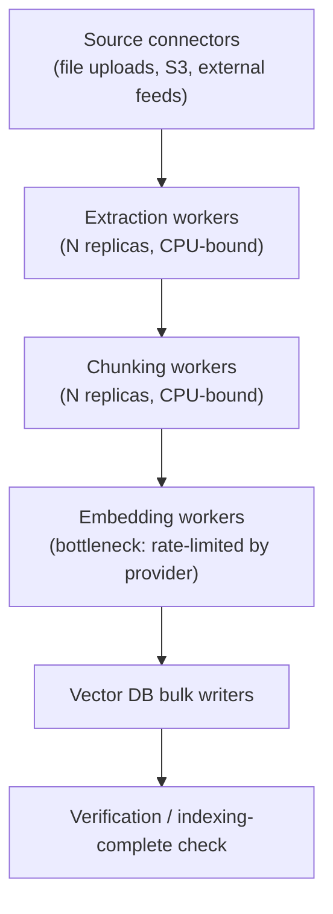

# 9. Ingesting 10M+ Documents

Module 4 built the event-driven ingestion pipeline's shape and Module 8's scenario referenced
"Ledger's ongoing ingestion" without stress-testing it at real volume. [Basic RAG's](../../part-1-foundations/07-basic-rag-pipeline/README.md)
ingestion (load → chunk → embed → store) works fine for a demo corpus. At 10 million documents,
ingestion becomes its own distributed system: parallel processing, incremental updates,
deduplication, and backpressure all become required, not optional.

## Learning objectives

- Design a parallelized ingestion pipeline, elaborating Module 4's architecture with real
  throughput numbers.
- Design incremental ingestion vs full reprocessing, and the change-detection mechanism.
- Implement deduplication at both the document and chunk level.
- Design backpressure against the embedding model provider.
- Estimate ingestion throughput and time-to-complete for a 10M-document corpus, and identify
  the bottleneck stage.

## Prerequisites

- [Event-Driven Architecture in GenAI Apps](../04-event-driven-architecture/README.md)
- [Vector Databases](../../part-1-foundations/08-vector-databases/README.md)

## Core concepts

### 9.1 Why naive ingestion doesn't finish in reasonable time

A serial for-loop processing one document at a time — load, chunk, embed, store — at even a
generous 2 documents/second throughput takes **10,000,000 ÷ 2 ≈ 58 days** to complete a 10M-
document backfill. This single calculation is the entire justification for everything else in
this module: naive ingestion isn't slow, it's structurally incompatible with the timeframes a
real onboarding or backfill needs.

### 9.2 Parallel ingestion architecture

Directly elaborating Module 4's event-driven pipeline diagram, now with worker pool sizing as
an explicit design variable per stage:



The critical design insight: **each stage scales independently**, and they should be sized
*differently* — extraction and chunking are CPU-bound and can run with many parallel replicas
cheaply; the embedding stage is bottlenecked not by your own compute but by an external
provider's rate limit, so adding more embedding workers beyond that ceiling doesn't help at
all (directly reusing [Scaling GenAI Systems](../05-scaling-genai-systems/README.md) §5.1's
bottleneck-identification principle).

### 9.3 Incremental ingestion

Reprocessing all 10M documents every time *any* subset changes is wasteful and slow.
**Content hashing** — computing a hash of each document's content at ingestion and comparing
against the stored hash on subsequent passes — lets the pipeline skip unchanged documents
entirely. **Source-system change events** (a webhook or change-data-capture stream from
wherever documents originate) trigger reprocessing only for documents that actually changed,
directly composing with Module 4's event-driven pipeline rather than needing a separate
mechanism.

### 9.4 Deduplication

- **Document-level** — exact-duplicate documents (the same filing submitted twice, a
  re-uploaded file) detected via content hash before they enter the pipeline at all.
- **Near-duplicate chunk detection** — chunks that are highly similar but not identical
  (e.g. boilerplate legal language repeated across many filings) detected via embedding
  similarity above a high threshold. Over-deduplicating is a real risk here: two chunks that
  are *mostly* similar but differ in one legally significant clause must not be collapsed into
  one — tune the threshold conservatively, favoring under- over over-deduplication when unsure.

### 9.5 Backpressure against the embedding provider

Directly reusing [Scaling GenAI Systems](../05-scaling-genai-systems/README.md) §5.3's queuing
pattern, applied specifically to the embedding stage: a bounded worker pool consuming from a
queue at a rate matched to the provider's actual rate limit, with the queue absorbing bursts
(a sudden batch of 50,000 new documents) without overwhelming the provider or triggering
cascading rate-limit errors.

### 9.6 Bulk-loading into the vector DB

Most vector databases offer **batch upsert APIs** that are meaningfully more efficient than
individual inserts for high-volume writes. For a **fresh full-corpus index** (a brand-new
10M-vector index), building from a bulk import is typically faster and produces a
better-optimized index than incrementally upserting 10M vectors one at a time. For an
**already-live index** receiving ongoing updates, incremental upserts are the only option —
this distinction matters when planning an initial backfill (bulk-optimized) versus steady-state
operation (incremental).

## Scenario walkthrough: capacity math for "Ledger"'s initial backfill

```
Assume: 10,000,000 documents, averaging 8 chunks/document = 80,000,000 chunks
Embedding provider rate limit: assume 3,000 requests/minute, batched at 20 chunks/request
→ 3,000 × 20 = 60,000 chunks/minute = 3,600,000 chunks/hour
→ 80,000,000 ÷ 3,600,000 ≈ 22.2 hours, just for the embedding stage
```

The embedding stage is the clear bottleneck (extraction/chunking, being CPU-bound and
horizontally scalable without an external rate ceiling, complete well within this window) —
this single number is the entire basis for two real decisions: (1) pre-negotiating a higher
rate limit with the embedding provider before a large backfill, since ~22 hours may or may not
meet a business deadline, or (2) evaluating a self-hosted embedding model specifically to
remove the external rate ceiling, accepting the operational cost of running inference capacity
(previewed in [Server & Compute Scaling](../11-server-and-compute-scaling/README.md)) in
exchange for controlling this bottleneck directly.

## Scenario walkthrough: onboarding without starving others

"Ledger" onboards a new enterprise tenant with 2 million historical filings needing backfill.
Directly applying [Multi-Tenant User Management](../02-multi-tenant-user-management/README.md)
§2.7's noisy-neighbor mitigation: this backfill runs on a **lower-priority queue** so it
doesn't compete for embedding-provider rate-limit budget or shared compute against either live
query traffic or other tenants' ongoing (smaller-volume) ingestion — a large backfill completing
somewhat slower than the theoretical minimum is an acceptable trade against degrading other
tenants' interactive experience.

## Code example

```python
import asyncio
import hashlib

async def embedding_worker_pool(queue: asyncio.Queue, rate_limit_per_minute: int, batch_size: int):
    interval = 60 / (rate_limit_per_minute / batch_size)
    while True:
        batch = []
        for _ in range(batch_size):
            if queue.empty():
                break
            batch.append(await queue.get())
        if batch:
            await embed_and_store_batch(batch)
        await asyncio.sleep(interval)  # paced to stay within the provider's rate limit

def content_hash(document_text: str) -> str:
    return hashlib.sha256(document_text.encode()).hexdigest()

def should_reprocess(document_id: str, current_hash: str, stored_hashes: dict[str, str]) -> bool:
    return stored_hashes.get(document_id) != current_hash  # skip unchanged documents

async def embed_and_store_batch(chunks: list[dict]) -> None:
    texts = [c["content"] for c in chunks]
    vectors = await embedding_provider.embed_batch(texts)  # one provider call for the whole batch
    await vector_store.bulk_upsert(zip(chunks, vectors))
```

## Production pitfalls

- **Sizing every pipeline stage identically.** Extraction/chunking and embedding have entirely
  different scaling ceilings — a uniform worker-pool size either starves the CPU-bound stages or
  wastes capacity waiting on the rate-limited stage.
- **No incremental ingestion, ever reprocessing the full corpus.** At 10M+ documents, this
  makes every update cycle as slow as the original backfill — content hashing (§9.3) is not
  optional at this scale.
- **Over-aggressive near-duplicate chunk deduplication.** Risks silently discarding legally or
  factually distinct content that happens to be textually similar — tune conservatively.
- **Treating a large tenant backfill as equal priority to live query traffic.** Directly
  reintroduces the noisy-neighbor problem from Module 2 if not explicitly queued at lower
  priority.
- **Not pre-negotiating provider rate limits before a known large ingestion event.** Discovering
  the embedding-stage bottleneck's real throughput ceiling during a live backfill, instead of
  during capacity planning, turns a planning problem into an incident.

## Key takeaways

- Naive serial ingestion is structurally too slow at 10M+ scale — parallelization per stage,
  sized to each stage's actual bottleneck, is required.
- The embedding stage, rate-limited by an external provider, is almost always the bottleneck —
  identify and plan capacity around it explicitly, not the CPU-bound stages.
- Incremental ingestion (content hashing, change events) avoids reprocessing an entire
  10M-document corpus for every update.
- A large ingestion event (new tenant backfill) should run at lower priority than live query
  traffic to avoid the noisy-neighbor problem established in Module 2.

## Exercises

1. Redo the §9.6 capacity math assuming the embedding provider grants a 5x higher rate limit
   after a pre-negotiated agreement — how does the backfill timeline change, and does it change
   the self-hosted-embedding-model decision?
2. Design a near-duplicate chunk deduplication threshold policy for financial filings, where
   boilerplate language is common but a single differing clause can be legally significant —
   how conservative should the similarity threshold be, and why?
3. Sketch the event schema and priority-queue routing logic for a new-tenant backfill so it
   never competes with live query traffic for embedding-provider rate-limit budget.

Next: [Database Scaling Strategies](../10-database-scaling-strategies/README.md)
