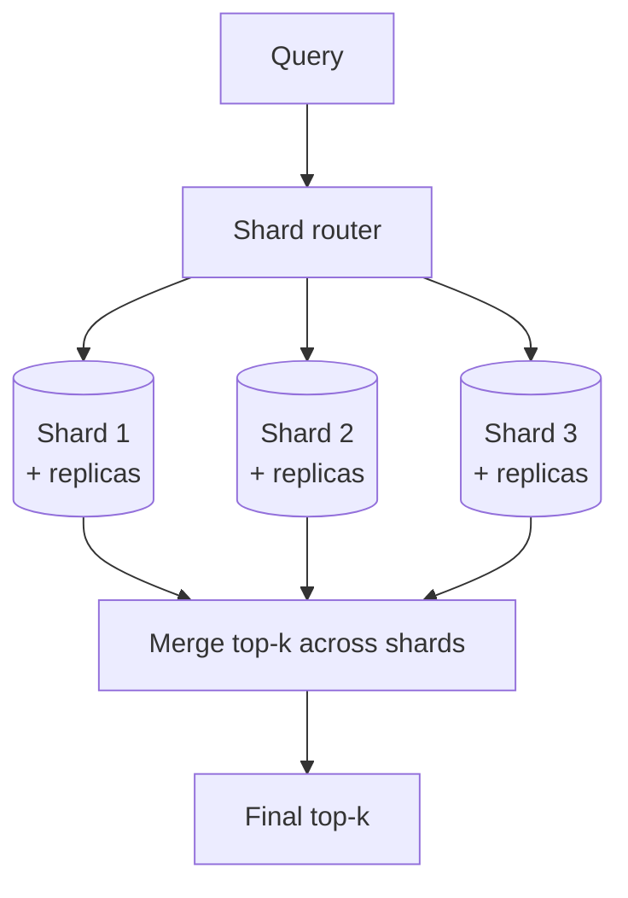

# 10. Database Scaling Strategies

Module 9's capacity math produced 80,000,000 chunks for "Ledger"'s initial backfill alone —
Module 3's polyglot schema, designed around access patterns, now needs to actually hold and
serve queries against that volume. This module covers what changes — for both the
relational/metadata stores and the vector index specifically — once you're past the point
where a single instance of each store comfortably handles the load.

## Learning objectives

- Apply standard relational scaling techniques to the GenAI-specific schema.
- Explain vector index scaling specifically: partitioning/sharding an ANN index, replica
  strategy, and how index type behaves under sharding.
- Reason about CAP trade-offs for each store in the polyglot design.
- Design a re-sharding/rebalancing strategy for a growing vector index without downtime.
- Choose between vertical scaling, horizontal sharding, and managed auto-scaling per store.

## Prerequisites

- [Database Design for GenAI Apps](../03-database-design-for-genai-apps/README.md)
- [Ingesting 10M+ Documents](../09-ingesting-10m-plus-documents/README.md)

## Core concepts

### 10.1 Where each store hits its ceiling first

Recall Module 3's polyglot design: Postgres for tenancy/billing/metadata, a vector DB for
embeddings, object storage for raw documents, Redis for cache/session. At "Ledger"'s scale, the
vector index and the metadata table backing it (heavily queried for the metadata filtering from
[Metadata Filtering & Query Construction](../../part-2-advanced-engineering/04-advanced-production-rag/01-metadata-filtering-and-query-construction/README.md))
are typically the first to need scaling attention, since they scale directly with document/
chunk count (§9's 80M chunks) rather than with user count.

### 10.2 Relational scaling techniques

Standard, well-established techniques, applied to Module 3's schema specifically:

- **Read replicas** — for query-heavy metadata reads (analysts browsing/filtering filings),
  offload reads from the primary write instance.
- **Sharding by tenant ID** — directly reusing
  [Multi-Tenant User Management](../02-multi-tenant-user-management/README.md)'s pooled
  isolation model as a sharding key: each shard holds a subset of tenants, naturally isolating
  load and enabling a large tenant to be moved to dedicated infrastructure without a schema
  change.
- **Connection pooling** — under high concurrent agent load (many simultaneous agent runs each
  making several metadata queries), connection pooling prevents connection exhaustion against
  the relational store.

### 10.3 Vector index scaling, in depth

The harder problem, because it doesn't have decades of established relational-scaling tooling
behind it in the same way:

- **Sharding an ANN index** — split the index across multiple nodes, either by ID hash (even
  distribution, simplest) or by tenant (natural isolation boundary, reusing Module 2's
  namespace-per-tenant pattern at scale). A query then searches across relevant shards and
  merges results.
- **The recall-vs-shard-count trade-off** — searching K shards and merging top-k results from
  each is not exactly equivalent to searching one unsharded index of the same total size; recall
  can degrade slightly because each shard's local top-k might miss a globally-relevant vector
  that happens to rank just outside the local top-k in its shard. This is a real, measurable
  trade-off to validate against your recall requirements as shard count grows, not just assume
  away.
- **Replica sets for read throughput** — independent of sharding (which splits data), replicas
  duplicate a shard's data to serve more concurrent read queries against it — the two techniques
  compose (sharded *and* replicated).



### 10.4 CAP trade-offs across the polyglot stores

| Store | CAP posture | Why |
|---|---|---|
| Billing/tenant config (Postgres) | CP (consistency-favoring) | Financial correctness requires strong consistency; brief unavailability during a partition is acceptable |
| Conversation state | AP acceptable, with conflict resolution | A few seconds of staleness or a last-write-wins resolution is tolerable for chat history |
| Embeddings/vector index | AP acceptable | A newly ingested embedding not yet visible for a few seconds (Module 9's ingestion lag) doesn't break correctness, just briefly delays searchability |

This directly extends Module 3 §3.4's consistency table into an explicit CAP framing —
deciding this *before* a partition event forces the trade-off on you under pressure is the
whole point of doing it here, deliberately, as a design decision.

### 10.5 Zero-downtime resharding

Growing shard count (as data volume grows past what the current shard count comfortably
serves) needs a migration strategy that doesn't take the system offline:

1. **Dual-write** — new writes go to both old and new shard layouts during migration.
2. **Background backfill** — historical data is copied from the old layout into the new one
   without blocking live traffic.
3. **Cutover** — once backfill catches up to dual-write, reads switch to the new layout;
   old layout is decommissioned after a validation window.

### 10.6 Decision framework

Vertical scaling (bigger instance) first, for simplicity — it's the cheapest engineering effort
and often sufficient far longer than teams expect. **Read replicas** next, once read load (not
write load or total data volume) is the binding constraint. **Sharding** only once a single
instance's write throughput or total data volume genuinely can't be served by a bigger
instance — sharding adds real operational complexity (§10.5's migration burden, cross-shard
query complexity) and shouldn't be reached for prematurely.

## Scenario walkthrough

"Ledger" crosses 10M documents (Module 9's backfill volume) and its single-node vector index
starts missing the sub-2-second p95 query SLO from
[HLD Fundamentals](../01-hld-fundamentals-for-genai/README.md). The response: shard the vector
index across 8 nodes by tenant (reusing Module 2's isolation boundary as the shard key, which
also happens to keep each enterprise tenant's queries hitting a bounded, predictable subset of
shards), and add read replicas per shard to handle concurrent analyst query volume. The
metadata Postgres instance, meanwhile, is scaled independently — sharded by tenant as well, but
on a different rollout timeline, since its bottleneck (write throughput from ingestion, per
Module 9) hit its ceiling before the vector index's read-latency ceiling did. The two stores'
scaling needs diverged, which is expected — they were chosen for different access patterns in
Module 3 and don't scale in lockstep.

## Code example

```python
def shard_for_tenant(tenant_id: str, shard_count: int = 8) -> int:
    return hash(tenant_id) % shard_count

async def sharded_vector_search(query_vector: list[float], tenant_id: str, k: int = 10):
    shard_id = shard_for_tenant(tenant_id)
    shard_client = get_shard_client(shard_id)
    return await shard_client.similarity_search(query_vector, k=k)

async def sharded_vector_search_cross_tenant_admin(query_vector: list[float], shard_ids: list[int], k: int = 10):
    # Rare admin-only path: search across multiple shards and merge, accepting the
    # recall trade-off noted in §10.3
    results = await asyncio.gather(*[
        get_shard_client(sid).similarity_search(query_vector, k=k) for sid in shard_ids
    ])
    merged = sorted([r for shard_results in results for r in shard_results],
                     key=lambda r: r.score, reverse=True)
    return merged[:k]
```

## Production pitfalls

- **Sharding before it's actually needed.** Adds migration complexity, cross-shard query
  complexity, and operational burden well before a simpler vertical-scale or read-replica
  approach would have sufficed.
- **Assuming sharded search has identical recall to unsharded search.** The per-shard top-k
  merge trade-off in §10.3 is real — validate it against your actual recall requirements as
  shard count grows, don't assume it away.
- **No explicit CAP decision made ahead of a partition event.** Deciding "what happens to
  writes during a network partition" reactively, during an actual incident, produces worse
  outcomes than deciding it deliberately in advance per store.
- **A resharding migration without dual-write, causing a consistency gap.** Skipping the
  dual-write phase (§10.5) for a "faster" migration risks writes being lost or applied to only
  one layout during the cutover window.

## Key takeaways

- The vector index and its supporting metadata store are typically the first to need scaling
  attention in a document-heavy GenAI system, since they scale with corpus size, not user count.
- Vector index sharding trades a small amount of recall for horizontal scalability — a real,
  measurable trade-off, not a free lunch.
- CAP posture should be decided explicitly per data type ahead of time, extending Module 3's
  consistency table into a concrete availability-vs-consistency decision.
- Scale vertically first, then read replicas, then shard — only once data volume or write
  throughput genuinely exceeds what a single well-sized instance can serve.

## Exercises

1. For "Ledger"'s tenant-sharded vector index, describe a query scenario that would require the
   rare cross-shard admin search path in the code example, and discuss its recall implications.
2. Walk through the dual-write/backfill/cutover migration for growing from 8 to 16 shards, and
   identify the point at which it's safe to decommission the old 8-shard layout.
3. Argue whether "Ledger"'s conversation-state store should be CP or AP, given the
   requirements established across Parts 1-3, and compare your reasoning to the billing store's
   CP classification in §10.4.

Next: [Server & Compute Scaling](../11-server-and-compute-scaling/README.md)
