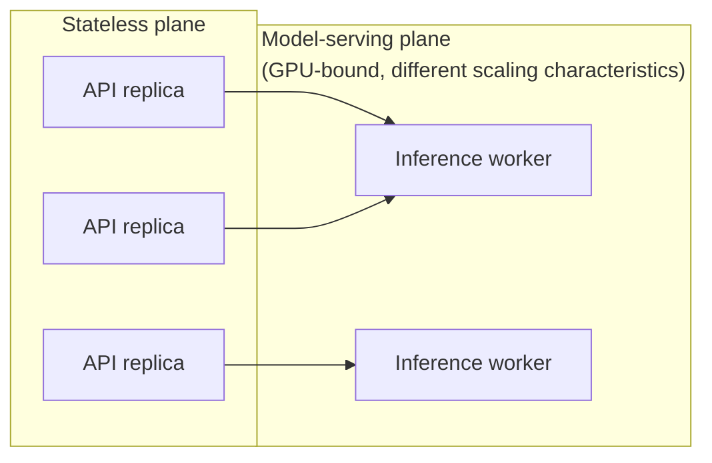
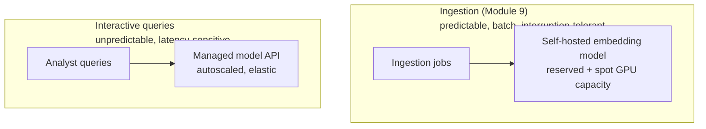

# 11. Server & Compute Scaling

Module 5 established the concepts (bottleneck identification, queuing, load balancing) at a
conceptual level, and Module 9's capacity math depended on assumed embedding-provider
throughput without examining what runs on the other side of that API call. This module goes
one level deeper into the actual compute layer: how API/orchestration servers and
model-serving infrastructure are provisioned, deployed, and scaled in practice.

## Learning objectives

- Design the deployment topology for the stateless API/orchestration tier.
- Explain model-serving infrastructure concepts: continuous batching and KV-cache management.
- Distinguish self-hosted model serving from managed API providers on the compute-scaling axis,
  and design a hybrid.
- Apply autoscaling policy design: metrics to scale on, cooldowns, cost implications.
- Reason about cost optimization levers: spot capacity, request batching, model right-sizing,
  reserved baseline capacity.

## Prerequisites

- [Scaling GenAI Systems](../05-scaling-genai-systems/README.md)
- [Database Scaling Strategies](../10-database-scaling-strategies/README.md)

## Core concepts

### 11.1 Two compute planes



The stateless plane (API/orchestration, Module 5 §5.2) scales with standard cloud-native
techniques and is comparatively simple. The model-serving plane is fundamentally different:
GPU capacity is expensive, comes in discrete, chunky units (a whole GPU or a fraction via
sharing, not infinitely divisible like CPU cores), and has meaningfully slower cold-start
characteristics — these differences drive everything else in this module.

### 11.2 Model serving fundamentals

A naive "one request, one model call, one GPU forward pass" server wastes most of a GPU's
capacity, because GPUs are throughput-optimized hardware that benefit enormously from
processing multiple requests together. **Continuous batching** dynamically adds newly-arrived
requests into an in-progress batch as earlier requests in that batch complete (rather than
waiting for a fixed-size batch to fully form before starting, or waiting for the whole batch to
finish before accepting new work) — this is the modern standard technique behind serving
frameworks purpose-built for LLM inference, and is largely *why* those frameworks exist instead
of just calling a model in-process per request. **KV-cache management** (the per-request
attention cache that grows as a generation proceeds) is the other major piece these serving
frameworks handle — efficiently reusing and evicting this cache across many concurrent
in-flight requests is a nontrivial memory-management problem that a naive implementation
handles poorly, directly limiting how many concurrent requests a GPU can actually serve well.

### 11.3 Self-hosted vs managed, on the scaling axis

Directly extending [LLM Gateway](../../part-2-advanced-engineering/06-llm-gateway/README.md)
§6.5's self-hosted-vs-managed decision from a control/compliance framing to a pure
compute-scaling framing:

- **Self-hosted** — control over cost at high, *sustained* volume (you're paying for owned/
  reserved GPU capacity regardless of whether it's fully utilized every minute, which pays off
  specifically when utilization is consistently high), and control over the serving stack
  (batching strategy, model version, hardware). Real ops burden: capacity planning, scaling
  policy, hardware failures.
- **Managed API** — zero ops burden, and genuinely elastic burst capacity (a provider serving
  many customers can absorb your traffic spike using capacity your own reserved fleet couldn't
  justify holding idle most of the time) — the trade-off is per-token pricing that, at very
  high sustained volume, typically costs more than well-utilized owned capacity.

A **hybrid routing strategy** — predictable steady-state load to self-hosted capacity, burst/
peak overflow to a managed API — captures the cost advantage of owned capacity for baseline
load while retaining elastic headroom for spikes, without needing to size owned capacity for
worst-case peak (which would sit mostly idle most of the time).

### 11.4 Autoscaling policy design

Directly reusing [Scaling GenAI Systems](../05-scaling-genai-systems/README.md) §5.5, now with
concrete policy parameters: scale on **queue depth or concurrency** rather than CPU/GPU
utilization alone, since utilization metrics can look healthy right up until a queue backs up
sharply. **Cooldown tuning** prevents thrashing — scaling up and back down repeatedly in
response to short-lived fluctuations wastes the cold-start cost (§11.1) of each scale-up event
without meaningfully helping. **Pre-warming** for predictable traffic patterns (recall Module
5's quarter-end scenario) sidesteps cold-start lag entirely for load you can forecast, reserving
reactive autoscaling for genuinely unpredictable variation.

### 11.5 Cost optimization levers

- **Spot/preemptible GPU capacity** — significantly cheaper than on-demand, at the cost of
  possible interruption; well-suited to non-latency-critical batch work (Module 9's ingestion
  embedding jobs, which can tolerate a worker being reclaimed and the job resuming elsewhere)
  and poorly suited to interactive query serving (which can't tolerate mid-request interruption).
- **Reserved baseline capacity** — for steady-state load that's well understood, reserved/
  committed-use pricing is typically cheaper than on-demand for the same sustained utilization.
- **Model right-sizing** — using a smaller, cheaper model where quality allows (not every task
  needs the most capable available model — Part 2 Module 6's gateway routing can direct
  different task types to differently-sized models based on measured quality requirements, not
  defaulting to "biggest model for everything").

## Scenario walkthrough

"Ledger" runs a self-hosted embedding model on reserved GPU capacity for steady-state ingestion
(Module 9's ongoing document processing) — predictable, high-utilization, cost-optimized
workload well-suited to owned capacity, and one where spot instances are also viable given
ingestion jobs can tolerate interruption and resumption. Interactive analyst queries, by
contrast, route to a managed model API with autoscaling for unpredictable burst load — a
workload where elastic headroom (managed) matters more than marginal cost savings (self-hosted),
and where mid-request interruption (spot capacity's risk) is unacceptable. The full compute
topology: reserved/spot self-hosted capacity for the predictable async ingestion workload, and
managed, autoscaled capacity for the unpredictable interactive workload — two different points
on the self-hosted-vs-managed spectrum, chosen deliberately per workload rather than picking one
answer for the whole system.



## Code example

```python
from dataclasses import dataclass

@dataclass
class AutoscalingPolicy:
    min_replicas: int
    max_replicas: int
    scale_up_queue_depth_threshold: int
    scale_down_queue_depth_threshold: int
    cooldown_seconds: int

def evaluate_scaling_decision(
    current_replicas: int,
    current_queue_depth: int,
    seconds_since_last_scale_event: int,
    policy: AutoscalingPolicy,
) -> int:
    if seconds_since_last_scale_event < policy.cooldown_seconds:
        return current_replicas  # avoid thrashing
    if current_queue_depth > policy.scale_up_queue_depth_threshold:
        return min(current_replicas + 1, policy.max_replicas)
    if current_queue_depth < policy.scale_down_queue_depth_threshold:
        return max(current_replicas - 1, policy.min_replicas)
    return current_replicas

def route_workload(workload_type: str) -> str:
    routing = {
        "ingestion_embedding": "self_hosted_reserved_or_spot",
        "interactive_query": "managed_api_autoscaled",
    }
    return routing.get(workload_type, "managed_api_autoscaled")  # default to elastic/safe option
```

## Production pitfalls

- **Running interactive, latency-sensitive workloads on spot capacity.** Interruption mid-
  request directly violates latency SLOs — reserve spot for interruption-tolerant batch work
  only.
- **Autoscaling on CPU/GPU utilization alone for inference workers.** Misses queue backup until
  it's already user-visible — queue depth is the more reliable signal (§11.4).
- **No cooldown tuning, causing scale-up/down thrashing.** Wastes the cold-start cost of each
  scaling event without net benefit, and can even destabilize serving during genuinely variable
  load.
- **Using the biggest available model for every task by default.** Model right-sizing (§11.5)
  is a real, often-overlooked cost lever — not every task needs maximum capability.
- **No hybrid strategy, forcing an all-or-nothing self-hosted-vs-managed choice.** Different
  workloads within the same system often warrant different points on that spectrum, as this
  module's scenario demonstrates.

## Key takeaways

- The stateless API plane and the GPU-bound model-serving plane have fundamentally different
  scaling characteristics and should be reasoned about separately.
- Continuous batching and KV-cache management are why purpose-built serving frameworks
  outperform naive per-request model invocation.
- Self-hosted capacity favors predictable, high-utilization workloads; managed APIs favor
  unpredictable, bursty workloads — a hybrid per-workload strategy often beats an all-or-
  nothing choice.
- Autoscale on queue depth with tuned cooldowns; use pre-warming for predictable load instead
  of relying purely on reactive scaling.
- Spot capacity, reserved baseline capacity, and model right-sizing are the primary cost
  optimization levers, each suited to specific workload characteristics.

## Exercises

1. Classify three more "Ledger" workloads (e.g. community summarization for GraphRAG, Part 2
   Module 4e) as better suited to self-hosted or managed capacity, and justify each.
2. Design cooldown and threshold values for the `AutoscalingPolicy` for a workload with highly
   variable, spiky traffic versus one with smooth, gradually-changing traffic — how should the
   parameters differ?
3. Propose a model right-sizing strategy for Northwind's support copilot: which specific tasks
   (classification, FAQ answering, escalation summarization) could reasonably use a smaller
   model, and which likely need the more capable one?

Next: [Capstone: Full HLD Case Study](../12-capstone-case-study/README.md)
