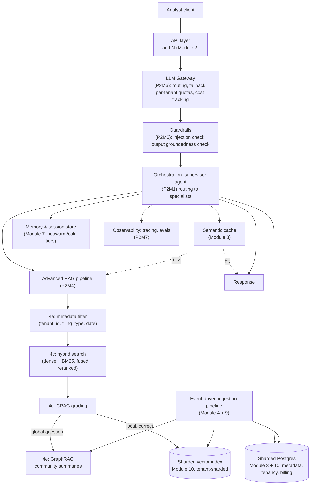
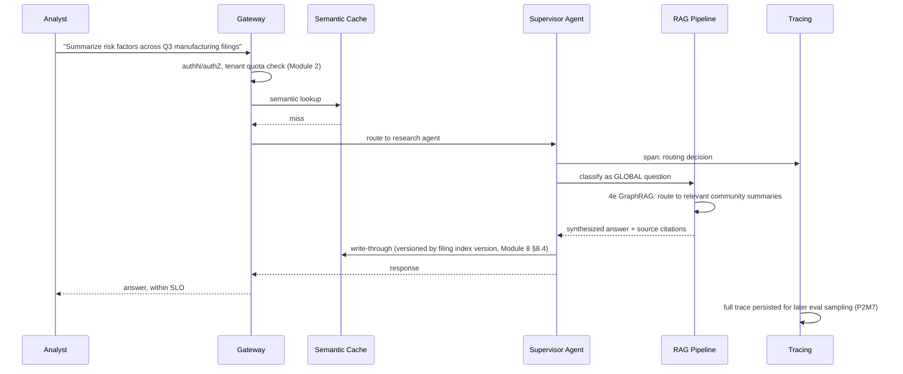

# 12. Capstone: Full HLD Case Study — "Ledger"

This module doesn't teach a new concept — it assembles every module from Parts 1-3 into one
coherent, fully specified system design, the way you'd actually present an HLD in a design
review or an interview. If you can follow this end to end and defend every choice, you've
completed the course.

## Learning objectives

- Produce a complete requirements + capacity estimation + component diagram + deep-dive design
  for a real-scale GenAI system, in the format established in
  [HLD Fundamentals for GenAI Systems](../01-hld-fundamentals-for-genai/README.md).
- Trace, for a single end-to-end user request, every module of this course it touches, and why
  each is there.
- Defend the design's trade-offs under follow-up pressure.

## Prerequisites

- All prior modules in Parts 1-3.

## System: "Ledger"

A fintech platform where analysts query and reason over 10M+ financial filings and contracts:
natural-language search, summarization, multi-document risk analysis, and a conversational
agent that can pull structured data (via tools) alongside grounded document answers, serving
thousands of concurrent analysts across enterprise tenants with strict availability and
compliance requirements.

## 1. Requirements & estimation (recap and finalize)

From [HLD Fundamentals](../01-hld-fundamentals-for-genai/README.md) §"scenario walkthrough":

- **Functional**: NL search/summarization over filings, multi-document risk analysis
  (GraphRAG-backed for genuinely global questions), a tool-using conversational agent.
- **Non-functional**: sub-2s p95 interactive query latency; a defined availability SLA
  including a quality SLI, not just uptime (Module 6); strict per-tenant data isolation
  (Module 2); cost ceiling per tenant enforced at the gateway (Part 2 Module 6).
- **Non-goal**: real-time streaming filing ingestion at launch — batch/near-real-time is
  acceptable (revisited in §8 below).
- **Capacity**: ~10M documents × ~8 chunks/doc ≈ 80M chunks (Module 9); thousands of concurrent
  analysts; embedding-provider throughput as the binding ingestion bottleneck (Module 9 §9.6:
  ~22 hours for the initial backfill at assumed rate limits).

## 2. Full architecture

Every box in this diagram is justified by a specific earlier module — that traceability is the
actual deliverable of an HLD, not the diagram alone.

## 3. Request walkthrough

The latency budget across this path (per [HLD Fundamentals](../01-hld-fundamentals-for-genai/README.md)
§1.3's estimation chain): API/gateway overhead is negligible (~10ms), the cache miss check is
fast (~20ms), GraphRAG's community-summary lookup and synthesis is the dominant cost
(~1-1.5s) — this is a case where the sub-2s p95 SLO is genuinely tight for a global question,
and is exactly the kind of measurement that would drive a real decision about whether to
pre-compute more aggressively or relax the SLO for this specific question class.

## 4. Ingestion walkthrough

The event-driven pipeline (Module 4 + Module 9) handles two concurrent ingestion workloads
without one starving the other: ongoing filing updates (normal-priority queue, triggering
semantic-cache invalidation per Module 8 §8.4 and incremental GraphRAG graph updates) and a
new-tenant historical backfill (low-priority queue, per Module 2 §2.7's noisy-neighbor
mitigation) — both consuming from the same embedding-worker pool but with priority-based queue
ordering ensuring live-critical updates never wait behind a large backfill.

## 5. Multi-tenancy, security, and guardrails

- **Isolation**: bridge model (Module 2) — most tenants pooled with tenant-sharded vector
  index + metadata filtering (Module 10 §10.3); highest-compliance-tier tenants siloed.
- **AuthZ**: role-based, extended to tool-call level (Module 2 §2.4) — an analyst role can call
  `search_filings`/`summarize_document`; cross-tenant tool calls are structurally blocked, not
  just permission-checked (Module 2's `authorize_tool_call` pattern).
- **Guardrails** (Module 5): input injection checks (relevant given filings are third-party
  documents ingested into RAG — indirect injection risk, Module 5 §5.2, is real here), output
  groundedness checks tied to CRAG's grading, least-privilege tool scoping per agent.

## 6. Scaling and availability plan

- **What scales automatically**: stateless API/orchestration tier (Module 5 §5.2), semantic
  cache hit path.
- **What's provisioned ahead of demand**: embedding capacity for known large backfills
  (pre-negotiated rate limits or self-hosted embedding model, Module 9 §9.6/Module 11 §11.3),
  pre-warmed inference capacity for predictable spikes like quarter-end (Module 5's scenario).
- **Degradation ladder** (Module 6 §6.5): primary model → fallback model → semantic cache
  (Level 3) → explicit "temporarily degraded" (Level 4) — tested, not theoretical.
- **Vector index**: tenant-sharded with read replicas (Module 10 §10.3), zero-downtime
  resharding plan (Module 10 §10.5) as tenant count and document volume grow.

## 7. Cost model (rough monthly breakdown)

| Component | Rough driver | Primary lever to reduce |
|---|---|---|
| Interactive inference | Query volume × avg tokens/query | Model right-sizing (Module 11 §11.5), semantic cache hit rate (Module 8) |
| Embedding (ingestion) | Chunk volume × embedding calls | Self-hosted model for steady-state volume (Module 11 §11.3) |
| Vector index storage/compute | Chunk count × shard/replica count | Right-sized shard count (Module 10), avoid over-replicating |
| GraphRAG indexing | Corpus size × extraction/summarization calls | Scope to tenants/corpora with real global-question volume (P2 Module 4e §"cost reality check") |
| Compute (GPU) | Reserved baseline + spot + managed burst | Hybrid self-hosted/managed split by workload predictability (Module 11) |

Top 3 levers, in priority order for "Ledger" specifically: (1) semantic cache hit rate, since
Module 8's scenario already showed ~40% hit rate on repeated analyst questions; (2) self-hosted
embedding for the large, predictable ingestion workload, since Module 9's capacity math showed
this is the binding bottleneck at scale; (3) scoping GraphRAG to only the tenants/corpora that
actually generate global questions, per Part 2 Module 4's overview diagnostic method, rather
than indexing every tenant's corpus into a knowledge graph by default.

## 8. Follow-up drills

**"Design changes if this needs to support real-time filing alerts"** — the current design's
explicit non-goal (§1) gets revisited: real-time alerts need the ingestion pipeline's latency
budget tightened significantly (Module 4/9's async batch-friendly design would need a
low-latency fast-path for time-sensitive filings), and likely a push mechanism (webhooks/
notifications) layered on top of the existing event-driven backbone rather than a wholesale
redesign — the event-driven foundation (Module 4) was chosen partly because it extends this way.

**"Design changes at 100M documents instead of 10M"** — Module 10's sharding strategy scales
by adding shards, but the recall-vs-shard-count trade-off (§10.3) becomes more significant at
10x the shard count; likely needs a second look at index type choice (Module 1 Part 1's
HNSW-vs-IVF trade-off, revisited at this volume favoring IVF+PQ's better memory profile over
HNSW). Ingestion throughput (Module 9) also needs re-planning — the embedding bottleneck math
scales linearly with chunk count, making a self-hosted embedding model's fixed cost advantage
over per-token managed pricing even more decisive at this volume.

**"How would you phase this build over two quarters instead of building it all at once"** —
Quarter 1: Part 1-level foundation (basic RAG, single-tenant, no GraphRAG) plus Module 1-3
system-design basics (multi-tenancy, database design) to get a working product with real
customers on the pooled tier. Quarter 2: Advanced Production RAG techniques (Part 2 Module 4)
added incrementally as diagnosed failure clusters justify each one (per the module's own
diagnostic method — not all five on day one), plus semantic caching and the full availability/
scaling treatment as traffic volume actually demands it. This phasing mirrors the course's own
structure: basics first, advanced techniques adopted based on measured need, system-design
rigor applied as scale actually arrives — not speculatively upfront.

Every module from [GenAI & LLM Basics](../../part-1-foundations/01-genai-and-llm-basics/README.md)
through here has a concrete, justified place in this final design.

This capstone designed a finished system top-down, in one pass. Real systems don't get built
that way — they start as an MVP and get scaled reactively, one traced failure at a time. That
build-order version of this same discipline is the subject of
[Part 4](../../part-4-capstone-build-tfe-agent/README.md).

Next: [Part 4 — Capstone Build: The TFE Agent, From Scratch](../../part-4-capstone-build-tfe-agent/README.md)
