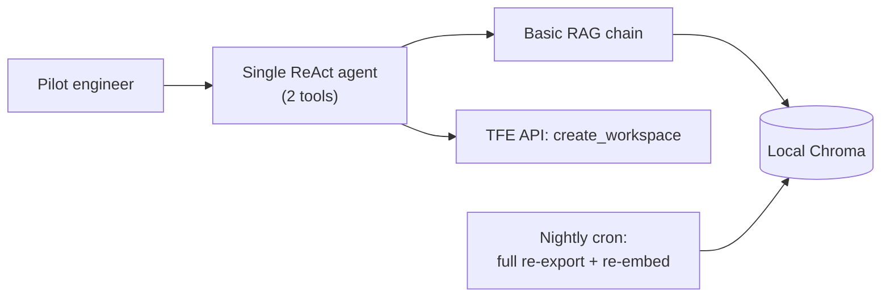

# Phase 1: MVP

Every system in this course so far has been designed with the benefit of hindsight — you
already knew it needed to scale. TFE Agent doesn't get that luxury. It starts as a one-week
bet: can an AI assistant actually help engineers use the internal Terraform Enterprise (TFE)
platform, enough to be worth building further? The right way to answer that question is the
smallest thing that could possibly work — not the finished architecture from
[Module 12](../../part-3-system-design/12-capstone-case-study/README.md).

## Learning objectives

- Recognize which techniques from Parts 1-3 are genuinely unnecessary at MVP scale, and why
  skipping them is a correct engineering decision, not a shortcut you'll regret.
- Build a minimal but real agentic RAG system: one retrieval chain, one tool-using agent.
- Identify, in advance, the specific signals that would tell you it's time to move past this
  design — so Phase 2's fixes are anticipated, not a surprise.

## Prerequisites

- [Basic RAG Pipeline](../../part-1-foundations/07-basic-rag-pipeline/README.md)
- [Agents 101](../../part-1-foundations/05-agents-101/README.md)

## The brief

A 50-person platform engineering pilot team needs a assistant that can (1) answer questions
about how to use TFE, sourced from the team's existing Confluence space, and (2) create a new
TFE workspace on request, instead of engineers filing a ticket and waiting. Ship it in a week.

## What gets built

- **Ingestion**: a one-time, manual export of the Confluence space, chunked with
  [Basic RAG Pipeline](../../part-1-foundations/07-basic-rag-pipeline/README.md)'s recursive
  splitter, embedded into a local Chroma store. A nightly cron job re-runs the whole export and
  re-embeds everything from scratch.
- **Agent**: a single [Agents 101](../../part-1-foundations/05-agents-101/README.md)-style
  ReAct loop with two tools: `search_confluence` (RAG retrieval) and `create_workspace` (a
  direct, unguarded call to the TFE API).



## What deliberately does *not* get built, and why

This list matters as much as what got built — every omission here is a real decision, not an
oversight:

- **No caching** — at 50 users, request volume is nowhere near where redundant model calls
  cost anything worth optimizing.
- **No guardrails** — a trusted pilot group of 50 known engineers is not the threat model
  [LLM Guardrails](../../part-2-advanced-engineering/05-llm-guardrails/README.md) was built
  for; adding injection classifiers now would be defending against an attacker who doesn't
  exist yet.
- **No observability/tracing** — at this scale, if something's wrong, a Slack message from one
  of 50 pilot users and a five-minute look at the code finds it. Formal tracing infrastructure
  is a solution to a problem ("I can't tell which of a million requests failed and why") this
  system doesn't have.
- **No multi-agent architecture** — two tools is not a tool-selection problem. A supervisor
  pattern here would be pure overhead.
- **No event-driven ingestion** — a nightly cron job that reprocesses the whole (still small)
  Confluence space is completely adequate; building a webhook-driven incremental pipeline now
  would be solving a staleness problem that, at this scale and this update frequency, nobody
  has actually complained about yet.

Every one of these will become necessary. None of them are necessary *yet* — building them now
would mean shipping nothing to the pilot team for weeks, in service of problems that don't
exist. This is the same discipline
[Workflows vs Agents](../../part-1-foundations/06-workflows-vs-agents/README.md) taught about
not reaching for autonomy by default, generalized to system design: build for the load you
have, not the load you're afraid of.

## Code

```python
from langchain_community.document_loaders import ConfluenceLoader
from langchain_text_splitters import RecursiveCharacterTextSplitter
from langchain_openai import OpenAIEmbeddings, ChatOpenAI
from langchain_community.vectorstores import Chroma
from langchain_core.tools import tool
from langgraph.prebuilt import create_react_agent

# --- Ingestion: nightly cron job, full re-export ---
loader = ConfluenceLoader(url="https://internal.atlassian.net/wiki", space_key="TFE")
docs = loader.load()
splitter = RecursiveCharacterTextSplitter(chunk_size=800, chunk_overlap=100)
chunks = splitter.split_documents(docs)

embeddings = OpenAIEmbeddings(model="text-embedding-3-small")
vector_store = Chroma.from_documents(chunks, embeddings, collection_name="tfe_confluence")

# --- Tools ---
@tool
def search_confluence(query: str) -> str:
    """Search the TFE Confluence space for relevant documentation."""
    results = vector_store.similarity_search(query, k=4)
    return "\n\n".join(r.page_content for r in results)

@tool
def create_workspace(name: str, vcs_repo: str) -> dict:
    """Create a new TFE workspace linked to a VCS repository."""
    return tfe_client.create_workspace(name=name, vcs_repo=vcs_repo)  # direct, unguarded call

# --- Agent: a single ReAct loop, two tools ---
model = ChatOpenAI(model="gpt-4.1", temperature=0)
agent = create_react_agent(model, tools=[search_confluence, create_workspace])

response = agent.invoke({"messages": [("user", "How do I create a workspace for the payments-service repo?")]})
```

## Where this leaves the system

It works. The pilot team likes it — questions get answered from real internal documentation
instead of a generic model guess, and workspace creation goes from a multi-day ticket to a
single chat message. Leadership approves a company-wide rollout to the entire engineering
organization: roughly 100,000 employees.

Nothing in this MVP was built to survive that. Two weeks after rollout, four distinct things
start breaking — each one a direct, predictable consequence of a decision made in this phase.

## Key takeaways

- An MVP's job is to validate the idea with the least possible engineering investment — every
  module from Parts 1-3 that isn't in this design was correctly, deliberately left out, not
  forgotten.
- The two tools this agent has are exactly what the pilot needs — no more, no less; scope
  creep at this stage would have delayed shipping for no validated benefit.
- Knowing *why* each omission is currently correct is what lets you recognize the moment it
  stops being correct — that recognition is the subject of every phase that follows.

## Exercises

1. List three more features a stakeholder might ask for at this stage ("can it also do X") and
   argue, using this phase's reasoning, why each should be deferred past the pilot.
2. Predict, before reading Phase 2, which of this MVP's four omissions will cause the first
   visible production problem at 100,000 users, and why.

Next: [Phase 2: Scaling to 100K Users](../02-scaling-to-100k-users/README.md)
