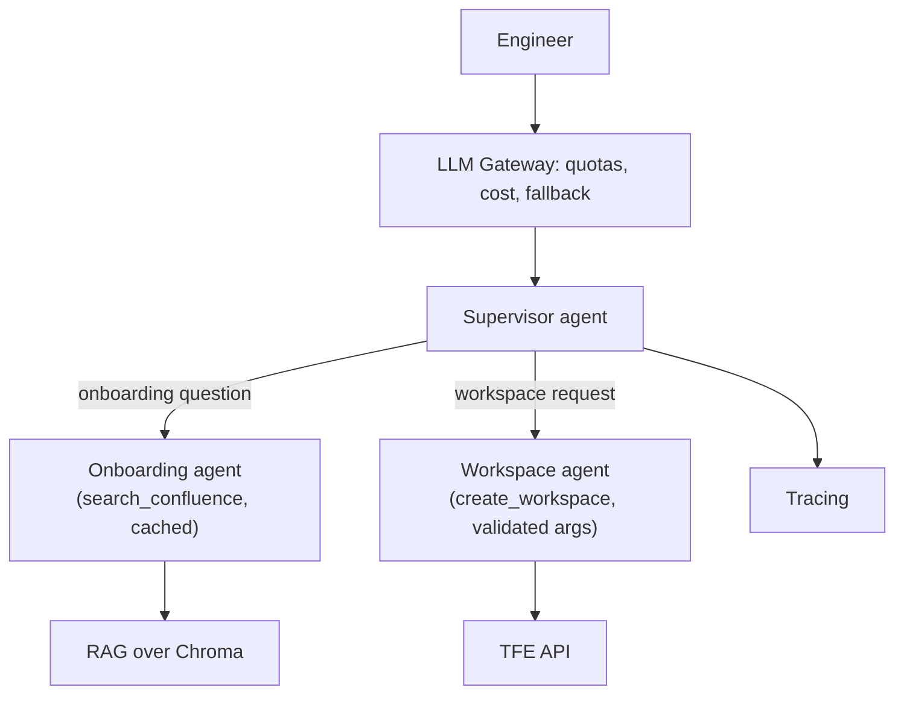

# Phase 2: Scaling to 100K Users

[Phase 1](../01-mvp/README.md) ended with leadership approving a company-wide rollout — the
MVP, unchanged, goes live for roughly 100,000 employees who can now ask it TFE-related
questions. Within two weeks, four distinct symptoms appear. Each one is the direct,
predictable consequence of a decision Phase 1 made correctly *for its scale* — this phase is
about recognizing that the scale has changed, not about anyone having built the MVP wrong.

## Learning objectives

- Diagnose four simultaneous production symptoms back to their specific root causes, rather
  than treating "it's slow and wrong sometimes" as one vague problem.
- Apply the gateway, caching, and multi-agent patterns from Part 2 to fix each root cause
  independently.
- Use tracing not just to fix a known problem, but to *discover* a problem you didn't know you
  had.

## Prerequisites

- [Phase 1: MVP](../01-mvp/README.md)
- [LLM Gateway](../../part-2-advanced-engineering/06-llm-gateway/README.md)
- [Caching in Agents](../../part-2-advanced-engineering/03-caching-in-agents/README.md)
- [Advanced Agent Architectures](../../part-2-advanced-engineering/01-advanced-agent-architectures/README.md)

## The four symptoms

| Symptom | Root cause | Fix |
|---|---|---|
| Latency spikes and rate-limit errors at peak hours | No central request management — every request hits the model provider directly, no queuing or per-team quotas | [LLM Gateway](../../part-2-advanced-engineering/06-llm-gateway/README.md) |
| Cost far above forecast | Every question re-runs full generation, even near-duplicate onboarding questions asked hundreds of times a day | [Caching in Agents](../../part-2-advanced-engineering/03-caching-in-agents/README.md) (exact-match) |
| The agent increasingly calls the wrong tool, or the right tool with malformed arguments, as more tools get added ad hoc | Single-agent, ungoverned tool sprawl, no schema validation on tool arguments | [Advanced Agent Architectures](../../part-2-advanced-engineering/01-advanced-agent-architectures/README.md), [Pydantic & Structured Outputs](../../part-1-foundations/04-pydantic-and-structured-outputs/README.md) |
| No way to tell *why* a specific answer was wrong when a user complains | No observability | [LLMOps: Observability & Security](../../part-2-advanced-engineering/07-llmops-observability-and-security/README.md) |

This is the same diagnostic discipline
[Advanced Production RAG](../../part-2-advanced-engineering/04-advanced-production-rag/README.md)'s
overview taught for retrieval failures, applied for the first time to a whole system: separate
the symptoms before reaching for fixes, because — as the table shows — "the bot is slow and
sometimes wrong" is actually four unrelated problems wearing one trenchcoat.

## Fix 1: a gateway in front of every model call

Directly adopting [LLM Gateway](../../part-2-advanced-engineering/06-llm-gateway/README.md):
per-team rate limits so one busy team can't starve another's requests, cost attribution by
business unit (useful later — see Phase 4), and automatic fallback across model providers so a
single provider hiccup doesn't take the whole assistant down.

## Fix 2: exact-match caching for the highest-volume repeats

A quick look at query logs shows the same handful of onboarding questions dominate volume —
"how do I get TFE access," "how do I create a workspace." Directly applying
[Caching in Agents](../../part-2-advanced-engineering/03-caching-in-agents/README.md) §3.3's
exact-match caching to the `search_confluence` tool (a safe, read-only, side-effect-free
operation) cuts a meaningful fraction of model calls immediately. `create_workspace` is
explicitly **never** cached — it's a write, and §3.5's rule ("never cache writes") applies here
exactly as it did in every prior scenario in this course.

Note what this fix does *not* do: it doesn't help with differently-worded near-duplicates
("how do I get access" vs "how do I request access") — that gap is still open, and stays open
until [Phase 3](../03-event-driven-ingestion-and-multimodal-rag/README.md) adds semantic
caching. Exact-match is the right first step because it's simple and already captures the
biggest wins; reaching for semantic caching immediately would have been solving a smaller,
second-order problem before the larger, first-order one.

## Fix 3: from one agent to a supervisor with two specialists

As more tools got bolted onto the single MVP agent ad hoc (a status-check tool, a docs-search
refinement, an early attempt at a second workspace-related action), tool-selection accuracy
degraded — exactly the failure mode
[Advanced Agent Architectures](../../part-2-advanced-engineering/01-advanced-agent-architectures/README.md)
§1.1 predicted. The fix: split into a **supervisor** routing to two focused specialists —
`onboarding_agent` (read-only, low-risk, holds `search_confluence` and nothing else) and
`workspace_agent` (holds `create_workspace`, the one tool that touches real infrastructure).
Every tool's arguments are now validated with a Pydantic schema
([Structured Outputs](../../part-1-foundations/04-pydantic-and-structured-outputs/README.md)),
with a validation-failure retry loop — cutting malformed TFE API calls sharply.



## Fix 4: tracing — and what it finds

Basic request tracing ([LLMOps: Observability & Security](../../part-2-advanced-engineering/07-llmops-observability-and-security/README.md))
is added mainly to make the first three fixes debuggable. But pulling a sample of "wrong
answer" traces surfaces something nobody was specifically looking for: a cluster of answers
confidently citing Confluence content that turns out to be **stale** — pages that were updated
days ago, but the nightly-cron ingestion (a Phase 1 decision, correct at the time) hasn't
caught up, or updates land at unpredictable points in the 24-hour cycle relative to when
someone asks.

This is the chapter's most important lesson: tracing isn't just for confirming a bug you
already suspect — it's how you *discover* the bug you didn't know to look for. The staleness
finding here is what Phase 3 is entirely about.

## Code

```python
from pydantic import BaseModel, Field
from langgraph.graph import StateGraph, START, END
from typing import Annotated, Literal
from typing_extensions import TypedDict
from langgraph.graph.message import add_messages

class WorkspaceRequest(BaseModel):
    name: str = Field(description="Workspace name, lowercase-hyphenated")
    vcs_repo: str = Field(description="Full VCS repo path, e.g. org/payments-service")

class SupervisorState(TypedDict):
    messages: Annotated[list, add_messages]
    route: Literal["onboarding", "workspace"]

def supervisor(state: SupervisorState) -> dict:
    # Structured-output classification, reusing the Module 4 (Part 1) pattern
    return {"route": classify_route(state["messages"][-1].content)}

def route_to_specialist(state: SupervisorState) -> str:
    return state["route"]

graph = StateGraph(SupervisorState)
graph.add_node("supervisor", supervisor)
graph.add_node("onboarding", onboarding_agent_node)   # holds only search_confluence
graph.add_node("workspace", workspace_agent_node)      # holds only create_workspace, validated args
graph.add_edge(START, "supervisor")
graph.add_conditional_edges("supervisor", route_to_specialist, {
    "onboarding": "onboarding", "workspace": "workspace",
})
graph.add_edge("onboarding", END)
graph.add_edge("workspace", END)
app = graph.compile()
```

## Where this leaves the system

Latency, cost, and tool-selection accuracy all recover. But the staleness finding from
tracing hasn't been fixed yet — only diagnosed. And a second issue emerges alongside it: the
Confluence space has grown, and grown differently — the ops-heavy teams have started
documenting with heavy use of screenshots and architecture diagrams, content the pipeline
currently just ignores. Both problems point the same direction: ingestion itself needs to
change, not just how the system handles the results of ingestion.

## Key takeaways

- Four simultaneous symptoms at scale are rarely one problem — diagnose each to its specific
  root cause before reaching for a fix, exactly as the RAG-specific version of this discipline
  taught in Part 2.
- Fix the highest-leverage, simplest version of a problem first (exact-match caching) before
  the more sophisticated version (semantic caching) — don't skip ahead.
- Tracing's value isn't limited to confirming known bugs; it surfaces problems nobody was
  specifically looking for, which is exactly what happens here.

## Exercises

1. For each of the four symptoms in this phase's table, identify what would have happened if
   the fixes had been applied in the *wrong* order (e.g. multi-agent split before the gateway)
   — would anything have broken worse, or just been less efficient?
2. Design the Pydantic schema for a new tool this phase's tracing suggests might be needed:
   `check_workspace_status(workspace_name)` — what fields, what validation?

Next: [Phase 3: Event-Driven Ingestion & Multimodal RAG](../03-event-driven-ingestion-and-multimodal-rag/README.md)
