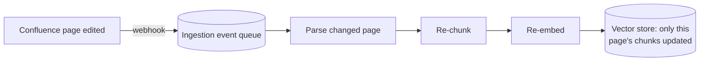
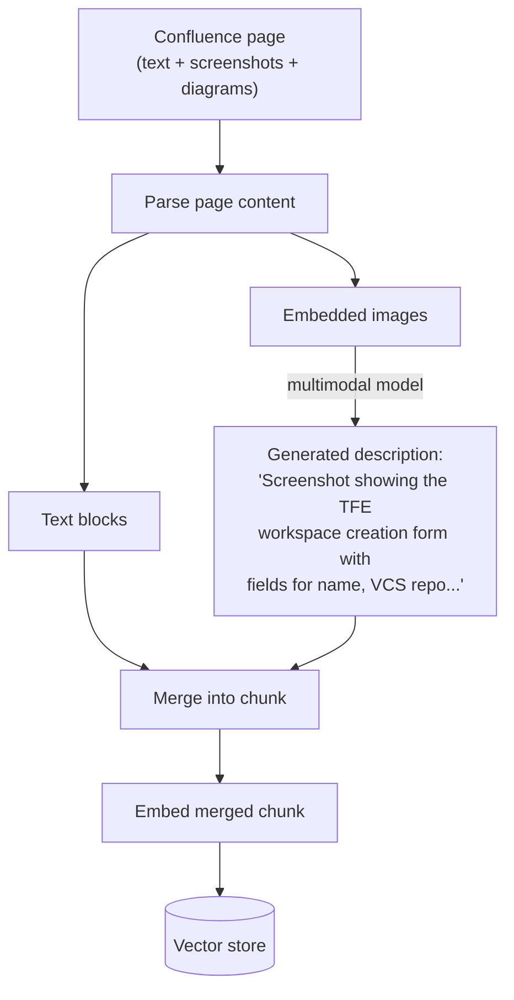

# Phase 3: Event-Driven Ingestion & Multimodal RAG

[Phase 2](../02-scaling-to-100k-users/README.md) closed with two problems pointing the same
direction: tracing found stale answers caused by the nightly-cron ingestion lag, and the
Confluence space had grown to include heavy use of screenshots and architecture diagrams that
the text-only pipeline silently drops. Both are ingestion problems. This phase rebuilds
ingestion, not the parts of the system downstream of it.

## Learning objectives

- Replace batch ingestion with an event-driven pipeline that keeps answers current within
  minutes, not a day.
- Design multimodal ingestion so screenshots and diagrams become searchable content instead of
  silently-dropped bytes.
- Extend caching from exact-match to semantic, and correctly scope which agent's traffic is
  allowed to use it.

## Prerequisites

- [Phase 2: Scaling to 100K Users](../02-scaling-to-100k-users/README.md)
- [Event-Driven Architecture in GenAI Apps](../../part-3-system-design/04-event-driven-architecture/README.md)
- [Semantic Caching at Scale](../../part-3-system-design/08-semantic-caching-at-scale/README.md)

## Fix 1: event-driven ingestion

The nightly full re-embed is replaced with a Confluence webhook that fires on every page
create/update, publishing an event that triggers re-chunking and re-embedding of **only that
page** — directly reusing
[Event-Driven Architecture](../../part-3-system-design/04-event-driven-architecture/README.md)'s
pipeline shape and
[Ingesting 10M+ Documents](../../part-3-system-design/09-ingesting-10m-plus-documents/README.md)
§9.3's content-hashing/incremental pattern, at a far smaller scale than that module's
10-million-document case but the identical mechanism. A page edited at 2:00pm is searchable by
roughly 2:02pm, closing the staleness gap Phase 2's tracing found.



## Fix 2: multimodal ingestion

Confluence pages here aren't pure text — runbooks are full of UI screenshots ("click here")
and architecture diagrams that carry real information a text-only pipeline drops entirely. The
fix: at ingestion, each embedded image is passed through a multimodal model to generate a text
description, merged into the surrounding chunk *as text* before embedding — turning "a
screenshot the pipeline can't search" into "a paragraph describing the screenshot's content,
indexed exactly like any other text."



## Fix 3: semantic caching, scoped correctly

Phase 2's exact-match cache catches identical repeated strings. Tracing data shows a much
larger set of *differently worded* duplicates going uncached — "how do I get TFE access" and
"how do I request access to TFE" are different strings answering the same underlying question.
[Semantic Caching at Scale](../../part-3-system-design/08-semantic-caching-at-scale/README.md)
closes this gap, applied specifically to the **Onboarding Agent's** traffic. It is deliberately
**not** applied to the Workspace Agent's path — a cached "workspace created" response for a
call that didn't execute this time would be a direct, dangerous bug, the same write-tool rule
from [Caching in Agents](../../part-2-advanced-engineering/03-caching-in-agents/README.md) §3.5
that already excluded `create_workspace` from Phase 2's exact-match cache.

## Code

```python
from langchain_openai import ChatOpenAI

vision_model = ChatOpenAI(model="gpt-4.1", temperature=0)  # multimodal-capable

def caption_image(image_bytes: bytes) -> str:
    return vision_model.invoke([
        {"role": "user", "content": [
            {"type": "text", "text": "Describe this screenshot's content and any UI steps it shows, for a documentation search index."},
            {"type": "image_url", "image_url": {"url": f"data:image/png;base64,{encode(image_bytes)}"}},
        ]}
    ]).content

def build_multimodal_chunk(text_block: str, images: list[bytes]) -> str:
    captions = [caption_image(img) for img in images]
    return text_block + "\n\n" + "\n".join(f"[Image: {c}]" for c in captions)
```

```python
def handle_confluence_webhook(event: dict) -> None:
    page_id = event["page_id"]
    content_hash = hashlib.sha256(event["content"].encode()).hexdigest()
    if content_hash == get_stored_hash(page_id):
        return  # unchanged, skip (Module 9's incremental pattern)
    text_blocks, images = parse_page(event["content"])
    chunks = [build_multimodal_chunk(t, images) for t in text_blocks]
    vector_store.delete(filter={"page_id": page_id})  # replace this page's old chunks
    vector_store.add_texts(chunks, metadatas=[{"page_id": page_id}] * len(chunks))
    store_hash(page_id, content_hash)
```

## Where this leaves the system

Answers are current within minutes of a page edit, screenshots and diagrams are searchable
content, and the Onboarding Agent's response time and cost both drop further thanks to
semantic caching. Adoption keeps climbing as word spreads that the assistant is reliably
current — and more business units start onboarding their own TFE workspaces and documenting
their own runbooks in the same Confluence space. That growth surfaces the next problem: it's
no longer just about answering questions well, it's about making sure one team's activity
can't affect another's, and about having a real record of what the Workspace Agent has actually
done.

## Key takeaways

- Ingestion problems (staleness, missing content types) need to be fixed at the ingestion
  layer — no amount of downstream retrieval cleverness compensates for content that was never
  indexed or is out of date.
- Multimodal content should be converted to searchable text at ingestion time, not handled
  specially at query time.
- Extending exact-match caching to semantic caching is a natural next step, but the write-tool
  exclusion rule carries forward unchanged — caching scope is a decision made per tool, every
  time, not a blanket policy.

## Exercises

1. Design the event schema for the Confluence webhook payload and the fields needed to
   correctly scope `vector_store.delete(filter={"page_id": ...})` to only the changed page's
   chunks.
2. Propose a fallback behavior for `caption_image` when the multimodal model call fails or
   times out — should ingestion for that page fail entirely, proceed with the image
   uncaptioned, or retry?
3. Estimate the added ingestion cost of multimodal captioning per page, given an average of 3
   images per runbook page, and discuss whether this changes the case for a cheaper/smaller
   model for the captioning step specifically.

Next: [Phase 4: Database & Tenant Isolation at Scale](../04-database-and-tenant-isolation-at-scale/README.md)
