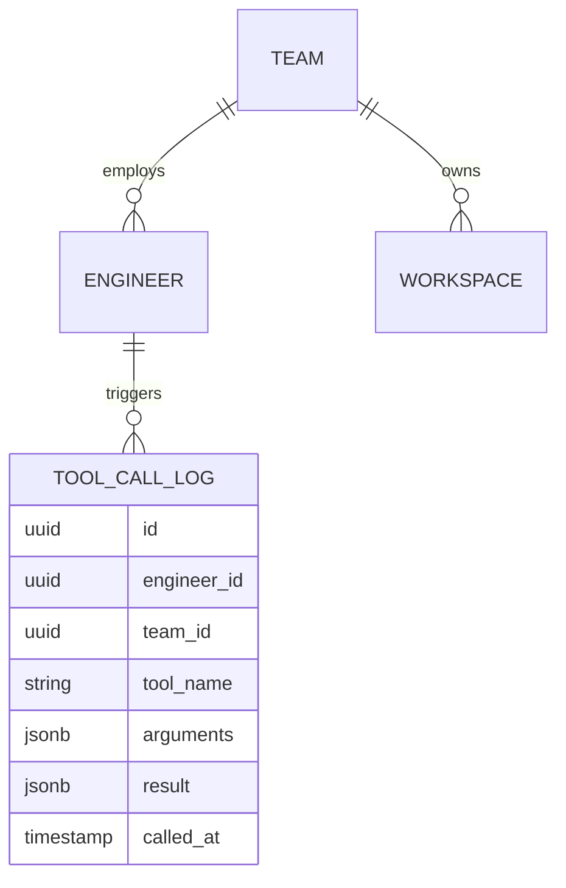

# Phase 4: Database & Tenant Isolation at Scale

[Phase 3](../03-event-driven-ingestion-and-multimodal-rag/README.md) closed with adoption
climbing across business units — more teams onboarding their own TFE usage, more teams
documenting in the same Confluence space. That growth changes what the data layer needs to
guarantee: it's no longer enough to answer questions well, the system now needs a real record
of what its mutating tools have done, and a hard guarantee that one team's agent activity can't
touch another team's infrastructure.

## Learning objectives

- Recognize when audit logging shifts from "nice to have" to a hard requirement, specifically
  because of what kind of tool the system has.
- Apply pooled multi-tenant isolation, scoped by business unit, to an internal platform tool —
  not just the external-customer case this course has emphasized so far.
- Extend authorization down to the tool-call level so a permission gap can't be papered over
  by "the UI just doesn't show that button."

## Prerequisites

- [Phase 3: Event-Driven Ingestion & Multimodal RAG](../03-event-driven-ingestion-and-multimodal-rag/README.md)
- [Database Design for GenAI Apps](../../part-3-system-design/03-database-design-for-genai-apps/README.md)
- [Multi-Tenant User Management](../../part-3-system-design/02-multi-tenant-user-management/README.md)

## Fix 1: audit logging becomes non-optional

Every `create_workspace` call needs a durable, queryable record of who (which engineer, which
team) triggered what action and when — directly reusing
[Database Design for GenAI Apps](../../part-3-system-design/03-database-design-for-genai-apps/README.md)'s
`TOOL_CALL_LOG` entity and its append-only, eventually-consistent classification. This isn't
observability anymore in the Phase 2 sense (debugging a wrong answer) — for an agent that can
create real infrastructure, it's the record that answers "why does this cloud account have a
workspace nobody remembers approving," a question that will eventually get asked, and needs a
real answer when it does.



## Fix 2: blast-radius isolation between business units

As more business units onboard, one team's agent activity must not be able to affect another
team's TFE workspaces — directly applying
[Multi-Tenant User Management](../../part-3-system-design/02-multi-tenant-user-management/README.md)'s
**pooled isolation model**, scoped by business unit rather than external customer tenant.
Compute and the vector index stay shared (this system is nowhere near needing per-team silos),
but every retrieval and every tool call carries a `team_id` scope, enforced the same way
Module 2's pattern enforces `tenant_id` — as a mandatory filter on every query path, not a
convention teams are trusted to follow.

## Fix 3: authorization down to the tool-call level

Directly reusing
[Multi-Tenant User Management](../../part-3-system-design/02-multi-tenant-user-management/README.md)
§2.4: an engineer's role and team membership determine which tools they can trigger and against
which scope, checked at the moment of the tool call itself — not just at the API layer, and not
assumed from what the chat UI happens to expose. A workspace-agent action scoped to Team A's
TFE organization must be structurally incapable of touching Team B's, regardless of what the
agent "decides" mid-conversation.

## Fix 4: the metadata store gets its first real scaling attention

Dashboard and reporting queries against the growing audit log (a preview of
[Phase 6](../06-final-architecture-the-tfe-agent/README.md)'s reporting agent) start showing up
as load on the primary database. Following
[Database Scaling Strategies](../../part-3-system-design/10-database-scaling-strategies/README.md)
§10.6's "vertical scaling first, then read replicas" default, a read replica is added for these
query patterns — sharding is explicitly **not** justified yet at this volume, and reaching for
it now would be exactly the premature complexity that module warned against.

## Code

```python
def authorize_tool_call(engineer_id: str, team_id: str, tool_name: str, target_team_id: str) -> bool:
    if team_id != target_team_id:
        return False  # structurally block any cross-team tool call, regardless of role
    role = get_engineer_role(engineer_id)
    allowed_tools_by_role = {
        "engineer": {"search_confluence"},
        "team_admin": {"search_confluence", "create_workspace"},
    }
    return tool_name in allowed_tools_by_role.get(role, set())

def log_tool_call(engineer_id: str, team_id: str, tool_name: str, arguments: dict, result: dict) -> None:
    audit_db.execute(
        """INSERT INTO tool_call_log (engineer_id, team_id, tool_name, arguments, result, called_at)
           VALUES (%s, %s, %s, %s, %s, now())""",
        (engineer_id, team_id, tool_name, json.dumps(arguments), json.dumps(result)),
    )

def create_workspace_guarded(engineer_id: str, team_id: str, name: str, vcs_repo: str) -> dict:
    if not authorize_tool_call(engineer_id, team_id, "create_workspace", team_id):
        raise PermissionError("Not authorized to create workspaces for this team")
    result = tfe_client.create_workspace(name=name, vcs_repo=vcs_repo)
    log_tool_call(engineer_id, team_id, "create_workspace", {"name": name, "vcs_repo": vcs_repo}, result)
    return result
```

## Where this leaves the system

Every mutating action now has an owner, a team scope, and a durable record. Cross-team blast
radius is structurally contained, not just discouraged by convention. But the underlying growth
that triggered this phase hasn't stopped — the Confluence space keeps growing, request volume
keeps climbing, and at around a million monthly requests, a different kind of complaint starts
dominating: not "who did this" but "why did it retrieve the wrong thing."

## Key takeaways

- Audit logging becomes a hard requirement specifically because this system has mutating
  tools — the bar is different from a read-only assistant.
- Pooled multi-tenant isolation applies just as directly to internal business-unit boundaries
  as it does to external customer tenants — the pattern doesn't care who the "tenant" is.
- Authorization checked only at the API layer is not authorization — it needs to reach the
  specific tool call, scoped to the specific target, every time.
- Scale the database the boring way first (read replicas) — sharding is a later-stage tool,
  not a default.

## Exercises

1. Extend the `TOOL_CALL_LOG` schema to support the reporting/RCA capability previewed for
   Phase 6 — what additional fields would a "what caused last Tuesday's failures" query need
   that this phase's schema doesn't yet capture?
2. Design a test that would catch a cross-team authorization gap *before* it reaches
   production, given that `authorize_tool_call` is the single function every mutating path
   depends on.
3. Argue for or against adding per-team silo isolation for one specific hypothetical team (e.g.
   a security-sensitive team) even at this shared-infrastructure stage — what would justify the
   extra cost this early?

Next: [Phase 5: Scaling to 1M Requests — the Vector Retrieval Crisis](../05-scaling-to-1m-requests-vector-retrieval-crisis/README.md)
