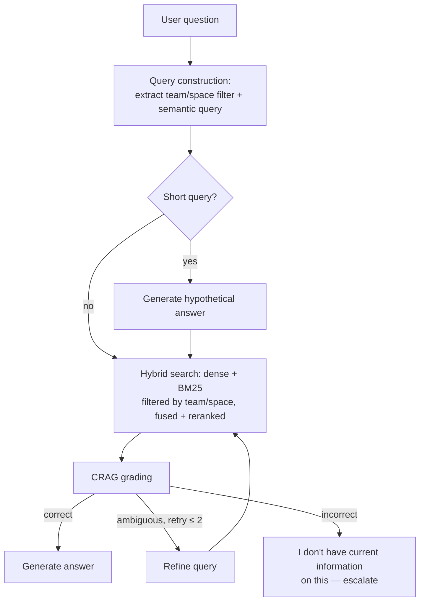

# Phase 5: Scaling to 1M Requests — the Vector Retrieval Crisis

[Phase 4](../04-database-and-tenant-isolation-at-scale/README.md) closed with growth
continuing past the point where "who did this" was the dominant question. Company-wide usage
keeps climbing, and the Confluence space keeps growing with it — more teams, more runbooks,
more architecture docs. Around a million monthly agent requests, retrieval quality — not
infrastructure capacity — becomes the dominant complaint. This phase is the most
technique-dense in the build, because it's where
[Advanced Production RAG](../../part-2-advanced-engineering/04-advanced-production-rag/README.md)'s
entire toolbox finally earns its place, one traced symptom at a time.

## Learning objectives

- Apply the Advanced Production RAG diagnostic method to a real, large, growing corpus instead
  of a hypothetical one.
- Recognize that "retrieval is bad" is never one problem — separate each symptom to its
  specific fix, exactly as Phase 2 taught for whole-system symptoms.
- Scale the vector index itself once volume and concurrency, not just retrieval quality, become
  the bottleneck.

## Prerequisites

- [Phase 4: Database & Tenant Isolation at Scale](../04-database-and-tenant-isolation-at-scale/README.md)
- [Advanced Production RAG](../../part-2-advanced-engineering/04-advanced-production-rag/README.md) (all five sub-modules)
- [Database Scaling Strategies](../../part-3-system-design/10-database-scaling-strategies/README.md)

## The diagnostic pass

A sample of low-rated and support-escalated interactions is pulled and categorized — the exact
method [Advanced Production RAG](../../part-2-advanced-engineering/04-advanced-production-rag/README.md)'s
overview taught for a hypothetical Northwind system, now run for real:

| Symptom | Root cause | Fix |
|---|---|---|
| "Branch protection?" and similarly terse questions retrieve nothing useful | Query-answer embedding asymmetry | [HyDE](../../part-2-advanced-engineering/04-advanced-production-rag/02-hyde/README.md) |
| A question about Team A's workspace naming policy retrieves Team B's similar-sounding but wrong policy page | No structural scoping on retrieval, only semantic similarity | [Metadata Filtering](../../part-2-advanced-engineering/04-advanced-production-rag/01-metadata-filtering-and-query-construction/README.md) — filter by `team`, `space`, `doc_type` |
| Exact resource identifiers (workspace names, repo slugs) aren't retrieved even when present verbatim in a page | Dense-only retrieval is weak on exact tokens | [Hybrid Search](../../part-2-advanced-engineering/04-advanced-production-rag/03-hybrid-search/README.md) |
| The agent confidently answers using a page that was correct last month but has since been superseded, despite Phase 3's event-driven sync (a race: the question arrives seconds before an update event finishes propagating) | No self-check on retrieval currency | [Corrective RAG (CRAG)](../../part-2-advanced-engineering/04-advanced-production-rag/04-corrective-rag-crag/README.md) |
| p95 query latency creeps upward as the single vector index grows | A single unsharded index straining under both volume and concurrent query load | [Database Scaling Strategies](../../part-3-system-design/10-database-scaling-strategies/README.md) — shard by `team`/`space` |

Notice what's absent: GraphRAG. The diagnostic pass finds no cluster of failures shaped like
"needs synthesis across many documents" — every failure here is a *local* retrieval problem.
Per [Advanced Production RAG](../../part-2-advanced-engineering/04-advanced-production-rag/README.md)'s
own decision framework, GraphRAG is correctly **not** adopted in this phase. It becomes
relevant only once [Phase 6](../06-final-architecture-the-tfe-agent/README.md) introduces a
genuinely global-question capability.

## Applying the fixes

Metadata filtering is close to free and ships first — the `team`/`space` filter also reuses
[Phase 4](../04-database-and-tenant-isolation-at-scale/README.md)'s tenant-scoping metadata
directly, so implementing it is largely wiring existing data into the retrieval path rather
than adding new capture logic. HyDE is gated to fire only on short queries (under a token-count
threshold), following
[HyDE](../../part-2-advanced-engineering/04-advanced-production-rag/02-hyde/README.md) §4b.4's
guidance not to pay its extra-call cost on every request. Hybrid search (dense + BM25, fused
with Reciprocal Rank Fusion) is added as the default retrieval path, not an optional mode. CRAG
wraps the whole retrieval step with a grading pass, with its refine-and-fallback branches capped
at two attempts per [CRAG](../../part-2-advanced-engineering/04-advanced-production-rag/04-corrective-rag-crag/README.md)'s
bounded-loop requirement.



## Scaling the index itself

Separately from retrieval *quality*, retrieval *latency* under concurrent load needs its own
fix: the vector index is sharded by `team`/`space` — a boundary that conveniently reinforces
[Phase 4](../04-database-and-tenant-isolation-at-scale/README.md)'s isolation model rather than
fighting it — with read replicas per shard for concurrent query throughput, directly applying
[Database Scaling Strategies](../../part-3-system-design/10-database-scaling-strategies/README.md)
§10.3.

## Code

```python
from pydantic import BaseModel
from typing import Literal

class RetrievalGrade(BaseModel):
    relevance: Literal["correct", "ambiguous", "incorrect"]

def retrieve_with_full_pipeline(question: str, team_id: str, refine_attempts: int = 0) -> list[str]:
    parsed = query_constructor.invoke(question)  # metadata filter + semantic query
    query_text = parsed.semantic_query

    if len(query_text.split()) <= 3:  # gate HyDE to short queries only
        query_text = generate_hyde_hypothetical(query_text)

    fused = hybrid_search(query_text, filter={"team_id": team_id, **parsed.filter}, shard=shard_for_team(team_id))
    grade = grader.invoke(f"Question: {question}\nRetrieved: {fused}").relevance

    if grade == "correct":
        return fused
    if grade == "ambiguous" and refine_attempts < 2:
        return retrieve_with_full_pipeline(question, team_id, refine_attempts + 1)
    return []  # triggers the fallback / "I don't have current information" path
```

## Where this leaves the system

Retrieval quality complaints drop sharply, and query latency stabilizes even as the corpus and
request volume keep growing. The system is now, in every retrieval-quality and infrastructure
sense, production-grade. What it doesn't yet have is *capability breadth* — the platform team
has been fielding requests for two things the current four-tool, two-agent design was never
built for: ad hoc infrastructure tasks beyond workspace creation, and reporting on platform
health that no amount of better document retrieval can answer, because the answer isn't in a
document at all.

## Key takeaways

- "Retrieval is bad" is never one problem — the same discipline that separated Phase 2's four
  system-level symptoms applies to retrieval-quality symptoms specifically.
- Every Advanced Production RAG technique here was adopted because a real, traced failure
  demanded it — including the deliberate decision *not* to adopt GraphRAG, because no traced
  failure matched its shape.
- Retrieval quality and retrieval latency are separate problems with separate fixes — better
  ranking doesn't fix a slow index, and a sharded index doesn't fix bad ranking.
- Reusing existing metadata (Phase 4's team/space scoping) for a new purpose (retrieval
  filtering) is often cheaper than it looks, because the capture work was already done.

## Exercises

1. For each of the five symptoms in this phase's diagnostic table, argue why the *other* four
   fixes would not have resolved it — the same exercise
   [Advanced Production RAG](../../part-2-advanced-engineering/04-advanced-production-rag/README.md)
   asks, now applied to a concrete, cited failure.
2. Design a monitoring signal that would tell you CRAG's fallback branch is firing too often —
   what would a rising fallback rate actually indicate about the corpus or the ingestion
   pipeline from Phase 3?
3. Sketch a question a future user might ask that *would* justify adopting GraphRAG for this
   system, and contrast it with the local-only failures this phase found.

Next: [Phase 6: Final Architecture — the TFE Agent, Assembled](../06-final-architecture-the-tfe-agent/README.md)
