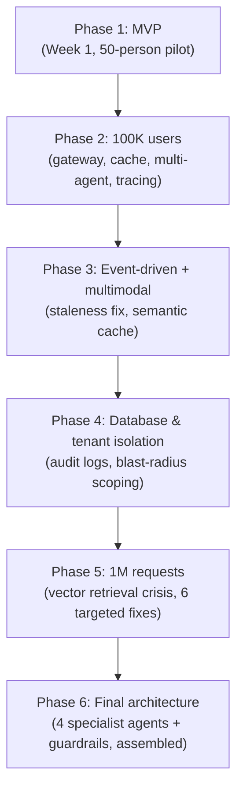

# Part 4 — Capstone Build: The TFE Agent, From Scratch

[Module 12](../part-3-system-design/12-capstone-case-study/README.md) designed a finished
system top-down, in one pass — the "if you had it to do all over knowing everything" view.
Real systems are never built that way. They're built as an MVP, shipped, and scaled
*reactively*, one painful, specific failure at a time. This part walks that path explicitly,
in order, as a single continuous story: building a production-grade agentic RAG platform from
a week-one MVP through a 1,000,000-request-a-month production system — hitting a real,
specific failure at each stage, and fixing it with a technique you've already learned earlier
in this course.

**Audience**: engineers who've completed Parts 1-3. This part assumes you can recognize a
reference to an earlier module without re-explanation — if a name here is unfamiliar, that's
the signal to go back and read that module first.

## The system: TFE Agent

An internal platform engineering team is building **TFE Agent**: an AI assistant for
engineers working with the company's internal **Terraform Enterprise (TFE)** installation —
HashiCorp's self-hosted infrastructure-as-code platform. Its knowledge base is the platform
team's Confluence space — hundreds of pages of setup guides, runbooks, workspace policy docs,
and architecture diagrams (screenshots, not just text — this system becomes **multimodal** the
moment ingestion quality starts mattering). Its tools call the real TFE API and the company's
VCS (version control) API to *take actions*, not just answer questions — which means, unlike
every prior scenario in this course, a wrong tool call here can create real cloud
infrastructure and real cost. That single fact shapes nearly every decision from Phase 4
onward.

## How to read this part

Read the phases in order — each one opens by recapping exactly where the system was left, and
closes with the specific symptom that forces the next phase. Nothing is built speculatively;
every technique is adopted because a traced, real failure demanded it, the same diagnostic
discipline taught in
[Advanced Production RAG](../part-2-advanced-engineering/04-advanced-production-rag/README.md),
now applied to an entire system's evolution instead of just retrieval.

## Phases

| # | Phase | What breaks | What fixes it |
|---|-------|--------------|----------------|
| 1 | [MVP](01-mvp/README.md) | Nothing yet — this is the baseline | — |
| 2 | [Scaling to 100K Users](02-scaling-to-100k-users/README.md) | Latency, cost, tool confusion, no visibility | Gateway, caching, multi-agent, tracing |
| 3 | [Event-Driven Ingestion & Multimodal RAG](03-event-driven-ingestion-and-multimodal-rag/README.md) | Stale answers, missed diagrams/screenshots | Event-driven sync, multimodal ingestion, semantic cache |
| 4 | [Database & Tenant Isolation at Scale](04-database-and-tenant-isolation-at-scale/README.md) | No audit trail, cross-team blast radius | Audit logging, pooled isolation, tool-level authz |
| 5 | [Scaling to 1M Requests: the Vector Retrieval Crisis](05-scaling-to-1m-requests-vector-retrieval-crisis/README.md) | Wrong/missing retrieval, rising latency | Metadata filtering, HyDE, hybrid search, CRAG, sharding |
| 6 | [Final Architecture: the TFE Agent, Assembled](06-final-architecture-the-tfe-agent/README.md) | New capabilities needed (infra tasks, RCA reporting), real-mutation risk | 2 more specialist agents, human-in-the-loop, guardrails |

Previous: [Part 3 — System Design for GenAI at Scale](../part-3-system-design/README.md)
